# Inventário de Aplicações — Núcleo Digital (Mendonça Galvão)

> Documento único gerado a partir de todos os arquivos em `docs/`.
> Cada seção abaixo indica o caminho original do arquivo — se precisar
> editar algo, edite o arquivo fonte em `docs/` e regenere este consolidado,
> não este arquivo diretamente.

## Sumário

- [README.md](#file-readmemd)
- [TEMPLATE-APLICACAO.md](#file-template-aplicacaomd)
- [PENDENCIAS.md](#file-pendenciasmd)
- [inventario.yaml](#file-inventarioyaml)
- Setores: contabil, fiscal, pessoal-dp, societario, ti-nucleo-digital, transversal
- Aplicações (28 fichas): ver pasta `aplicacoes/`

---

## `README.md`

# Inventário de Aplicações — Núcleo Digital (TI), Mendonça Galvão

Documentação técnica de todas as aplicações internas identificadas neste
workspace. Fonte de verdade machine-readable: [`inventario.yaml`](./inventario.yaml).
Lacunas e achados de auditoria: [`PENDENCIAS.md`](./PENDENCIAS.md).

## Convenções

- Toda aplicação segue o mesmo template: [`TEMPLATE-APLICACAO.md`](./TEMPLATE-APLICACAO.md).
- Nada aqui foi inventado — o que não deu pra confirmar no código está
  marcado `DESCONHECIDO` e tem uma pergunta correspondente em `PENDENCIAS.md`.
- Nenhum `.env` real foi lido; nenhum segredo foi copiado pra estes docs.
- **Para adicionar uma nova aplicação ao inventário:**
  1. Adicione uma entrada em `inventario.yaml` seguindo o schema existente.
  2. Crie `docs/aplicacoes/<slug>/README.md` a partir de `TEMPLATE-APLICACAO.md`.
  3. Adicione a linha na tabela mestra abaixo e no(s) arquivo(s) de setor
     correspondente(s) em `docs/setores/`.
  4. Se algo não puder ser confirmado, marque `DESCONHECIDO` e registre a
     pergunta em `PENDENCIAS.md` — não adivinhe.

## Visão por setor

- [TI — Núcleo Digital](./setores/ti-nucleo-digital.md)
- [Contábil](./setores/contabil.md)
- [Fiscal](./setores/fiscal.md)
- [Pessoal / DP](./setores/pessoal-dp.md)
- [Societário](./setores/societario.md) *(extra — ver nota no arquivo)*
- [Transversal](./setores/transversal.md)

## Tabela mestra

| Aplicação | Setor(es) | Função | Stack | Banco | Status |
|---|---|---|---|---|---|
| [CRM Mendonça Galvão](./aplicacoes/crm-mg/README.md) | Transversal | Shell/hub central: auth, navegação entre sistemas, usuários/setores | React 19 + FastAPI | PostgreSQL (Alembic) | producao |
| [CRM MG Backend (API)](./aplicacoes/backend-fastapi/README.md) | Transversal | API do shell + proxy pra 5 sistemas embutidos | FastAPI (Python ≥3.11) | PostgreSQL (Alembic) | producao |
| [Central de Suporte](./aplicacoes/central-suporte/README.md) | Transversal | Chamados e suporte técnico interno | React 19 (embutido) | PostgreSQL (Supabase) | producao |
| [Ponto Admin](./aplicacoes/ponto-admin/README.md) | TI, DP | Administração do app de ponto (integração Cronos) | React 19 (embutido) | DESCONHECIDO | producao |
| [Processamento Ponto](./aplicacoes/processar-ponto/README.md) | DP | Processamento de registros de ponto eletrônico | React 19 (embutido) | DESCONHECIDO | producao |
| [TaskFlow](./aplicacoes/taskflow/README.md) | TI | Gestão de tarefas do time de TI | React 19 (embutido) | PostgreSQL (Supabase) | producao |
| [MG Prospect](./aplicacoes/mg-prospect/README.md) | TI | Prospecção automática de clientes | React 19 (embutido) | DESCONHECIDO (proxy) | producao |
| [BIMG - BI](./aplicacoes/bimg/README.md) | Contábil | Business Intelligence e análise de dados | React 19 (embutido) | PostgreSQL (Supabase) | producao |
| [ContAI](./aplicacoes/contai/README.md) | Contábil | Assistente de IA para contabilidade | React 19 (embutido) | DESCONHECIDO | producao |
| [Copilot Contábil](./aplicacoes/copilot-contabil/README.md) | Contábil | Copiloto de IA para tarefas contábeis | React 19 (embutido) | PostgreSQL (Supabase) | producao |
| [Dashboard DRE](./aplicacoes/dashboard-dre/README.md) | Contábil | Dashboard de métricas do DRE | React 19 (embutido) | DESCONHECIDO (proxy) | producao |
| [Documentação Contábil](./aplicacoes/documentacao-contabil/README.md) | Contábil | DESCONHECIDO | React 19 (embutido) | DESCONHECIDO | producao |
| [Conciliação Fiscal](./aplicacoes/conciliacao-fiscal/README.md) | Fiscal | Conciliação de notas e SPED contábil | React 19 (embutido) | DESCONHECIDO | producao |
| [ICMS Fronteira](./aplicacoes/fronteira/README.md) | Fiscal | Cálculo de ICMS fronteira (v8) | React 19 (embutido) | DESCONHECIDO | homologacao |
| [Abertura de Empresa](./aplicacoes/abertura-empresa/README.md) | Societário | Gerenciamento de abertura de empresas | React 19 (embutido) | DESCONHECIDO (proxy) | producao |
| [Consulta CNPJ](./aplicacoes/consulta-cnpj/README.md) | Societário | DESCONHECIDO | React 19 (embutido) | DESCONHECIDO | producao |
| [Carnê-Leão](./aplicacoes/carne-leao/README.md) | Societário | DESCONHECIDO (backend externo) | React 19 (embutido) | DESCONHECIDO | producao |
| [Agendamento de Férias](./aplicacoes/agendamento-ferias/README.md) | DP, Transversal | Agendamento e controle de férias | React 19 (embutido) | PostgreSQL (Supabase) | producao |
| [Analytics DP](./aplicacoes/analytics-dp/README.md) | DP | DESCONHECIDO | React 19 (embutido) | DESCONHECIDO | producao |
| [Dash RH](./aplicacoes/dash-rh/README.md) | DP | DESCONHECIDO (setor RESTRITO) | React 19 (embutido) | DESCONHECIDO | producao |
| [Cálculo Adiantamento](./aplicacoes/calculo-adiantamento/README.md) | DP | Cálculo de adiantamentos salariais | React 19 (embutido) | PostgreSQL (Supabase) | producao |
| [Aeronord](./aplicacoes/aeronord/README.md) | DP | Convocações e recibos (cliente Aeronord) | React 19 (embutido) | DESCONHECIDO | producao |
| [Calculadora de Rescisão](./aplicacoes/calculadora-rescisao/README.md) | DP | Cálculo de rescisões trabalhistas | React 19 (embutido) | nenhum (client-side) | producao |
| [Cálculo de Comissão](./aplicacoes/calculo-comissao/README.md) | DP | Cálculo de comissões de vendas | React 19 (embutido) | nenhum (client-side) | producao |
| [Guia DP](./aplicacoes/guia-dp/README.md) | DP | Guia de DP e Contabilidade para clientes | React 19 (embutido) | DESCONHECIDO | producao |
| [Obrigações Acessórias](./aplicacoes/obrigacoes/README.md) | Transversal | Controle de entregas/prazos/documentos de cliente | React 19 (embutido) | PostgreSQL (Supabase) | desenvolvimento |
| [Obrigações — Worker de Recibos](./aplicacoes/obrigacoes-recibo/README.md) | Transversal | Serviço auxiliar do Obrigações Acessórias | DESCONHECIDO | DESCONHECIDO | DESCONHECIDO |
| [Ouvidoria Interna (RH)](./aplicacoes/ouvidoria/README.md) | Transversal | Canal de ouvidoria interna | React 19 (embutido) | PostgreSQL (Supabase) | producao |

*(28 aplicações no total — ver `inventario.yaml` para o schema completo de
cada uma. 2 sistemas adicionais aparecem no banco de sistemas de produção
sem código neste workspace — Portal do Colaborador e Cláusula AI — ver
`PENDENCIAS.md`.)*

## Diagrama do ecossistema

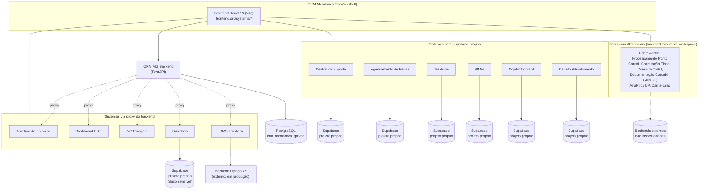

## Documentação legada (pré-existente nesta pasta)

Estes documentos já existiam em `docs/` antes deste inventário e continuam
válidos — não foram absorvidos no `inventario.yaml` porque cobrem tópicos
específicos, não fichas de aplicação:

- [arquitetura-crm-mendonca-galvao.md](./arquitetura-crm-mendonca-galvao.md) — visão geral de arquitetura do CRM
- [review-log.md](./review-log.md) — histórico de revisões de código
- [integracao-ferias-cronos.md](./integracao-ferias-cronos.md) — integração Férias → Cronos (lado emissor)
- [contrato-ferias-cronos.md](./contrato-ferias-cronos.md) — contrato de integração Férias ↔ Cronos
- [obrigacoes-readme.md](./obrigacoes-readme.md) — sistema de Obrigações Acessórias
- [obrigacoes-recibo-worker-readme.md](./obrigacoes-recibo-worker-readme.md) — worker de baixa automática por recibo
- [frontend-readme.md](./frontend-readme.md) — README original do template Vite do frontend
- [migracoes/handoff.md](./migracoes/handoff.md) — handoffs de migração de sistemas (iframe → nativo)

> O `README.md` na raiz do repositório continua lá de propósito — é o que o
> GitHub renderiza como página inicial do projeto.

## Escopo e limitações desta rodada

Ver [`PENDENCIAS.md`](./PENDENCIAS.md) seção 3 para o detalhamento completo,
mas resumindo: a maioria das 25 aplicações embutidas em `frontend/src/systems/`
fala com um backend próprio que **não está neste workspace** (API externa,
Supabase próprio, ou serviço em Lovable/Vercel). Para essas, a ficha cobre o
que dá pra confirmar pelo frontend (stack de UI, env vars, integrações
visíveis) — `INSTALACAO.md`/`BANCO.md` detalhados ficam para quando o time
confirmar onde vive cada backend.

---

## `TEMPLATE-APLICACAO.md`

# Template — Ficha de Aplicação

> Este arquivo é o modelo usado por `docs/aplicacoes/<slug>/README.md`. Toda
> ficha de aplicação segue exatamente esta ordem de seções, mesmo quando uma
> seção só tem `DESCONHECIDO` — nunca omitir uma seção, só preenchê-la vazio.
>
> Fonte de verdade: `docs/inventario.yaml`. Se um dado aparece aqui, tem que
> estar lá também — os `.md` são a renderização humana do YAML, não uma
> segunda fonte.

```markdown
# <Nome do Sistema>

## 1. Identificação
- **Slug:** `<slug>`
- **Status:** producao | homologacao | desenvolvimento | descontinuado
- **Criticidade:** alta | media | baixa
- **Setor responsável (dono técnico):** <setor>

## 2. Função do sistema
<2-3 frases: o que faz, para quem, que dor resolve.>

## 3. Setores que utilizam
- <setor 1>
- <setor 2>

## 4. Stack utilizada
| Camada | Tecnologia | Versão | Observação |
|---|---|---|---|
| Frontend | | | |
| Backend | | | |
| Banco | | | |
| Infra | | | |

## 5. Arquitetura
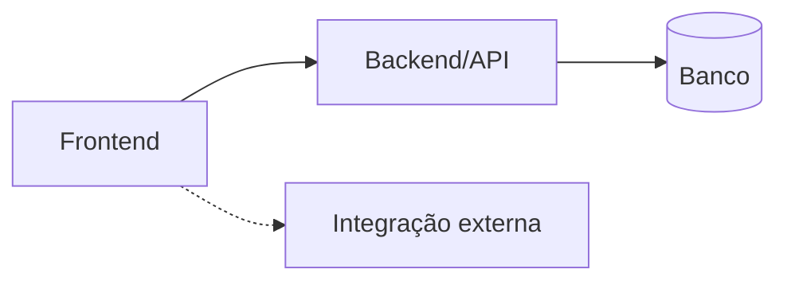

## 6. Banco de dados
<resumo curto — detalhe completo em BANCO.md>

## 7. Autenticação e permissões
- **Método:** <Google OAuth | JWT próprio | Supabase Auth | DESCONHECIDO>
- **RBAC:** sim/não — papéis e o que cada um pode fazer

## 8. PWA
- **Perfil:** pwa-first | desktop-com-pwa | nao-aplicavel
- **Manifest:** sim/não
- **Service worker:** sim/não
- **Offline:** completo | basico | nenhum

## 9. Integrações externas
- <nome da integração — para quê>

## 10. Dependências de outros sistemas internos
- <slug do sistema — natureza da dependência>

## 11. Variáveis de ambiente
| Nome | Obrigatória | Sensível | Descrição |
|---|---|---|---|

## 12. Observações de segurança e LGPD
<achados relevantes; detalhe completo em PENDENCIAS.md/BANCO.md>
```

---

## `PENDENCIAS.md`

# Pendências do inventário

> Lacunas encontradas durante o levantamento (`docs/inventario.yaml`) que só o
> time consegue confirmar, mais os achados de auditoria (segurança/multi-
> tenant/LGPD/PWA) coletados durante a varredura. Nenhum item aqui foi
> inventado — cada um cita o arquivo/campo onde a lacuna apareceu.

## Como usar este documento

- **Perguntas** (seção 1): um item por campo `DESCONHECIDO` relevante do
  `inventario.yaml`, agrupado por aplicação. Ao responder, atualize o YAML e
  a ficha correspondente, e risque o item aqui (ou mova pra um changelog).
- **Auditoria** (seção 2): achados de segurança/multi-tenant/LGPD/PWA vistos
  de passagem durante a varredura. Não é um pentest — é o que apareceu ao
  ler configs e código público dos routers/settings.

---

## 1. Perguntas para o time

### Aplicações inteiras sem código neste workspace
- `portal-do-colaborador` e `clausula-ai` aparecem em `sistemas_seed.sql`
  (URLs `portalcolabmg.lovable.app` e `clausulaailp.nucleodigital.cloud`) mas
  não têm pasta correspondente em `frontend/src/systems/` nem em nenhum
  outro lugar deste workspace. **Pergunta:** esses sistemas têm repositório
  próprio fora deste workspace? Se sim, qual, pra incluir no inventário.

### Stack / backend não identificado no código
Estas aplicações usam uma API própria (`VITE_*_API_URL`) cujo repositório de
backend não está neste workspace, então stack/banco/RLS ficaram
`DESCONHECIDO`:
- `ponto-admin` (VITE_CRONOS_API_URL — sistema "Cronos")
- `processar-ponto` (VITE_PONTO_API_URL)
- `contai` (VITE_CONTAI_API_URL)
- `conciliacao-fiscal` (VITE_FISCAL_API_BASE_URL)
- `consulta-cnpj` (VITE_CNPJ_API_URL)
- `documentacao-contabil` (VITE_DOCCONTABIL_API_URL)
- `guia-dp` (VITE_GUIADP_API_BASE_URL)
- `analytics-dp` (VITE_ANALYTICS_DP_API_URL)
- `carne-leao` (VITE_CARNE_LEAO_API_URL — repo externo "PROJETO-CARNE-LEAO" citado em comentário do registry.tsx)
- `bimg`, `taskflow` (têm Supabase próprio + uma `VITE_*_API_URL` complementar — o que essa API adicional faz?)

**Pergunta:** onde estão esses backends (repositório, hospedagem, quem
mantém)? Sem isso não dá pra preencher `BANCO.md`/RLS/LGPD dessas aplicações
de verdade — o inventário está registrando só o que o *frontend* revela.

### Sem nenhum indício de backend
- `calculadora-rescisao` e `calculo-comissao`: nenhuma env var de API nem
  cliente Supabase encontrado — aparentam ser calculadoras 100% client-side.
  **Pergunta:** confirma? Se sim, não há dado pessoal armazenado (só
  processado na sessão do navegador) — vale declarar isso oficialmente pra
  LGPD.
- `aeronord`, `dashboard-dre`: mesma situação, mas o nome/função sugere que
  DEVERIA ter algum armazenamento (recibos, métricas de DRE). Prováveis
  candidatos a backend externo (Lovable/Vercel) não inspecionado.
  **Pergunta:** essas aplicações persistem dado em algum lugar?

### Função do sistema não confirmada
`sistemas_seed.sql` não tinha descrição para estes (ou a linha não apareceu
no dump que consegui ler): `documentacao-contabil`, `consulta-cnpj`,
`analytics-dp`, `dash-rh`. A `funcao` no YAML pra esses é uma inferência só
pelo nome — **pergunta:** confirmar a descrição real de cada um com o
responsável do setor.

### Setor responsável (dono técnico)
O YAML preenche `setores` (quem *usa*) com confiança (vem do
`sistemas_seed.sql`), mas `setor_responsavel` (quem *mantém tecnicamente*)
ficou `DESCONHECIDO` pra quase tudo fora do núcleo TI — **pergunta:** o
Núcleo Digital mantém todos os 25 sistemas, ou alguns têm dev externo
(ex.: os hospedados em Lovable/Vercel)?

### `dash-rh`
Setor cadastrado como `RESTRITO` no banco de sistemas (não é um dos setores
"normais" como CONTABIL/FISCAL/DP) — **pergunta:** o que esse setor
significa em termos de controle de acesso? Precisa entrar como um setor
próprio em `docs/setores/` ou é um caso especial de RH?

### Portas locais / dev
A maioria das aplicações embutidas não tem porta própria — todas rodam sob o
mesmo `npm run dev` do `frontend/` (porta 5173 padrão do Vite, ou 3009 via
docker-compose). Marquei `DESCONHECIDO` porta_local nas fichas individuais
por precisão, mas na prática **é sempre a porta do frontend raiz**.
Confirmar se isso é intencional (todas compartilham 1 build) antes de eu
consolidar essa nota nas fichas.

### `VITE_ADIANTAMENTO_SUPABASE_URL`
Em `calculo-adiantamento` encontrei um cliente Supabase (`createClient`) mas
não consegui confirmar o nome exato da env var lendo só os arquivos que
grepei — **pergunta/ação:** localizar o arquivo `integrations/supabase/client.ts`
desse sistema e confirmar o nome exato antes de considerar o dado definitivo.

### `obrigacoes-recibo` (services/)
Só vi o diretório (`services/obrigacoes-recibo`) e seu `.env.example` — não
inspecionei o código-fonte dele em profundidade (fora do escopo desta
passada, focada nos apps de `frontend/src/systems/`). **Pergunta:** stack,
função exata e se ainda está em uso ativo.

---

## 2. Auditoria (achados ao longo da varredura)

Classificação: **crítico / alto / médio / baixo**. Isto **não é um pentest**
— são achados de leitura de configuração/routers públicos, não de teste de
intrusão nem análise de todo o código de cada aplicação.

### Segurança

- **[ALTO] Senha de banco com default hardcoded no código-fonte**
  `backend-fastapi/app/core/config.py:16` — `POSTGRES_PASSWORD: str =
  "crm_dev_password_2024"`. Se a env var `POSTGRES_PASSWORD` não for setada
  em algum ambiente (ex.: erro de deploy), o backend sobe silenciosamente
  usando essa senha conhecida em vez de falhar. Mesmo padrão em
  `EVOLUTION_API_KEY: str = "dev_evolution_key_123"` (linha 56). Recomendação:
  remover o default e deixar sem valor (obrigar a env var, falhar no boot se
  ausente) — igual já é feito com `JWT_SECRET: str` (sem default) na linha 20,
  que é o padrão correto já presente no mesmo arquivo.

- **[MÉDIO] `OUVIDORIA_SUPABASE_SERVICE_ROLE_KEY` centralizada no backend**
  `backend-fastapi/app/core/config.py:40` — a service role key do Supabase da
  Ouvidoria (bypassa RLS) fica configurada no backend do CRM, um serviço à
  parte do Supabase da Ouvidoria em si. Não é uma vulnerabilidade por si só
  (o comentário no código diz que é usada só server-side pra webhooks/
  embeddings), mas amplia a superfície: se o backend do CRM for comprometido,
  o atacante ganha acesso irrestrito ao banco da Ouvidoria — que trata dado
  de denúncia (ver LGPD abaixo). Vale revisar se essa key precisa mesmo estar
  aqui ou se dá pra escopar num serviço isolado.

- **[BAIXO] `BACKEND_CORS_ORIGINS` com default de dev**
  `backend-fastapi/app/core/config.py:10` — default é só
  `localhost:3000/5173/8080`, o que é seguro; só fica como nota porque não
  vi confirmação de qual é o valor real em produção (deve vir de env var,
  não inspecionado por ser `.env` real).

- **[ALTO] `service_role` key do Supabase de `obrigacoes` concentrada num
  worker Python separado (`services/obrigacoes-recibo`)** — comprometer esse
  worker (ou vazar seu `.env`) compromete o isolamento multi-tenant inteiro
  do sistema `obrigacoes`, que trata documento de múltiplas empresas-cliente
  na mesma base. Ver `docs/aplicacoes/obrigacoes-recibo/README.md`.

### Multi-tenant

- **[CONFIRMADO] `obrigacoes` é multi-tenant de verdade** — dado de mais de
  uma empresa-cliente na mesma tabela, isolado por RLS usando a empresa
  vinda do JWT do cliente (nunca de rota/query string). Documentação legada
  (`docs/obrigacoes-readme.md`) confirma que a suíte de testes roda com dois
  tenants pra provar isolamento — é a única aplicação deste inventário com
  essa confirmação explícita e testada.
- **[A CONFIRMAR]** As demais aplicações não têm multi-tenant confirmado ou
  descartado — marquei `nao_aplicavel` no YAML como padrão pras que
  claramente atendem só o escritório internamente, mas `conciliacao-fiscal`,
  `documentacao-contabil`, `guia-dp` e outros sistemas voltados a "clientes"
  do escritório podem ter uma noção de isolamento por cliente que não ficou
  visível só pelo frontend — **pergunta para o time**: alguma dessas trata
  dado de múltiplos clientes/empresas na mesma base sem segregação por
  tenant, sem o mesmo nível de teste que `obrigacoes` tem?

### LGPD

- **[ALTO] Ouvidoria trata relato de denúncia sem confirmação de retenção/anonimização**
  `frontend/src/systems/ouvidoria` + proxies em
  `backend-fastapi/app/api/v1/endpoints/ouvidoria_proxy.py` — é o dado mais
  sensível do inventário (relato de denúncia interna, potencialmente sobre
  pessoas identificáveis). Não encontrei confirmação de política de retenção,
  anonimização do denunciante, nem quem tem acesso à
  `OUVIDORIA_SUPABASE_SERVICE_ROLE_KEY`. Recomendação: tratar como prioridade
  #1 de revisão LGPD.

- **[MÉDIO] Nenhuma aplicação documentada declara política de retenção definida**
  Em praticamente todas as fichas, `retencao_definida: DESCONHECIDO`. Isso
  por si só é um achado: não há (ou não está documentada) uma política de
  retenção/exclusão de dado pessoal em nenhum dos sistemas levantados.

- **[BAIXO] `analytics-dp`, `dash-rh`, `calculo-adiantamento`, `aeronord`,
  `processar-ponto`, `ponto-admin` tratam dado trabalhista/salarial** sem
  RLS/policy confirmável (backend fora deste workspace). Marcar como
  pendente de confirmação, não como incidente confirmado.

### PWA

- **[MÉDIO] Nenhuma das 25 aplicações embutidas tem manifest/service worker
  identificado neste workspace.** Não encontrei `manifest.json`,
  `manifest.webmanifest`, `vite-plugin-pwa` nem arquivo de service worker em
  nenhum `frontend/src/systems/*`, nem no `frontend/` raiz. Se alguma
  aplicação é usada em campo/mobile (ex.: ponto eletrônico), a ausência de
  PWA pode ser um problema de UX real, não só de checklist — **pergunta para
  o time**: alguma dessas aplicações precisa funcionar offline ou como app
  instalável?

---

## 3. Decisões de escopo desta rodada

- Documentei em profundidade (README + arquitetura) as aplicações do núcleo
  TI e as que eu já conhecia em detalhe por trabalho anterior nesta sessão
  (`central-suporte`). Para as demais 24 aplicações, a ficha cobre o que dá
  pra confirmar via `sistemas_seed.sql` + `registry.tsx` + grep de configs —
  sem `INSTALACAO.md`/`BANCO.md` individuais nesta primeira passada, porque
  o backend real da maioria não está neste workspace (ver seção 1). Ficam
  como próximo passo quando o time confirmar as pendências acima.

---

## `inventario.yaml`

```yaml
# Inventário de aplicações — Núcleo Digital (TI), Mendonça Galvão
#
# Fonte de verdade machine-readable. Os .md em docs/aplicacoes/, docs/setores/
# e docs/README.md são gerados/mantidos manualmente a partir deste arquivo —
# qualquer dado que apareça num .md tem que estar aqui também.
#
# Como foi levantado (para auditoria futura):
#   - sistemas_seed.sql (raiz do repo) e frontend/src/systems/registry.tsx são
#     a fonte primária de nome/slug/setor/url_producao — vêm do dump real da
#     tabela `sistemas` do CRM, não foram adivinhados.
#   - Stack/backend por sistema: inspeção de package.json raiz (stack
#     compartilhada do monorepo frontend), grep por `VITE_*_API_URL` e
#     `createClient` (Supabase) dentro de cada frontend/src/systems/<slug>/.
#   - Nenhum valor de .env real foi lido — só .env.example.
#   - Todo campo que não deu pra confirmar por essa via está DESCONHECIDO e
#     tem uma pergunta correspondente em docs/PENDENCIAS.md.

aplicacoes:
  # ============================================================
  # NÚCLEO — CRM shell (hub que hospeda os sistemas embutidos)
  # ============================================================
  - slug: crm-mg
    nome: CRM Mendonça Galvão
    status: producao
    criticidade: alta
    setores: [transversal]
    setor_responsavel: ti-nucleo-digital
    funcao: >
      Shell/hub central do escritório: autenticação (Google OAuth), registro
      e navegação entre todos os sistemas internos (embutidos nativamente ou
      via iframe), gestão de usuários/setores/clientes, tarefas, auditoria e
      notificações. Os 25 sistemas em frontend/src/systems/ rodam dentro
      dele como módulos React lazy-loaded (ver registry.tsx).
    repositorio: . (raiz deste workspace)
    url_producao: DESCONHECIDO
    stack:
      frontend: { framework: React, versao: "19.2.6", linguagem: TypeScript, build: Vite 8 }
      backend: { framework: FastAPI, versao: ">=0.111.0", linguagem: Python, runtime: ">=3.11" }
      infra: { hospedagem: Coolify, containerizacao: Docker, proxy: DESCONHECIDO }
      bibliotecas_chave: [radix-ui, "@tanstack/react-query", "@supabase/supabase-js", tailwindcss, "@mg/ui (workspace)", "@mg/tokens (workspace)"]
    banco_de_dados:
      - tipo: PostgreSQL
        provedor: Docker Compose local (serviço `postgres`) / Coolify em produção
        nome_logico: crm_mendonca_galvao
        migrations: alembic
        rls: nao
        multi_tenant: nao_aplicavel
        chave_isolamento: nao_aplicavel
    autenticacao:
      metodo: Google OAuth + JWT próprio (pyjwt, ver backend-fastapi)
      rbac: sim
      papeis: [DESCONHECIDO — ver app/models/user.py e user_system_access.py]
    pwa:
      perfil: DESCONHECIDO
      manifest: DESCONHECIDO
      service_worker: DESCONHECIDO
      offline: DESCONHECIDO
    dados_pessoais_lgpd:
      trata_dados_pessoais: sim
      categorias: [nome, email, dados_de_acesso]
      retencao_definida: DESCONHECIDO
    integracoes: ["Google OAuth", "OpenAI (OPENAI_API_KEY)", "Evolution API (WhatsApp)"]
    dependencias_internas: [backend-fastapi, "todos os sistemas em frontend/src/systems/"]
    porta_local: 3009  # HOST_FRONTEND_PORT (.env.example)
    variaveis_ambiente:
      - { nome: JWT_SECRET, obrigatoria: true, sensivel: true, descricao: "chave de assinatura dos tokens JWT do backend" }
      - { nome: JWT_EXPIRATION_SECONDS, obrigatoria: true, sensivel: false, descricao: "TTL do token, default 604800 (7 dias)" }
      - { nome: GOOGLE_CLIENT_ID, obrigatoria: true, sensivel: false, descricao: "client id do OAuth do Google" }
      - { nome: OPENAI_API_KEY, obrigatoria: false, sensivel: true, descricao: "usada em features de IA (proxies/copilot)" }
      - { nome: EVOLUTION_API_URL, obrigatoria: false, sensivel: false, descricao: "endpoint da integração WhatsApp" }
      - { nome: EVOLUTION_API_KEY, obrigatoria: false, sensivel: true, descricao: "chave da Evolution API" }
      - { nome: POSTGRES_PASSWORD, obrigatoria: true, sensivel: true, descricao: "senha do Postgres do backend" }

  - slug: backend-fastapi
    nome: "CRM MG Backend (API)"
    status: producao
    criticidade: alta
    setores: [transversal]
    setor_responsavel: ti-nucleo-digital
    funcao: >
      API FastAPI que sustenta o crm-mg: auth, usuários, setores, clientes,
      registro de sistemas, tarefas, controle de acesso, dashboard, auditoria,
      documentos, busca, sessões, releases. Também expõe rotas "proxy" para
      5 sistemas embutidos (abertura-empresa, dashboard-dre, mg-prospect,
      ouvidoria, fronteira) — ver app/api/v1/router.py.
    repositorio: ./backend-fastapi
    url_producao: DESCONHECIDO
    stack:
      backend: { framework: FastAPI, versao: ">=0.111.0", linguagem: Python, runtime: ">=3.11" }
      infra: { hospedagem: Coolify, containerizacao: Docker (Dockerfile próprio), proxy: DESCONHECIDO }
      bibliotecas_chave: [sqlalchemy, asyncpg, alembic, pyjwt, "google-auth", httpx, openai]
    banco_de_dados:
      - tipo: PostgreSQL
        provedor: Docker Compose (`postgres`) / Coolify
        nome_logico: crm_mendonca_galvao
        migrations: alembic
        rls: nao
        multi_tenant: nao_aplicavel
        chave_isolamento: nao_aplicavel
    autenticacao:
      metodo: "Google OAuth (google-auth) + JWT próprio (pyjwt)"
      rbac: sim
      papeis: DESCONHECIDO
    pwa: { perfil: nao-aplicavel, manifest: nao, service_worker: nao, offline: nenhum }
    dados_pessoais_lgpd:
      trata_dados_pessoais: sim
      categorias: [nome, email]
      retencao_definida: DESCONHECIDO
    integracoes: ["Google OAuth", "OpenAI"]
    dependencias_internas: []
    porta_local: 8089  # HOST_BACKEND_PORT (.env.example)
    variaveis_ambiente:
      - { nome: DATABASE_URL, obrigatoria: true, sensivel: true, descricao: "string de conexão asyncpg com o Postgres" }
      - { nome: JWT_SECRET, obrigatoria: true, sensivel: true, descricao: "compartilhado com o crm-mg" }

  # ============================================================
  # TI — Núcleo Digital
  # ============================================================
  - slug: central-suporte
    nome: Central de Suporte
    status: producao
    criticidade: alta
    setores: [transversal]
    setor_responsavel: ti-nucleo-digital
    funcao: >
      Sistema de chamados e suporte técnico interno: abertura conversacional
      de chamado, Kanban, chat flutuante, relatórios, incidentes, tarefas
      automatizadas, consulta/auditoria de chamados.
    repositorio: ./frontend/src/systems/central-suporte
    url_producao: https://chamados.mendoncagalvao.com.br
    stack:
      frontend: { framework: React (embutido no crm-mg), versao: "19.2.6", linguagem: TypeScript, build: Vite (compartilhado) }
      backend: { framework: "Supabase (PostgREST + Realtime + Storage)", versao: DESCONHECIDO, runtime: DESCONHECIDO }
      infra: { hospedagem: "Supabase (projeto próprio, hospedagem DESCONHECIDA — self-hosted ou cloud)", containerizacao: nao_aplicavel, proxy: DESCONHECIDO }
      bibliotecas_chave: ["@supabase/supabase-js", "@hello-pangea/dnd", recharts, "@mg/ui"]
    banco_de_dados:
      - tipo: PostgreSQL (Supabase)
        provedor: DESCONHECIDO (self-hosted Coolify ou Supabase Cloud)
        nome_logico: central-suporte
        migrations: "SQL solto em integrations/supabase/migrations/ — NÃO aplicado automaticamente, aplicação é manual via SQL Editor"
        rls: parcial
        multi_tenant: nao_aplicavel
        chave_isolamento: nao_aplicavel
    autenticacao:
      metodo: Supabase Auth (Google OAuth)
      rbac: sim
      papeis: [admin_ti, direction, coordinator, "coordinator_sp/sc/sf/fn/rh", support_agent, dev, viewer, dp, fiscal, contabil, financeiro, societario, recepcao, rh]
    pwa: { perfil: nao-aplicavel, manifest: nao, service_worker: nao, offline: nenhum }
    dados_pessoais_lgpd:
      trata_dados_pessoais: sim
      categorias: [nome, email, conteudo_de_chamados_e_anexos]
      retencao_definida: nao
    integracoes: []
    dependencias_internas: [crm-mg]
    porta_local: DESCONHECIDO (compartilha porta do frontend, 3009)
    variaveis_ambiente:
      - { nome: VITE_SUPORTE_SUPABASE_URL, obrigatoria: true, sensivel: false, descricao: "URL do projeto Supabase" }
      - { nome: VITE_SUPORTE_SUPABASE_PUBLISHABLE_KEY, obrigatoria: true, sensivel: false, descricao: "chave anon/publishable do Supabase" }

  - slug: ponto-admin
    nome: Ponto Admin
    status: producao
    criticidade: alta
    setores: [ti-nucleo-digital, pessoal-dp]
    setor_responsavel: ti-nucleo-digital
    funcao: >
      Administração do aplicativo de ponto eletrônico da empresa: gestão de
      colaboradores, espelho de ponto, justificativas, férias — integrado
      com um sistema externo chamado "Cronos".
    repositorio: ./frontend/src/systems/ponto-admin
    url_producao: https://pontoadmin.mendoncagalvao.com.br
    stack:
      frontend: { framework: React (embutido), versao: "19.2.6", linguagem: TypeScript, build: Vite }
      backend: { framework: "API própria (VITE_CRONOS_API_URL)", versao: DESCONHECIDO, runtime: DESCONHECIDO }
      infra: { hospedagem: DESCONHECIDO, containerizacao: DESCONHECIDO, proxy: DESCONHECIDO }
      bibliotecas_chave: [DESCONHECIDO]
    banco_de_dados:
      - tipo: DESCONHECIDO
        provedor: DESCONHECIDO (backend "Cronos" não está neste repositório)
        nome_logico: DESCONHECIDO
        migrations: nenhuma (não versionadas neste repo)
        rls: DESCONHECIDO
        multi_tenant: DESCONHECIDO
        chave_isolamento: DESCONHECIDO
    autenticacao: { metodo: DESCONHECIDO, rbac: DESCONHECIDO, papeis: [] }
    pwa: { perfil: DESCONHECIDO, manifest: DESCONHECIDO, service_worker: DESCONHECIDO, offline: DESCONHECIDO }
    dados_pessoais_lgpd:
      trata_dados_pessoais: sim
      categorias: [nome, dados_trabalhistas, ponto_eletronico]
      retencao_definida: DESCONHECIDO
    integracoes: ["Cronos (sistema de ponto externo)"]
    dependencias_internas: [crm-mg]
    porta_local: DESCONHECIDO
    variaveis_ambiente:
      - { nome: VITE_CRONOS_API_URL, obrigatoria: true, sensivel: false, descricao: "endpoint da API do Cronos" }

  - slug: processar-ponto
    nome: Processamento Ponto
    status: producao
    criticidade: media
    setores: [pessoal-dp]
    setor_responsavel: ti-nucleo-digital
    funcao: >
      Processamento e controle de ponto eletrônico — upload/leitura de
      registros e geração de resumos.
    repositorio: ./frontend/src/systems/processar-ponto
    url_producao: https://processarponto.mendoncagalvao.com.br
    stack:
      frontend: { framework: React (embutido), versao: "19.2.6", linguagem: TypeScript, build: Vite }
      backend: { framework: "API própria (VITE_PONTO_API_URL)", versao: DESCONHECIDO, runtime: DESCONHECIDO }
      infra: { hospedagem: DESCONHECIDO, containerizacao: DESCONHECIDO, proxy: DESCONHECIDO }
      bibliotecas_chave: [DESCONHECIDO]
    banco_de_dados:
      - { tipo: DESCONHECIDO, provedor: DESCONHECIDO, nome_logico: DESCONHECIDO, migrations: nenhuma, rls: DESCONHECIDO, multi_tenant: DESCONHECIDO, chave_isolamento: DESCONHECIDO }
    autenticacao: { metodo: DESCONHECIDO, rbac: DESCONHECIDO, papeis: [] }
    pwa: { perfil: DESCONHECIDO, manifest: DESCONHECIDO, service_worker: DESCONHECIDO, offline: DESCONHECIDO }
    dados_pessoais_lgpd:
      trata_dados_pessoais: sim
      categorias: [nome, ponto_eletronico]
      retencao_definida: DESCONHECIDO
    integracoes: []
    dependencias_internas: [crm-mg]
    porta_local: DESCONHECIDO
    variaveis_ambiente:
      - { nome: VITE_PONTO_API_URL, obrigatoria: true, sensivel: false, descricao: "endpoint da API de processamento de ponto" }

  - slug: taskflow
    nome: TaskFlow
    status: producao
    criticidade: media
    setores: [ti-nucleo-digital]
    setor_responsavel: ti-nucleo-digital
    funcao: >
      Gestão de tarefas/fluxo de trabalho do time de TI (kanban próprio,
      distinto do Kanban da Central de Suporte).
    repositorio: ./frontend/src/systems/taskflow
    url_producao: https://taskflow.nucleodigital.cloud
    stack:
      frontend: { framework: React (embutido), versao: "19.2.6", linguagem: TypeScript, build: Vite }
      backend: { framework: "Supabase + API própria (VITE_TASKFLOW_API_URL)", versao: DESCONHECIDO, runtime: DESCONHECIDO }
      infra: { hospedagem: DESCONHECIDO, containerizacao: DESCONHECIDO, proxy: DESCONHECIDO }
      bibliotecas_chave: ["@supabase/supabase-js"]
    banco_de_dados:
      - { tipo: PostgreSQL (Supabase), provedor: DESCONHECIDO, nome_logico: taskflow, migrations: "nao versionadas neste repo", rls: DESCONHECIDO, multi_tenant: DESCONHECIDO, chave_isolamento: DESCONHECIDO }
    autenticacao: { metodo: "Supabase Auth", rbac: DESCONHECIDO, papeis: [] }
    pwa: { perfil: DESCONHECIDO, manifest: DESCONHECIDO, service_worker: DESCONHECIDO, offline: DESCONHECIDO }
    dados_pessoais_lgpd: { trata_dados_pessoais: sim, categorias: [nome, email], retencao_definida: DESCONHECIDO }
    integracoes: []
    dependencias_internas: [crm-mg]
    porta_local: DESCONHECIDO
    variaveis_ambiente:
      - { nome: VITE_TASKFLOW_SUPABASE_URL, obrigatoria: true, sensivel: false, descricao: "URL do projeto Supabase" }
      - { nome: VITE_TASKFLOW_SUPABASE_ANON_KEY, obrigatoria: true, sensivel: false, descricao: "chave anon do Supabase" }
      - { nome: VITE_TASKFLOW_API_URL, obrigatoria: false, sensivel: false, descricao: "endpoint de API própria complementar" }

  - slug: mg-prospect
    nome: MG Prospect
    status: producao
    criticidade: media
    setores: [ti-nucleo-digital]
    setor_responsavel: ti-nucleo-digital
    funcao: >
      Prospecção automática de clientes; páginas internas (staff) migradas
      pro CRM nativo, páginas públicas (formulário de interesse, unsubscribe)
      continuam no site original.
    repositorio: ./frontend/src/systems/mg-prospect
    url_producao: https://prospect.nucleodigital.cloud
    stack:
      frontend: { framework: React (embutido), versao: "19.2.6", linguagem: TypeScript, build: Vite }
      backend: { framework: "Proxy via backend-fastapi (mgprospect_proxy)", versao: DESCONHECIDO, runtime: DESCONHECIDO }
      infra: { hospedagem: DESCONHECIDO, containerizacao: DESCONHECIDO, proxy: backend-fastapi }
      bibliotecas_chave: [DESCONHECIDO]
    banco_de_dados:
      - { tipo: DESCONHECIDO, provedor: DESCONHECIDO, nome_logico: DESCONHECIDO, migrations: nenhuma, rls: DESCONHECIDO, multi_tenant: DESCONHECIDO, chave_isolamento: DESCONHECIDO }
    autenticacao: { metodo: DESCONHECIDO, rbac: DESCONHECIDO, papeis: [] }
    pwa: { perfil: DESCONHECIDO, manifest: DESCONHECIDO, service_worker: DESCONHECIDO, offline: DESCONHECIDO }
    dados_pessoais_lgpd: { trata_dados_pessoais: sim, categorias: [nome, email, telefone_de_leads], retencao_definida: DESCONHECIDO }
    integracoes: []
    dependencias_internas: [crm-mg, backend-fastapi]
    porta_local: DESCONHECIDO
    variaveis_ambiente: []

  # ============================================================
  # CONTÁBIL
  # ============================================================
  - slug: bimg
    nome: "BIMG - Business Intelligence"
    status: producao
    criticidade: media
    setores: [contabil]
    setor_responsavel: DESCONHECIDO
    funcao: "Plataforma de Business Intelligence e análise de dados (descrição do banco de sistemas)."
    repositorio: ./frontend/src/systems/bimg
    url_producao: https://bimg.nucleodigital.cloud
    stack:
      frontend: { framework: React (embutido), versao: "19.2.6", linguagem: TypeScript, build: Vite }
      backend: { framework: "Supabase + API própria (VITE_BIMG_API_URL)", versao: DESCONHECIDO, runtime: DESCONHECIDO }
      infra: { hospedagem: DESCONHECIDO, containerizacao: DESCONHECIDO, proxy: DESCONHECIDO }
      bibliotecas_chave: ["@supabase/supabase-js"]
    banco_de_dados:
      - { tipo: PostgreSQL (Supabase), provedor: DESCONHECIDO, nome_logico: bimg, migrations: "nao versionadas neste repo", rls: DESCONHECIDO, multi_tenant: DESCONHECIDO, chave_isolamento: DESCONHECIDO }
    autenticacao: { metodo: "Supabase Auth", rbac: DESCONHECIDO, papeis: [] }
    pwa: { perfil: DESCONHECIDO, manifest: DESCONHECIDO, service_worker: DESCONHECIDO, offline: DESCONHECIDO }
    dados_pessoais_lgpd: { trata_dados_pessoais: DESCONHECIDO, categorias: [], retencao_definida: DESCONHECIDO }
    integracoes: []
    dependencias_internas: [crm-mg]
    porta_local: DESCONHECIDO
    variaveis_ambiente:
      - { nome: VITE_BIMG_SUPABASE_URL, obrigatoria: true, sensivel: false, descricao: "URL do projeto Supabase" }
      - { nome: VITE_BIMG_SUPABASE_ANON_KEY, obrigatoria: true, sensivel: false, descricao: "chave anon do Supabase" }
      - { nome: VITE_BIMG_API_URL, obrigatoria: false, sensivel: false, descricao: "endpoint de API própria complementar" }

  - slug: contai
    nome: ContAI
    status: producao
    criticidade: media
    setores: [contabil]
    setor_responsavel: DESCONHECIDO
    funcao: "Assistente de IA para contabilidade (descrição do banco de sistemas)."
    repositorio: ./frontend/src/systems/contai
    url_producao: https://contai.mendoncagalvao.com.br
    stack:
      frontend: { framework: React (embutido), versao: "19.2.6", linguagem: TypeScript, build: Vite }
      backend: { framework: "API própria (VITE_CONTAI_API_URL)", versao: DESCONHECIDO, runtime: DESCONHECIDO }
      infra: { hospedagem: DESCONHECIDO, containerizacao: DESCONHECIDO, proxy: DESCONHECIDO }
      bibliotecas_chave: [DESCONHECIDO]
    banco_de_dados:
      - { tipo: DESCONHECIDO, provedor: DESCONHECIDO, nome_logico: DESCONHECIDO, migrations: nenhuma, rls: DESCONHECIDO, multi_tenant: DESCONHECIDO, chave_isolamento: DESCONHECIDO }
    autenticacao: { metodo: DESCONHECIDO, rbac: DESCONHECIDO, papeis: [] }
    pwa: { perfil: DESCONHECIDO, manifest: DESCONHECIDO, service_worker: DESCONHECIDO, offline: DESCONHECIDO }
    dados_pessoais_lgpd: { trata_dados_pessoais: DESCONHECIDO, categorias: [], retencao_definida: DESCONHECIDO }
    integracoes: ["IA generativa (fornecedor DESCONHECIDO — não confirmado no front)"]
    dependencias_internas: [crm-mg]
    porta_local: DESCONHECIDO
    variaveis_ambiente:
      - { nome: VITE_CONTAI_API_URL, obrigatoria: true, sensivel: false, descricao: "endpoint da API do ContAI" }

  - slug: copilot-contabil
    nome: Copilot Contábil
    status: producao
    criticidade: media
    setores: [contabil]
    setor_responsavel: DESCONHECIDO
    funcao: "Copiloto inteligente para tarefas contábeis (descrição do banco de sistemas)."
    repositorio: ./frontend/src/systems/copilot-contabil
    url_producao: https://copilot.mendoncagalvao.com.br
    stack:
      frontend: { framework: React (embutido), versao: "19.2.6", linguagem: "TypeScript/JavaScript (App em .jsx)", build: Vite }
      backend: { framework: Supabase, versao: DESCONHECIDO, runtime: DESCONHECIDO }
      infra: { hospedagem: DESCONHECIDO, containerizacao: DESCONHECIDO, proxy: DESCONHECIDO }
      bibliotecas_chave: ["@supabase/supabase-js"]
    banco_de_dados:
      - { tipo: PostgreSQL (Supabase), provedor: DESCONHECIDO, nome_logico: copilot-contabil, migrations: "nao versionadas neste repo", rls: DESCONHECIDO, multi_tenant: DESCONHECIDO, chave_isolamento: DESCONHECIDO }
    autenticacao: { metodo: "Supabase Auth", rbac: DESCONHECIDO, papeis: [] }
    pwa: { perfil: DESCONHECIDO, manifest: DESCONHECIDO, service_worker: DESCONHECIDO, offline: DESCONHECIDO }
    dados_pessoais_lgpd: { trata_dados_pessoais: DESCONHECIDO, categorias: [], retencao_definida: DESCONHECIDO }
    integracoes: ["IA generativa (fornecedor DESCONHECIDO)"]
    dependencias_internas: [crm-mg]
    porta_local: DESCONHECIDO
    variaveis_ambiente:
      - { nome: VITE_COPILOT_SUPABASE_URL, obrigatoria: true, sensivel: false, descricao: "URL do projeto Supabase" }
      - { nome: VITE_COPILOT_SUPABASE_ANON_KEY, obrigatoria: true, sensivel: false, descricao: "chave anon do Supabase" }
      - { nome: VITE_COPILOT_API_URL, obrigatoria: false, sensivel: false, descricao: "endpoint de API própria complementar" }

  - slug: dashboard-dre
    nome: Dashboard DRE
    status: producao
    criticidade: media
    setores: [contabil]
    setor_responsavel: DESCONHECIDO
    funcao: "Dashboard de métricas do DRE (Demonstração do Resultado do Exercício)."
    repositorio: ./frontend/src/systems/dashboard-dre
    url_producao: https://dash-razao.vercel.app
    stack:
      frontend: { framework: React (embutido), versao: "19.2.6", linguagem: TypeScript, build: Vite }
      backend: { framework: "Proxy via backend-fastapi (dre_proxy)", versao: DESCONHECIDO, runtime: DESCONHECIDO }
      infra: { hospedagem: "Vercel (url_producao aponta pra lá, além do proxy no Coolify)", containerizacao: DESCONHECIDO, proxy: backend-fastapi }
      bibliotecas_chave: [DESCONHECIDO]
    banco_de_dados:
      - { tipo: DESCONHECIDO, provedor: DESCONHECIDO, nome_logico: DESCONHECIDO, migrations: nenhuma, rls: DESCONHECIDO, multi_tenant: DESCONHECIDO, chave_isolamento: DESCONHECIDO }
    autenticacao: { metodo: DESCONHECIDO, rbac: DESCONHECIDO, papeis: [] }
    pwa: { perfil: DESCONHECIDO, manifest: DESCONHECIDO, service_worker: DESCONHECIDO, offline: DESCONHECIDO }
    dados_pessoais_lgpd: { trata_dados_pessoais: nao, categorias: [], retencao_definida: nao_aplicavel }
    integracoes: []
    dependencias_internas: [crm-mg, backend-fastapi]
    porta_local: DESCONHECIDO
    variaveis_ambiente: []

  - slug: documentacao-contabil
    nome: Documentação Contábil
    status: producao
    criticidade: media
    setores: [contabil]
    setor_responsavel: DESCONHECIDO
    funcao: DESCONHECIDO (não confirmado no banco de sistemas fornecido; nome sugere gestão de documentos contábeis)
    repositorio: ./frontend/src/systems/documentacao-contabil
    url_producao: https://doccontabil.mendoncagalvao.com.br
    stack:
      frontend: { framework: React (embutido), versao: "19.2.6", linguagem: TypeScript, build: Vite }
      backend: { framework: "API própria (VITE_DOCCONTABIL_API_URL)", versao: DESCONHECIDO, runtime: DESCONHECIDO }
      infra: { hospedagem: DESCONHECIDO, containerizacao: DESCONHECIDO, proxy: DESCONHECIDO }
      bibliotecas_chave: [DESCONHECIDO]
    banco_de_dados:
      - { tipo: DESCONHECIDO, provedor: DESCONHECIDO, nome_logico: DESCONHECIDO, migrations: nenhuma, rls: DESCONHECIDO, multi_tenant: DESCONHECIDO, chave_isolamento: DESCONHECIDO }
    autenticacao: { metodo: DESCONHECIDO, rbac: DESCONHECIDO, papeis: [] }
    pwa: { perfil: DESCONHECIDO, manifest: DESCONHECIDO, service_worker: DESCONHECIDO, offline: DESCONHECIDO }
    dados_pessoais_lgpd: { trata_dados_pessoais: DESCONHECIDO, categorias: [], retencao_definida: DESCONHECIDO }
    integracoes: []
    dependencias_internas: [crm-mg]
    porta_local: DESCONHECIDO
    variaveis_ambiente:
      - { nome: VITE_DOCCONTABIL_API_URL, obrigatoria: true, sensivel: false, descricao: "endpoint da API de documentação contábil" }

  # ============================================================
  # FISCAL
  # ============================================================
  - slug: conciliacao-fiscal
    nome: "Conciliação Fiscal (FiscalMatch)"
    status: producao
    criticidade: alta
    setores: [fiscal]
    setor_responsavel: DESCONHECIDO
    funcao: "Ferramenta para conciliação de notas e SPED contábil."
    repositorio: ./frontend/src/systems/conciliacao-fiscal
    url_producao: https://appfiscal.mendoncagalvao.com.br
    stack:
      frontend: { framework: React (embutido), versao: "19.2.6", linguagem: TypeScript, build: Vite }
      backend: { framework: "API própria (VITE_FISCAL_API_BASE_URL)", versao: DESCONHECIDO, runtime: DESCONHECIDO }
      infra: { hospedagem: DESCONHECIDO, containerizacao: DESCONHECIDO, proxy: DESCONHECIDO }
      bibliotecas_chave: [DESCONHECIDO]
    banco_de_dados:
      - { tipo: DESCONHECIDO, provedor: DESCONHECIDO, nome_logico: DESCONHECIDO, migrations: nenhuma, rls: DESCONHECIDO, multi_tenant: DESCONHECIDO, chave_isolamento: DESCONHECIDO }
    autenticacao: { metodo: DESCONHECIDO, rbac: DESCONHECIDO, papeis: [] }
    pwa: { perfil: DESCONHECIDO, manifest: DESCONHECIDO, service_worker: DESCONHECIDO, offline: DESCONHECIDO }
    dados_pessoais_lgpd: { trata_dados_pessoais: DESCONHECIDO, categorias: [dados_fiscais], retencao_definida: DESCONHECIDO }
    integracoes: []
    dependencias_internas: [crm-mg]
    porta_local: DESCONHECIDO
    variaveis_ambiente:
      - { nome: VITE_FISCAL_API_BASE_URL, obrigatoria: true, sensivel: false, descricao: "endpoint da API de conciliação fiscal" }

  - slug: fronteira
    nome: "ICMS Fronteira"
    status: homologacao
    criticidade: alta
    setores: [fiscal]
    setor_responsavel: DESCONHECIDO
    funcao: >
      Cálculo de ICMS fronteira. Versão v8 (código vendorizado do repo
      tnunes8/sistema-fronteira-v8) ainda em homologação contra o v7 Django
      em produção — ver comentário em FronteiraApp.tsx antes de alterar.
    repositorio: ./frontend/src/systems/fronteira
    url_producao: https://fronteira.mendoncagalvao.com.br
    stack:
      frontend: { framework: React (embutido, código vendorizado v8), versao: "19.2.6", linguagem: TypeScript, build: Vite }
      backend: { framework: "Proxy via backend-fastapi (fronteira_proxy) + backend Django v7 externo em producao", versao: DESCONHECIDO, runtime: DESCONHECIDO }
      infra: { hospedagem: DESCONHECIDO, containerizacao: DESCONHECIDO, proxy: backend-fastapi }
      bibliotecas_chave: [DESCONHECIDO]
    banco_de_dados:
      - { tipo: DESCONHECIDO, provedor: DESCONHECIDO, nome_logico: DESCONHECIDO, migrations: nenhuma, rls: DESCONHECIDO, multi_tenant: DESCONHECIDO, chave_isolamento: DESCONHECIDO }
    autenticacao: { metodo: DESCONHECIDO, rbac: DESCONHECIDO, papeis: [] }
    pwa: { perfil: DESCONHECIDO, manifest: DESCONHECIDO, service_worker: DESCONHECIDO, offline: DESCONHECIDO }
    dados_pessoais_lgpd: { trata_dados_pessoais: DESCONHECIDO, categorias: [dados_fiscais], retencao_definida: DESCONHECIDO }
    integracoes: []
    dependencias_internas: [crm-mg, backend-fastapi]
    porta_local: DESCONHECIDO
    variaveis_ambiente: []

  # ============================================================
  # SOCIETÁRIO
  # ============================================================
  - slug: abertura-empresa
    nome: "Abertura de Empresa"
    status: producao
    criticidade: media
    setores: [societario]
    setor_responsavel: DESCONHECIDO
    funcao: "Gerenciamento de abertura de novas empresas."
    repositorio: ./frontend/src/systems/abertura-empresa
    url_producao: https://abrirempresa.mendoncagalvao.com.br
    stack:
      frontend: { framework: React (embutido), versao: "19.2.6", linguagem: TypeScript, build: Vite }
      backend: { framework: "Proxy via backend-fastapi (abertura_empresa_proxy)", versao: DESCONHECIDO, runtime: DESCONHECIDO }
      infra: { hospedagem: DESCONHECIDO, containerizacao: DESCONHECIDO, proxy: backend-fastapi }
      bibliotecas_chave: [DESCONHECIDO]
    banco_de_dados:
      - { tipo: DESCONHECIDO, provedor: DESCONHECIDO, nome_logico: DESCONHECIDO, migrations: nenhuma, rls: DESCONHECIDO, multi_tenant: DESCONHECIDO, chave_isolamento: DESCONHECIDO }
    autenticacao: { metodo: DESCONHECIDO, rbac: DESCONHECIDO, papeis: [] }
    pwa: { perfil: DESCONHECIDO, manifest: DESCONHECIDO, service_worker: DESCONHECIDO, offline: DESCONHECIDO }
    dados_pessoais_lgpd: { trata_dados_pessoais: sim, categorias: [nome, cpf, dados_societarios], retencao_definida: DESCONHECIDO }
    integracoes: []
    dependencias_internas: [crm-mg, backend-fastapi]
    porta_local: DESCONHECIDO
    variaveis_ambiente: []

  - slug: consulta-cnpj
    nome: "Consulta CNPJ"
    status: producao
    criticidade: baixa
    setores: [societario]
    setor_responsavel: DESCONHECIDO
    funcao: DESCONHECIDO (não confirmado no banco de sistemas fornecido; nome sugere consulta de dados públicos de CNPJ)
    repositorio: ./frontend/src/systems/consulta-cnpj
    url_producao: https://consultacnpj.mendoncagalvao.com.br
    stack:
      frontend: { framework: React (embutido), versao: "19.2.6", linguagem: TypeScript, build: Vite }
      backend: { framework: "API própria (VITE_CNPJ_API_URL)", versao: DESCONHECIDO, runtime: DESCONHECIDO }
      infra: { hospedagem: DESCONHECIDO, containerizacao: DESCONHECIDO, proxy: DESCONHECIDO }
      bibliotecas_chave: [DESCONHECIDO]
    banco_de_dados:
      - { tipo: DESCONHECIDO, provedor: DESCONHECIDO, nome_logico: DESCONHECIDO, migrations: nenhuma, rls: DESCONHECIDO, multi_tenant: DESCONHECIDO, chave_isolamento: DESCONHECIDO }
    autenticacao: { metodo: DESCONHECIDO, rbac: DESCONHECIDO, papeis: [] }
    pwa: { perfil: DESCONHECIDO, manifest: DESCONHECIDO, service_worker: DESCONHECIDO, offline: DESCONHECIDO }
    dados_pessoais_lgpd: { trata_dados_pessoais: nao, categorias: [], retencao_definida: nao_aplicavel }
    integracoes: ["API pública de CNPJ (provedor DESCONHECIDO)"]
    dependencias_internas: [crm-mg]
    porta_local: DESCONHECIDO
    variaveis_ambiente:
      - { nome: VITE_CNPJ_API_URL, obrigatoria: true, sensivel: false, descricao: "endpoint da API de consulta de CNPJ" }

  - slug: carne-leao
    nome: "Carnê-Leão (Contábil Script)"
    status: producao
    criticidade: baixa
    setores: [societario]
    setor_responsavel: DESCONHECIDO
    funcao: DESCONHECIDO (repositório de backend real, PROJETO-CARNE-LEAO, não está neste workspace)
    repositorio: ./frontend/src/systems/carne-leao (frontend apenas — backend em repositório externo)
    url_producao: https://contabilscript.vercel.app
    stack:
      frontend: { framework: React (embutido), versao: "19.2.6", linguagem: TypeScript, build: Vite }
      backend: { framework: "API própria (VITE_CARNE_LEAO_API_URL, repositório externo, hospedado na Vercel)", versao: DESCONHECIDO, runtime: DESCONHECIDO }
      infra: { hospedagem: Vercel, containerizacao: DESCONHECIDO, proxy: DESCONHECIDO }
      bibliotecas_chave: [DESCONHECIDO]
    banco_de_dados:
      - { tipo: DESCONHECIDO, provedor: DESCONHECIDO, nome_logico: DESCONHECIDO, migrations: nenhuma, rls: DESCONHECIDO, multi_tenant: DESCONHECIDO, chave_isolamento: DESCONHECIDO }
    autenticacao: { metodo: DESCONHECIDO, rbac: DESCONHECIDO, papeis: [] }
    pwa: { perfil: DESCONHECIDO, manifest: DESCONHECIDO, service_worker: DESCONHECIDO, offline: DESCONHECIDO }
    dados_pessoais_lgpd: { trata_dados_pessoais: sim, categorias: [dados_fiscais_pessoais], retencao_definida: DESCONHECIDO }
    integracoes: []
    dependencias_internas: [crm-mg]
    porta_local: DESCONHECIDO
    variaveis_ambiente:
      - { nome: VITE_CARNE_LEAO_API_URL, obrigatoria: true, sensivel: false, descricao: "endpoint do backend externo (repo PROJETO-CARNE-LEAO)" }

  # ============================================================
  # PESSOAL / DP
  # ============================================================
  - slug: agendamento-ferias
    nome: "Agendamento de Férias"
    status: producao
    criticidade: media
    setores: [pessoal-dp, transversal]
    setor_responsavel: DESCONHECIDO
    funcao: "Agendamento e controle de férias dos colaboradores."
    repositorio: ./frontend/src/systems/agendamento-ferias
    url_producao: https://ferias.nucleodigital.cloud
    stack:
      frontend: { framework: "React (embutido, App em .jsx)", versao: "19.2.6", linguagem: "JavaScript/JSX", build: Vite }
      backend: { framework: Supabase, versao: DESCONHECIDO, runtime: DESCONHECIDO }
      infra: { hospedagem: DESCONHECIDO, containerizacao: DESCONHECIDO, proxy: DESCONHECIDO }
      bibliotecas_chave: ["@supabase/supabase-js", "@emailjs/browser"]
    banco_de_dados:
      - { tipo: PostgreSQL (Supabase), provedor: DESCONHECIDO, nome_logico: ferias, migrations: "nao versionadas neste repo", rls: DESCONHECIDO, multi_tenant: DESCONHECIDO, chave_isolamento: DESCONHECIDO }
    autenticacao: { metodo: "Supabase Auth", rbac: DESCONHECIDO, papeis: [] }
    pwa: { perfil: DESCONHECIDO, manifest: DESCONHECIDO, service_worker: DESCONHECIDO, offline: DESCONHECIDO }
    dados_pessoais_lgpd: { trata_dados_pessoais: sim, categorias: [nome, dados_trabalhistas, ferias], retencao_definida: DESCONHECIDO }
    integracoes: ["EmailJS (notificações por e-mail)"]
    dependencias_internas: [crm-mg]
    porta_local: DESCONHECIDO
    variaveis_ambiente:
      - { nome: VITE_FERIAS_SUPABASE_URL, obrigatoria: true, sensivel: false, descricao: "URL do projeto Supabase" }
      - { nome: VITE_FERIAS_SUPABASE_ANON_KEY, obrigatoria: true, sensivel: false, descricao: "chave anon do Supabase" }
      - { nome: VITE_FERIAS_EMAILJS_PUBLIC_KEY, obrigatoria: false, sensivel: false, descricao: "chave pública EmailJS" }
      - { nome: VITE_FERIAS_EMAILJS_SERVICE_ID, obrigatoria: false, sensivel: false, descricao: "ID do serviço EmailJS" }
      - { nome: VITE_FERIAS_EMAILJS_TEMPLATE_ID, obrigatoria: false, sensivel: false, descricao: "ID do template EmailJS" }

  - slug: analytics-dp
    nome: "Analytics DP"
    status: producao
    criticidade: media
    setores: [pessoal-dp]
    setor_responsavel: DESCONHECIDO
    funcao: DESCONHECIDO (não confirmado no banco de sistemas fornecido; nome sugere analytics/dashboards de Departamento Pessoal)
    repositorio: ./frontend/src/systems/analytics-dp
    url_producao: https://analyticsdp.mendoncagalvao.com.br
    stack:
      frontend: { framework: React (embutido), versao: "19.2.6", linguagem: TypeScript, build: Vite }
      backend: { framework: "API própria (VITE_ANALYTICS_DP_API_URL)", versao: DESCONHECIDO, runtime: DESCONHECIDO }
      infra: { hospedagem: DESCONHECIDO, containerizacao: DESCONHECIDO, proxy: DESCONHECIDO }
      bibliotecas_chave: [DESCONHECIDO]
    banco_de_dados:
      - { tipo: DESCONHECIDO, provedor: DESCONHECIDO, nome_logico: DESCONHECIDO, migrations: nenhuma, rls: DESCONHECIDO, multi_tenant: DESCONHECIDO, chave_isolamento: DESCONHECIDO }
    autenticacao: { metodo: DESCONHECIDO, rbac: DESCONHECIDO, papeis: [] }
    pwa: { perfil: DESCONHECIDO, manifest: DESCONHECIDO, service_worker: DESCONHECIDO, offline: DESCONHECIDO }
    dados_pessoais_lgpd: { trata_dados_pessoais: sim, categorias: [dados_trabalhistas], retencao_definida: DESCONHECIDO }
    integracoes: []
    dependencias_internas: [crm-mg]
    porta_local: DESCONHECIDO
    variaveis_ambiente:
      - { nome: VITE_ANALYTICS_DP_API_URL, obrigatoria: true, sensivel: false, descricao: "endpoint da API de analytics de DP" }

  - slug: dash-rh
    nome: "Dash RH"
    status: producao
    criticidade: media
    setores: [pessoal-dp]
    setor_responsavel: DESCONHECIDO
    funcao: DESCONHECIDO (registrado no banco de sistemas como setor RESTRITO; sem descrição no seed disponível)
    repositorio: ./frontend/src/systems/dash-rh
    url_producao: https://dashrh.nucleodigital.cloud
    stack:
      frontend: { framework: React (embutido), versao: "19.2.6", linguagem: TypeScript, build: Vite }
      backend: { framework: DESCONHECIDO, versao: DESCONHECIDO, runtime: DESCONHECIDO }
      infra: { hospedagem: DESCONHECIDO, containerizacao: DESCONHECIDO, proxy: DESCONHECIDO }
      bibliotecas_chave: [DESCONHECIDO]
    banco_de_dados:
      - { tipo: DESCONHECIDO, provedor: DESCONHECIDO, nome_logico: DESCONHECIDO, migrations: nenhuma, rls: DESCONHECIDO, multi_tenant: DESCONHECIDO, chave_isolamento: DESCONHECIDO }
    autenticacao: { metodo: DESCONHECIDO, rbac: DESCONHECIDO, papeis: [] }
    pwa: { perfil: DESCONHECIDO, manifest: DESCONHECIDO, service_worker: DESCONHECIDO, offline: DESCONHECIDO }
    dados_pessoais_lgpd: { trata_dados_pessoais: sim, categorias: [dados_trabalhistas], retencao_definida: DESCONHECIDO }
    integracoes: []
    dependencias_internas: [crm-mg]
    porta_local: DESCONHECIDO
    variaveis_ambiente: []
    observacao: "Setor RESTRITO no banco de sistemas — provável acesso sensível/restrito, confirmar com o time (ver PENDENCIAS.md)."

  - slug: calculo-adiantamento
    nome: "Cálculo Adiantamento"
    status: producao
    criticidade: baixa
    setores: [pessoal-dp]
    setor_responsavel: DESCONHECIDO
    funcao: "Cálculo de adiantamentos salariais."
    repositorio: ./frontend/src/systems/calculo-adiantamento
    url_producao: https://adiantamento.mendoncagalvao.com.br
    stack:
      frontend: { framework: React (embutido), versao: "19.2.6", linguagem: TypeScript, build: Vite }
      backend: { framework: Supabase, versao: DESCONHECIDO, runtime: DESCONHECIDO }
      infra: { hospedagem: DESCONHECIDO, containerizacao: DESCONHECIDO, proxy: DESCONHECIDO }
      bibliotecas_chave: ["@supabase/supabase-js"]
    banco_de_dados:
      - { tipo: PostgreSQL (Supabase), provedor: DESCONHECIDO, nome_logico: calculo-adiantamento, migrations: "nao versionadas neste repo", rls: DESCONHECIDO, multi_tenant: DESCONHECIDO, chave_isolamento: DESCONHECIDO }
    autenticacao: { metodo: "Supabase Auth", rbac: DESCONHECIDO, papeis: [] }
    pwa: { perfil: DESCONHECIDO, manifest: DESCONHECIDO, service_worker: DESCONHECIDO, offline: DESCONHECIDO }
    dados_pessoais_lgpd: { trata_dados_pessoais: sim, categorias: [nome, dados_trabalhistas_salariais], retencao_definida: DESCONHECIDO }
    integracoes: []
    dependencias_internas: [crm-mg]
    porta_local: DESCONHECIDO
    variaveis_ambiente:
      - { nome: VITE_ADIANTAMENTO_SUPABASE_URL, obrigatoria: DESCONHECIDO, sensivel: false, descricao: "nome exato da env var não confirmado — ver PENDENCIAS.md" }

  - slug: aeronord
    nome: "Aeronord - Convocações & Recibos"
    status: producao
    criticidade: baixa
    setores: [pessoal-dp]
    setor_responsavel: DESCONHECIDO
    funcao: "Convocações e geração de recibos para o cliente Aeronord."
    repositorio: ./frontend/src/systems/aeronord
    url_producao: https://nordcv.lovable.app/cv
    stack:
      frontend: { framework: React (embutido), versao: "19.2.6", linguagem: TypeScript, build: Vite }
      backend: { framework: DESCONHECIDO, versao: DESCONHECIDO, runtime: DESCONHECIDO }
      infra: { hospedagem: "Lovable (url_producao aponta pra lovable.app)", containerizacao: DESCONHECIDO, proxy: DESCONHECIDO }
      bibliotecas_chave: [DESCONHECIDO]
    banco_de_dados:
      - { tipo: DESCONHECIDO, provedor: DESCONHECIDO, nome_logico: DESCONHECIDO, migrations: nenhuma, rls: DESCONHECIDO, multi_tenant: DESCONHECIDO, chave_isolamento: DESCONHECIDO }
    autenticacao: { metodo: DESCONHECIDO, rbac: DESCONHECIDO, papeis: [] }
    pwa: { perfil: DESCONHECIDO, manifest: DESCONHECIDO, service_worker: DESCONHECIDO, offline: DESCONHECIDO }
    dados_pessoais_lgpd: { trata_dados_pessoais: sim, categorias: [nome, dados_trabalhistas], retencao_definida: DESCONHECIDO }
    integracoes: []
    dependencias_internas: [crm-mg]
    porta_local: DESCONHECIDO
    variaveis_ambiente: []

  - slug: calculadora-rescisao
    nome: "Calculadora de Rescisão"
    status: producao
    criticidade: baixa
    setores: [pessoal-dp]
    setor_responsavel: DESCONHECIDO
    funcao: "Cálculo de rescisões trabalhistas."
    repositorio: ./frontend/src/systems/calculadora-rescisao
    url_producao: https://calculadoramg.lovable.app
    stack:
      frontend: { framework: React (embutido), versao: "19.2.6", linguagem: TypeScript, build: Vite }
      backend: { framework: "nenhum identificado — provavel calculo 100% client-side", versao: nao_aplicavel, runtime: nao_aplicavel }
      infra: { hospedagem: "Lovable (url_producao) + embutido no crm-mg", containerizacao: DESCONHECIDO, proxy: DESCONHECIDO }
      bibliotecas_chave: [DESCONHECIDO]
    banco_de_dados: []
    autenticacao: { metodo: DESCONHECIDO, rbac: nao, papeis: [] }
    pwa: { perfil: DESCONHECIDO, manifest: DESCONHECIDO, service_worker: DESCONHECIDO, offline: DESCONHECIDO }
    dados_pessoais_lgpd: { trata_dados_pessoais: nao, categorias: [], retencao_definida: nao_aplicavel }
    integracoes: []
    dependencias_internas: [crm-mg]
    porta_local: DESCONHECIDO
    variaveis_ambiente: []

  - slug: calculo-comissao
    nome: "Sistema de Cálculo de Comissão"
    status: producao
    criticidade: baixa
    setores: [pessoal-dp]
    setor_responsavel: DESCONHECIDO
    funcao: "Cálculo de comissões de vendas."
    repositorio: ./frontend/src/systems/calculo-comissao
    url_producao: https://calculadp.lovable.app
    stack:
      frontend: { framework: React (embutido), versao: "19.2.6", linguagem: TypeScript, build: Vite }
      backend: { framework: "nenhum identificado — provavel calculo 100% client-side", versao: nao_aplicavel, runtime: nao_aplicavel }
      infra: { hospedagem: "Lovable (url_producao) + embutido no crm-mg", containerizacao: DESCONHECIDO, proxy: DESCONHECIDO }
      bibliotecas_chave: [DESCONHECIDO]
    banco_de_dados: []
    autenticacao: { metodo: DESCONHECIDO, rbac: nao, papeis: [] }
    pwa: { perfil: DESCONHECIDO, manifest: DESCONHECIDO, service_worker: DESCONHECIDO, offline: DESCONHECIDO }
    dados_pessoais_lgpd: { trata_dados_pessoais: nao, categorias: [], retencao_definida: nao_aplicavel }
    integracoes: []
    dependencias_internas: [crm-mg]
    porta_local: DESCONHECIDO
    variaveis_ambiente: []

  - slug: guia-dp
    nome: "Guia DP"
    status: producao
    criticidade: baixa
    setores: [pessoal-dp]
    setor_responsavel: DESCONHECIDO
    funcao: "Guia de Departamento Pessoal e Contabilidade para clientes."
    repositorio: ./frontend/src/systems/guia-dp
    url_producao: https://guiadp.mendoncagalvao.com.br
    stack:
      frontend: { framework: React (embutido), versao: "19.2.6", linguagem: TypeScript, build: Vite }
      backend: { framework: "API própria (VITE_GUIADP_API_BASE_URL)", versao: DESCONHECIDO, runtime: DESCONHECIDO }
      infra: { hospedagem: DESCONHECIDO, containerizacao: DESCONHECIDO, proxy: DESCONHECIDO }
      bibliotecas_chave: [DESCONHECIDO]
    banco_de_dados:
      - { tipo: DESCONHECIDO, provedor: DESCONHECIDO, nome_logico: DESCONHECIDO, migrations: nenhuma, rls: DESCONHECIDO, multi_tenant: DESCONHECIDO, chave_isolamento: DESCONHECIDO }
    autenticacao: { metodo: DESCONHECIDO, rbac: DESCONHECIDO, papeis: [] }
    pwa: { perfil: DESCONHECIDO, manifest: DESCONHECIDO, service_worker: DESCONHECIDO, offline: DESCONHECIDO }
    dados_pessoais_lgpd: { trata_dados_pessoais: DESCONHECIDO, categorias: [], retencao_definida: DESCONHECIDO }
    integracoes: []
    dependencias_internas: [crm-mg]
    porta_local: DESCONHECIDO
    variaveis_ambiente:
      - { nome: VITE_GUIADP_API_BASE_URL, obrigatoria: true, sensivel: false, descricao: "endpoint da API do Guia DP" }

  # ============================================================
  # TRANSVERSAL (geral / múltiplos setores)
  # ============================================================
  - slug: obrigacoes
    nome: "Obrigações Acessórias"
    status: desenvolvimento
    criticidade: media
    setores: [transversal]
    setor_responsavel: DESCONHECIDO
    funcao: >
      Controle de entrega de obrigações acessórias, com portal do cliente
      (magic link, sessão separada do SSO do escritório). Sistema satélite
      do CRM, Supabase próprio, multi-tenant real (dado de mais de uma
      empresa-cliente na mesma tabela, isolado por RLS).
    repositorio: ./frontend/src/systems/obrigacoes
    url_producao: "# (nao implantado standalone — url no banco de sistemas é '#')"
    stack:
      frontend: { framework: React (embutido), versao: "19.2.6", linguagem: TypeScript, build: Vite }
      backend: { framework: "Supabase + worker próprio (services/obrigacoes-recibo)", versao: DESCONHECIDO, runtime: DESCONHECIDO }
      infra: { hospedagem: DESCONHECIDO, containerizacao: DESCONHECIDO, proxy: DESCONHECIDO }
      bibliotecas_chave: ["@supabase/supabase-js"]
    banco_de_dados:
      - { tipo: PostgreSQL (Supabase), provedor: DESCONHECIDO, nome_logico: obrigacoes, migrations: "frontend/src/systems/obrigacoes/integrations/supabase/migrations/", rls: sim, multi_tenant: sim, chave_isolamento: "empresa (via JWT do cliente, nunca de rota/query string)" }
    autenticacao:
      metodo: "Supabase Auth — SSO Google (escritório) + magic link e-mail (portal do cliente), perímetros/rotas separados"
      rbac: sim
      papeis: [ADMIN, GESTOR, COLABORADOR]
    pwa: { perfil: DESCONHECIDO, manifest: DESCONHECIDO, service_worker: DESCONHECIDO, offline: DESCONHECIDO }
    dados_pessoais_lgpd: { trata_dados_pessoais: sim, categorias: [documentos_de_clientes], retencao_definida: DESCONHECIDO }
    integracoes: []
    dependencias_internas: [crm-mg, obrigacoes-recibo]
    porta_local: DESCONHECIDO
    variaveis_ambiente:
      - { nome: VITE_OBRIGACOES_SUPABASE_URL, obrigatoria: false, sensivel: false, descricao: "URL do projeto Supabase — sem ela o modulo se declara indisponivel (fail-soft), nao quebra o CRM" }
      - { nome: VITE_OBRIGACOES_SUPABASE_PUBLISHABLE_KEY, obrigatoria: false, sensivel: false, descricao: "chave anon/publishable do Supabase" }
    observacao: "Requer configurar o Auth Hook 'custom_access_token' no Supabase (Authentication > Hooks) — sem isso todo login sai sem claims e a RLS nega tudo, tela abre vazia sem erro aparente. Ver docs/obrigacoes-readme.md (legado, mais detalhado)."

  - slug: ouvidoria
    nome: "Ouvidoria Interna (RH)"
    status: producao
    criticidade: media
    setores: [transversal]
    setor_responsavel: DESCONHECIDO
    funcao: "Canal de ouvidoria interna para recursos humanos."
    repositorio: ./frontend/src/systems/ouvidoria
    url_producao: https://ouvidoria.mendoncagalvao.com.br
    stack:
      frontend: { framework: React (embutido), versao: "19.2.6", linguagem: TypeScript, build: Vite }
      backend: { framework: "Supabase + Proxy via backend-fastapi (ouvidoria_proxy)", versao: DESCONHECIDO, runtime: DESCONHECIDO }
      infra: { hospedagem: DESCONHECIDO, containerizacao: DESCONHECIDO, proxy: backend-fastapi }
      bibliotecas_chave: ["@supabase/supabase-js"]
    banco_de_dados:
      - { tipo: PostgreSQL (Supabase), provedor: DESCONHECIDO, nome_logico: ouvidoria, migrations: "nao versionadas neste repo", rls: DESCONHECIDO, multi_tenant: DESCONHECIDO, chave_isolamento: DESCONHECIDO }
    autenticacao: { metodo: "Supabase Auth", rbac: DESCONHECIDO, papeis: [] }
    pwa: { perfil: DESCONHECIDO, manifest: DESCONHECIDO, service_worker: DESCONHECIDO, offline: DESCONHECIDO }
    dados_pessoais_lgpd:
      trata_dados_pessoais: sim
      categorias: [nome, email, relato_sensivel_de_denuncia]
      retencao_definida: DESCONHECIDO
    integracoes: []
    dependencias_internas: [crm-mg, backend-fastapi]
    porta_local: DESCONHECIDO
    variaveis_ambiente:
      - { nome: VITE_OUVIDORIA_SUPABASE_URL, obrigatoria: true, sensivel: false, descricao: "URL do projeto Supabase" }
      - { nome: VITE_OUVIDORIA_SUPABASE_ANON_KEY, obrigatoria: true, sensivel: false, descricao: "chave anon do Supabase" }
    observacao: "Trata relato de denúncia — dado especialmente sensível de LGPD; ver PENDENCIAS.md."

  # ============================================================
  # SERVIÇOS AUXILIARES (fora do frontend/src/systems)
  # ============================================================
  - slug: obrigacoes-recibo
    nome: "Obrigações — Worker de Recibos"
    status: DESCONHECIDO
    criticidade: baixa
    setores: [transversal]
    setor_responsavel: ti-nucleo-digital
    funcao: "Serviço auxiliar do sistema Obrigações Acessórias — geração/processamento de recibos (nome do diretório; função exata não confirmada no código)."
    repositorio: ./services/obrigacoes-recibo
    url_producao: DESCONHECIDO
    stack:
      backend: { framework: DESCONHECIDO, versao: DESCONHECIDO, runtime: DESCONHECIDO }
      infra: { hospedagem: DESCONHECIDO, containerizacao: DESCONHECIDO, proxy: DESCONHECIDO }
      bibliotecas_chave: [DESCONHECIDO]
    banco_de_dados: []
    autenticacao: { metodo: DESCONHECIDO, rbac: DESCONHECIDO, papeis: [] }
    pwa: { perfil: nao-aplicavel, manifest: nao, service_worker: nao, offline: nenhum }
    dados_pessoais_lgpd: { trata_dados_pessoais: DESCONHECIDO, categorias: [], retencao_definida: DESCONHECIDO }
    integracoes: []
    dependencias_internas: [obrigacoes]
    porta_local: DESCONHECIDO
    variaveis_ambiente: []

# ============================================================
# Referenciados no banco de sistemas mas SEM código neste workspace
# (não documentados como aplicação — ver PENDENCIAS.md)
# ============================================================
# - Portal do Colaborador (portal-do-colaborador) — https://portalcolabmg.lovable.app
# - Cláusula AI (clausula-ai) — https://clausulaailp.nucleodigital.cloud
```

---

## `setores/contabil.md`

# Setor: Contábil

| Aplicação | Função | Status | Ficha |
|---|---|---|---|
| BIMG - Business Intelligence | Plataforma de BI e análise de dados | producao | [ficha](../aplicacoes/bimg/README.md) |
| ContAI | Assistente de IA para contabilidade | producao | [ficha](../aplicacoes/contai/README.md) |
| Copilot Contábil | Copiloto de IA para tarefas contábeis | producao | [ficha](../aplicacoes/copilot-contabil/README.md) |
| Dashboard DRE | Dashboard de métricas do DRE | producao | [ficha](../aplicacoes/dashboard-dre/README.md) |
| Documentação Contábil | DESCONHECIDO — função não confirmada (ver PENDENCIAS.md) | producao | [ficha](../aplicacoes/documentacao-contabil/README.md) |

## Sobreposições e lacunas

- **ContAI vs. Copilot Contábil**: dois assistentes de IA para o setor
  contábil, ambos descritos de forma muito parecida no banco de sistemas
  ("assistente"/"copiloto" para tarefas contábeis). Sobreposição de função
  não confirmada — vale perguntar ao setor se um substituiu o outro ou se
  atendem casos de uso diferentes.
- Nenhuma das 5 aplicações teve seu backend inspecionado em profundidade
  neste levantamento (todas fora deste workspace ou sem stack confirmada) —
  ver `docs/PENDENCIAS.md`.

---

## `setores/fiscal.md`

# Setor: Fiscal

| Aplicação | Função | Status | Ficha |
|---|---|---|---|
| Conciliação Fiscal (FiscalMatch) | Conciliação de notas e SPED contábil | producao | [ficha](../aplicacoes/conciliacao-fiscal/README.md) |
| ICMS Fronteira | Cálculo de ICMS fronteira (v8 em homologação) | homologacao | [ficha](../aplicacoes/fronteira/README.md) |

## Sobreposições e lacunas

- **ICMS Fronteira** está formalmente em homologação (v8 rodando ao lado do
  v7 Django em produção, conforme comentário em `FronteiraApp.tsx`) — não
  tratar como sistema estável até essa migração fechar.
- Nenhum dos dois teve o backend real inspecionado (Fronteira depende de um
  serviço Django v7 externo + proxy do CRM; Conciliação Fiscal usa uma API
  própria não localizada neste workspace) — ver `docs/PENDENCIAS.md`.

---

## `setores/pessoal-dp.md`

# Setor: Pessoal / DP (Departamento Pessoal)

| Aplicação | Função | Status | Ficha |
|---|---|---|---|
| Agendamento de Férias | Agendamento e controle de férias dos colaboradores | producao | [ficha](../aplicacoes/agendamento-ferias/README.md) |
| Analytics DP | DESCONHECIDO — função não confirmada (ver PENDENCIAS.md) | producao | [ficha](../aplicacoes/analytics-dp/README.md) |
| Dash RH | DESCONHECIDO — setor RESTRITO no banco de sistemas (ver PENDENCIAS.md) | producao | [ficha](../aplicacoes/dash-rh/README.md) |
| Cálculo Adiantamento | Cálculo de adiantamentos salariais | producao | [ficha](../aplicacoes/calculo-adiantamento/README.md) |
| Aeronord - Convocações & Recibos | Convocações e recibos para o cliente Aeronord | producao | [ficha](../aplicacoes/aeronord/README.md) |
| Calculadora de Rescisão | Cálculo de rescisões trabalhistas | producao | [ficha](../aplicacoes/calculadora-rescisao/README.md) |
| Sistema de Cálculo de Comissão | Cálculo de comissões de vendas | producao | [ficha](../aplicacoes/calculo-comissao/README.md) |
| Guia DP | Guia de DP e Contabilidade para clientes | producao | [ficha](../aplicacoes/guia-dp/README.md) |

## Sobreposições e lacunas

- **8 aplicações para o mesmo setor** é o maior número entre todos os
  setores levantados — várias são calculadoras pontuais (rescisão, comissão,
  adiantamento) que poderiam, em tese, viver como módulos de uma única
  ferramenta de cálculos de DP. Vale avaliar consolidação com o time.
- `Analytics DP` e `Dash RH` têm nomes/funções muito parecidos (ambos
  parecem dashboards de RH/DP) sem descrição confirmada de nenhum dos dois —
  possível sobreposição real, ver `docs/PENDENCIAS.md`.
- `Aeronord` é nomeado por cliente específico, não por função genérica —
  confirmar se é um sistema sob medida pra um cliente só (não reaproveitável)
  ou se atende mais clientes com nome legado.

---

## `setores/societario.md`

# Setor: Societário

> Não fazia parte da lista mínima de setores pedida (`contabil`, `fiscal`,
> `pessoal-dp`, `ti-nucleo-digital`, `transversal`), mas 3 aplicações do
> banco de sistemas (`sistemas_seed.sql`) estão cadastradas com
> `setor = SOCIETARIO`, sem se encaixar bem em nenhum dos 5 setores
> obrigatórios — por isso este arquivo extra.

| Aplicação | Função | Status | Ficha |
|---|---|---|---|
| Abertura de Empresa | Gerenciamento de abertura de novas empresas | producao | [ficha](../aplicacoes/abertura-empresa/README.md) |
| Consulta CNPJ | DESCONHECIDO — função não confirmada (ver PENDENCIAS.md) | producao | [ficha](../aplicacoes/consulta-cnpj/README.md) |
| Carnê-Leão (Contábil Script) | DESCONHECIDO — backend real em repositório externo | producao | [ficha](../aplicacoes/carne-leao/README.md) |

## Sobreposições e lacunas

- Nenhuma sobreposição óbvia entre as 3 — funções distintas (abertura de
  empresa, consulta de CNPJ, carnê-leão).
- `Consulta CNPJ` e `Carnê-Leão` têm função não confirmada oficialmente —
  ver `docs/PENDENCIAS.md`.

---

## `setores/ti-nucleo-digital.md`

# Setor: TI — Núcleo Digital

Aplicações mantidas e/ou usadas primariamente pelo Núcleo Digital.

| Aplicação | Função | Status | Ficha |
|---|---|---|---|
| CRM Mendonça Galvão | Shell/hub central: auth, navegação, gestão de usuários/setores/tarefas | producao | [ficha](../aplicacoes/crm-mg/README.md) |
| CRM MG Backend (API) | API que sustenta o shell + proxy pra 5 sistemas embutidos | producao | [ficha](../aplicacoes/backend-fastapi/README.md) |
| Central de Suporte | Chamados e suporte técnico interno | producao | [ficha](../aplicacoes/central-suporte/README.md) |
| Ponto Admin | Administração do app de ponto eletrônico (integração Cronos) | producao | [ficha](../aplicacoes/ponto-admin/README.md) |
| Processamento Ponto | Processamento de registros de ponto eletrônico | producao | [ficha](../aplicacoes/processar-ponto/README.md) |
| TaskFlow | Gestão de tarefas do time de TI | producao | [ficha](../aplicacoes/taskflow/README.md) |
| MG Prospect | Prospecção automática de clientes | producao | [ficha](../aplicacoes/mg-prospect/README.md) |

## Sobreposições e lacunas

- **TaskFlow vs. Kanban da Central de Suporte**: dois sistemas de
  gerenciamento de tarefas/kanban distintos, mantidos pelo mesmo setor.
  Vale confirmar com o time se são complementares (um pra chamado, outro
  pra tarefa interna geral) ou se há sobreposição real de uso.
- **Ponto Admin vs. Processamento Ponto**: dois sistemas de ponto
  eletrônico separados (um "admin", outro "processamento") — a fronteira
  exata de responsabilidade entre os dois não ficou clara só pelo código
  (ver `docs/PENDENCIAS.md`).
- **Nenhum sistema de TI tem PWA/offline confirmado** — se algum precisa
  funcionar em campo (ex.: ponto), é uma lacuna real (ver auditoria em
  `docs/PENDENCIAS.md`).

---

## `setores/transversal.md`

# Setor: Transversal (usado por múltiplos/todos os setores)

| Aplicação | Função | Status | Ficha |
|---|---|---|---|
| CRM Mendonça Galvão | Shell/hub central de todo o ecossistema | producao | [ficha](../aplicacoes/crm-mg/README.md) |
| CRM MG Backend (API) | API que sustenta o shell | producao | [ficha](../aplicacoes/backend-fastapi/README.md) |
| Central de Suporte | Chamados e suporte técnico — usado por todos os setores como solicitante | producao | [ficha](../aplicacoes/central-suporte/README.md) |
| Obrigações Acessórias | Controle de entregas/prazos/documentos de cliente | desenvolvimento | [ficha](../aplicacoes/obrigacoes/README.md) |
| Obrigações — Worker de Recibos | Serviço auxiliar do Obrigações Acessórias | DESCONHECIDO | [ficha](../aplicacoes/obrigacoes-recibo/README.md) |
| Ouvidoria Interna (RH) | Canal de ouvidoria interna | producao | [ficha](../aplicacoes/ouvidoria/README.md) |
| Agendamento de Férias | Também usado de forma transversal (todo colaborador agenda férias), além de ser ferramenta do DP | producao | [ficha](../aplicacoes/agendamento-ferias/README.md) |

## Sobreposições e lacunas

- `Obrigações Acessórias` ainda está em `status: desenvolvimento` e sem URL
  de produção própria (`url` = `#` no banco de sistemas) — não tratar como
  disponível pro escritório inteiro ainda.
- `Central de Suporte` é o único sistema deste grupo com documentação
  completa (README + INSTALACAO + BANCO) nesta rodada, por já ter sido
  trabalhado a fundo nesta sessão — os demais têm só a ficha resumida.

---

## `aplicacoes/abertura-empresa/README.md`

# Abertura de Empresa

## 1. Identificação
- **Slug:** `abertura-empresa` | **Status:** producao | **Criticidade:** media
- **Setor responsável:** DESCONHECIDO

## 2. Função do sistema
Gerenciamento de abertura de novas empresas.

## 3. Setores que utilizam
Societário

## 4. Stack utilizada
| Camada | Tecnologia | Versão | Observação |
|---|---|---|---|
| Frontend | React (embutido) | 19.2.6 | |
| Backend | Proxy via `backend-fastapi` (`abertura_empresa_proxy`) | — | |

## 5. Arquitetura
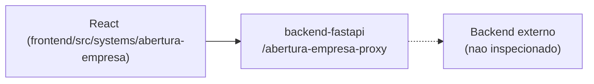

## 6. Banco de dados
DESCONHECIDO — mediado pelo proxy do backend.

## 7. Autenticação e permissões
DESCONHECIDO

## 8. PWA
Perfil DESCONHECIDO | Manifest: DESCONHECIDO | Service worker: DESCONHECIDO | Offline: DESCONHECIDO

## 9. Integrações externas
Nenhuma identificada além do backend próprio.

## 10. Dependências de outros sistemas internos
- `crm-mg`, `backend-fastapi`

## 11. Variáveis de ambiente
Nenhuma `VITE_*` própria — mediado pelo proxy.

## 12. Observações de segurança e LGPD
Trata dado societário/pessoal (nome, CPF de sócios). Ver `docs/PENDENCIAS.md`.

---

## `aplicacoes/aeronord/README.md`

# Aeronord - Convocações & Recibos

## 1. Identificação
- **Slug:** `aeronord` | **Status:** producao | **Criticidade:** baixa
- **Setor responsável:** DESCONHECIDO

## 2. Função do sistema
Convocações e geração de recibos para o cliente Aeronord (sistema nomeado
por cliente específico, não genérico).

## 3. Setores que utilizam
Pessoal/DP

## 4. Stack utilizada
| Camada | Tecnologia | Versão | Observação |
|---|---|---|---|
| Frontend | React (embutido) | 19.2.6 | |
| Backend | DESCONHECIDO | DESCONHECIDO | nenhuma env var/cliente identificado; `url_producao` aponta pra `lovable.app` |

## 5. Arquitetura
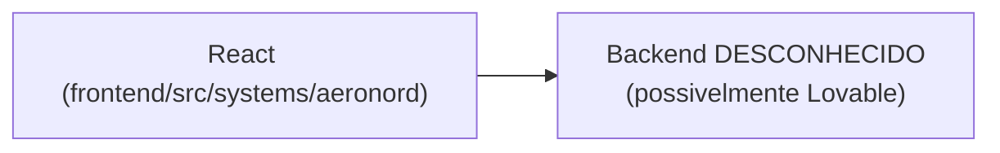

## 6. Banco de dados
DESCONHECIDO.

## 7. Autenticação e permissões
DESCONHECIDO

## 8. PWA
Perfil DESCONHECIDO | Manifest: DESCONHECIDO | Service worker: DESCONHECIDO | Offline: DESCONHECIDO

## 9. Integrações externas
DESCONHECIDO

## 10. Dependências de outros sistemas internos
- `crm-mg`

## 11. Variáveis de ambiente
Nenhuma identificada nesta rodada.

## 12. Observações de segurança e LGPD
Trata dado trabalhista do cliente Aeronord (convocações, recibos). Ver
`docs/PENDENCIAS.md`.

---

## `aplicacoes/agendamento-ferias/README.md`

# Agendamento de Férias

## 1. Identificação
- **Slug:** `agendamento-ferias` | **Status:** producao | **Criticidade:** media
- **Setor responsável:** DESCONHECIDO

## 2. Função do sistema
Agendamento e controle de férias dos colaboradores.

## 3. Setores que utilizam
Pessoal/DP, Transversal (todo colaborador agenda a própria férias)

## 4. Stack utilizada
| Camada | Tecnologia | Versão | Observação |
|---|---|---|---|
| Frontend | React (embutido, `App` em `.jsx`) | 19.2.6 | JavaScript/JSX |
| Backend | Supabase | DESCONHECIDO | |
| Notificação | EmailJS | — | |

## 5. Arquitetura
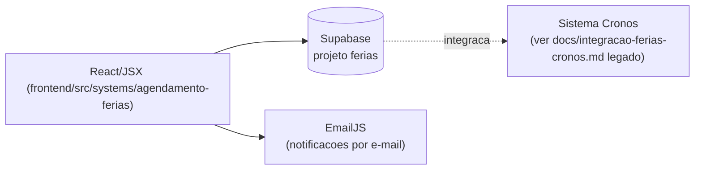

## 6. Banco de dados
PostgreSQL via Supabase (projeto `ferias`). Migrations não versionadas neste
repositório. **Nota:** este sistema já tem documentação legada própria em
`docs/integracao-ferias-cronos.md` e `docs/contrato-ferias-cronos.md` —
consultar antes de qualquer mudança na integração.

## 7. Autenticação e permissões
Supabase Auth. RBAC/papéis: DESCONHECIDO.

## 8. PWA
Perfil DESCONHECIDO | Manifest: DESCONHECIDO | Service worker: DESCONHECIDO | Offline: DESCONHECIDO

## 9. Integrações externas
- EmailJS (notificações)
- Cronos (ver docs legados citados acima)

## 10. Dependências de outros sistemas internos
- `crm-mg`

## 11. Variáveis de ambiente
| Nome | Obrigatória | Sensível | Descrição |
|---|---|---|---|
| `VITE_FERIAS_SUPABASE_URL` | sim | não | URL do projeto Supabase |
| `VITE_FERIAS_SUPABASE_ANON_KEY` | sim | não | chave anon do Supabase |
| `VITE_FERIAS_EMAILJS_PUBLIC_KEY` | não | não | chave pública EmailJS |
| `VITE_FERIAS_EMAILJS_SERVICE_ID` | não | não | ID do serviço EmailJS |
| `VITE_FERIAS_EMAILJS_TEMPLATE_ID` | não | não | ID do template EmailJS |

## 12. Observações de segurança e LGPD
Trata dado trabalhista (férias). Ver documentação legada de integração com
Cronos para detalhes de contrato de dado entre sistemas.

---

## `aplicacoes/analytics-dp/README.md`

# Analytics DP

## 1. Identificação
- **Slug:** `analytics-dp` | **Status:** producao | **Criticidade:** media
- **Setor responsável:** DESCONHECIDO

## 2. Função do sistema
DESCONHECIDO — não confirmado no banco de sistemas fornecido; nome sugere
analytics/dashboards de Departamento Pessoal. Ver `docs/PENDENCIAS.md`.

## 3. Setores que utilizam
Pessoal/DP

## 4. Stack utilizada
| Camada | Tecnologia | Versão | Observação |
|---|---|---|---|
| Frontend | React (embutido) | 19.2.6 | |
| Backend | API própria | DESCONHECIDO | repositório fora deste workspace |

## 5. Arquitetura
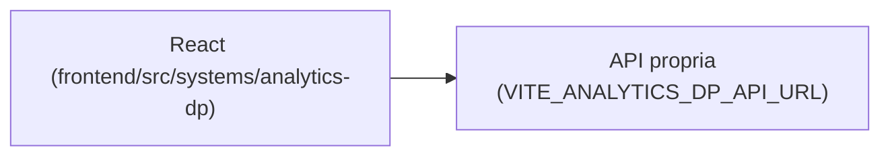

## 6. Banco de dados
DESCONHECIDO.

## 7. Autenticação e permissões
DESCONHECIDO

## 8. PWA
Perfil DESCONHECIDO | Manifest: DESCONHECIDO | Service worker: DESCONHECIDO | Offline: DESCONHECIDO

## 9. Integrações externas
Nenhuma identificada.

## 10. Dependências de outros sistemas internos
- `crm-mg`

## 11. Variáveis de ambiente
| Nome | Obrigatória | Sensível | Descrição |
|---|---|---|---|
| `VITE_ANALYTICS_DP_API_URL` | sim | não | endpoint da API de analytics de DP |

## 12. Observações de segurança e LGPD
Provável dado trabalhista agregado. Ver `docs/PENDENCIAS.md`.

---

## `aplicacoes/backend-fastapi/README.md`

# CRM MG Backend (API)

## 1. Identificação
- **Slug:** `backend-fastapi`
- **Status:** producao
- **Criticidade:** alta
- **Setor responsável (dono técnico):** TI — Núcleo Digital

## 2. Função do sistema
API FastAPI que sustenta o shell `crm-mg`: autenticação (Google OAuth + JWT
próprio), usuários, setores, clientes, registro de sistemas (o "hub" que a
navbar consulta), tarefas, controle de acesso por sistema, dashboard,
auditoria, documentos de cliente, busca, sessões e releases. Também expõe
rotas "proxy" para 5 sistemas embutidos que precisam manter algo
server-side (chave de API, cookie httpOnly): Abertura de Empresa, Dashboard
DRE, MG Prospect, Ouvidoria e ICMS Fronteira.

## 3. Setores que utilizam
- Transversal — é infraestrutura, usada indiretamente por todo o escritório
  via o shell.

## 4. Stack utilizada
| Camada | Tecnologia | Versão | Observação |
|---|---|---|---|
| Backend | FastAPI | `>=0.111.0` | `pyproject.toml` |
| Linguagem/runtime | Python | `>=3.11` (Dockerfile usa `python:3.12-slim`) | |
| ORM | SQLAlchemy (async) + asyncpg | `>=2.0.31` / `>=0.29.0` | |
| Migrations | Alembic | `>=1.13.1` | |
| Auth | pyjwt + google-auth | `>=2.8.0` / `>=2.30.0` | |
| IA | openai (lib) | `>=1.30.0` | usada em `app/services/ai_service.py` |
| Empacotamento | uv (`pip install uv`) | — | Dockerfile |

## 5. Arquitetura
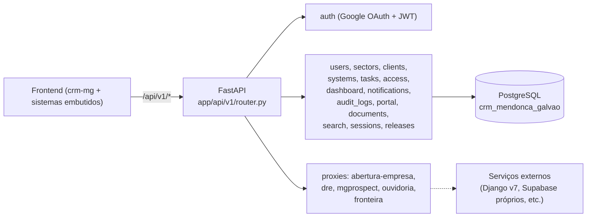

## 6. Banco de dados
PostgreSQL próprio (`crm_mendonca_galvao`), gerenciado via Alembic. Detalhe
completo (todas as tabelas mapeadas em `app/models/`) em [`BANCO.md`](./BANCO.md).

## 7. Autenticação e permissões
- **Método:** Login via Google OAuth (`google-auth`), emissão de JWT próprio
  (`pyjwt`) consumido pelo frontend e pelos outros sistemas que confiam no
  mesmo `JWT_SECRET`.
- **RBAC:** sim — `usuarios.perfil` + `usuarios.setor` +
  `usuario_sistema_acessos` (concessão de acesso por sistema, complementar à
  visibilidade por setor). Papéis exatos (`perfil`) não estão em um enum
  Python explícito visto nesta rodada — DESCONHECIDO os valores possíveis.
- Restrição de domínio de e-mail no login (`GOOGLE_ALLOWED_DOMAIN`, default
  `mendoncagalvao.com.br`) + lista de e-mails avulsos liberados
  (`GOOGLE_ALLOWED_EMAILS`).

## 8. PWA
- **Perfil:** nao-aplicavel (é uma API, não uma UI)

## 9. Integrações externas
- Google OAuth (login)
- OpenAI (features de IA — ver `app/services/ai_service.py`)
- Evolution API (WhatsApp) — configurada mas uso concreto não confirmado nesta rodada
- n8n (webhooks da Ouvidoria — `OUVIDORIA_N8N_*_WEBHOOK_URL`)

## 10. Dependências de outros sistemas internos
- Nenhuma — é a base que os outros dependem, não o contrário.

## 11. Variáveis de ambiente
| Nome | Obrigatória | Sensível | Descrição |
|---|---|---|---|
| `POSTGRES_HOST` / `PORT` / `USER` / `PASSWORD` / `DB` | sim | senha sim | conexão com o Postgres |
| `JWT_SECRET` | sim | sim | assinatura dos tokens — sem default no código (correto) |
| `JWT_EXPIRATION_SECONDS` | não (default 604800) | não | TTL do token |
| `GOOGLE_CLIENT_ID` | sim (pro login funcionar) | não | client id OAuth |
| `GOOGLE_ALLOWED_DOMAIN` | não (default `mendoncagalvao.com.br`) | não | domínio de e-mail liberado pro login |
| `GOOGLE_ALLOWED_EMAILS` | não | não | lista de e-mails avulsos liberados |
| `OPENAI_API_KEY` | não | sim | features de IA |
| `DASHBOARD_DRE_SENHA` | não | sim | senha repassada só server-side ao proxy do Dashboard DRE |
| `OUVIDORIA_SUPABASE_URL` / `OUVIDORIA_SUPABASE_SERVICE_ROLE_KEY` | não | a service role key sim | operações server-side do proxy da Ouvidoria |
| `OUVIDORIA_N8N_*_WEBHOOK_URL` (4 variáveis) | não | não | webhooks de triagem/resumo/chat/knowledge |
| `FRONTEIRA_V8_API_URL` | não | não | URL do backend do ICMS Fronteira v8 |
| `EVOLUTION_API_URL` / `EVOLUTION_API_KEY` / `EVOLUTION_INSTANCE` | não | a key sim | integração WhatsApp |
| `BACKEND_CORS_ORIGINS` | não (default localhost) | não | origens liberadas por CORS |

## 12. Observações de segurança e LGPD
- **[ALTO]** `POSTGRES_PASSWORD` e `EVOLUTION_API_KEY` têm **default
  hardcoded no código-fonte** (`app/core/config.py:16` e `:56`) em vez de
  obrigatórios sem default (como `JWT_SECRET` corretamente é). Ver
  `docs/PENDENCIAS.md`.
- `OUVIDORIA_SUPABASE_SERVICE_ROLE_KEY` (bypassa RLS do Supabase da
  Ouvidoria) fica configurada neste backend — amplia a superfície de
  exposição de um dado sensível (denúncias). Ver `docs/PENDENCIAS.md`.
- Trata dado pessoal de usuários (`usuarios`) e de clientes do escritório
  (`clientes`, `documentos`) — sem política de retenção documentada no
  código.

---

## `aplicacoes/backend-fastapi/INSTALACAO.md`

# CRM MG Backend — Instalação

## 1. Pré-requisitos
- Python `>=3.11` (Dockerfile de produção usa `python:3.12-slim`)
- [`uv`](https://github.com/astral-sh/uv) para instalar dependências (usado no Dockerfile: `pip install uv && uv pip install --system -e .`)
- Docker + Docker Compose (para rodar `postgres` localmente via `docker-compose.yml` da raiz)

## 2. Clonagem e instalação
```bash
git clone <repositorio>
cd backend-fastapi
pip install uv
uv pip install --system -e .
# ou, para desenvolvimento com testes/lint:
uv pip install --system -e ".[dev]"
```

## 3. Configuração de `.env`
Copiar o `.env.example` da **raiz do repositório** (não há um específico do
backend):
```bash
cp .env.example .env
```
Preencher pelo menos:

| Variável | Onde obter |
|---|---|
| `JWT_SECRET` | gerar com `openssl rand -base64 48` — nunca reaproveitar entre ambientes |
| `GOOGLE_CLIENT_ID` | Google Cloud Console, projeto OAuth do CRM |
| `POSTGRES_PASSWORD` | definir uma senha forte — **não usar o default hardcoded no código** (ver `docs/PENDENCIAS.md`) |
| `OPENAI_API_KEY` | painel da OpenAI, se for usar features de IA |

Segredos (`JWT_SECRET`, `POSTGRES_PASSWORD`, `OPENAI_API_KEY`,
`EVOLUTION_API_KEY`, `OUVIDORIA_SUPABASE_SERVICE_ROLE_KEY`) devem vir de um
cofre de segredos em produção (Coolify tem gestão de env vars própria) —
nunca do repositório.

## 4. Subida do banco
Via `docker-compose.yml` da raiz:
```bash
docker compose up -d postgres pgadmin
```
Depois, aplicar as migrations:
```bash
cd backend-fastapi
alembic upgrade head
```
Não há seed automático de dados de exemplo além dos scripts soltos na raiz
do repo (`sistemas_seed.sql`, `cadastro_dashboard_dre.sql`, etc.) — rodar
manualmente se precisar de dado de exemplo.

## 5. Execução em desenvolvimento
```bash
cd backend-fastapi
uvicorn app.main:app --reload --port 8080
```
Ou via Docker Compose (usa o mesmo `Dockerfile`):
```bash
docker compose up -d backend
```
Porta padrão: `8080` dentro do container; publicada no host via
`HOST_BACKEND_PORT` (default `8089` no `.env.example`).

## 6. Build e execução em produção
```bash
docker build -t crm-mg-backend ./backend-fastapi
docker run -p 8080:8080 --env-file .env crm-mg-backend
```
O `CMD` do Dockerfile já sobe com `uvicorn app.main:app --host 0.0.0.0 --port 8080`.

## 7. Deploy (Coolify)
1. Coolify builda a partir do `docker-compose.yml` da raiz (serviço `backend`).
2. Configurar as env vars de produção no painel do Coolify (nunca no repo).
3. Aplicar migrations pendentes (`alembic upgrade head`) antes ou logo após
   o deploy — não há passo automático de migration no Dockerfile.
4. Sem healthcheck explícito identificado para o serviço `backend` no
   `docker-compose.yml` (o `postgres` tem; o `backend` não) — considerar
   adicionar um antes de depender de rollback automático por healthcheck.

## 8. Verificação pós-instalação
- [ ] `GET /api/v1/...` (algum endpoint de health/status — não identificado
      explicitamente; confirmar se existe `/health` ou usar
      `/docs` do FastAPI pra checar que a API subiu)
- [ ] Login via Google OAuth completa e retorna um JWT válido
- [ ] `alembic current` mostra a revisão esperada (sem migrations pendentes)
- [ ] Frontend consegue chamar `/api/v1/sistemas` e listar os sistemas cadastrados

## 9. Troubleshooting
- **Backend sobe mas todo endpoint autenticado falha** — checar se
  `JWT_SECRET` do backend é o **mesmo** configurado no frontend/outros
  serviços que validam o token.
- **Erro de conexão com Postgres** — lembrar que `POSTGRES_HOST`/`PORT` são
  sobrescritos automaticamente para `postgres:5432` quando rodando via
  Docker Compose; ao rodar o backend fora do compose (ex.: `pytest` direto
  no host), apontar para `localhost:${HOST_POSTGRES_PORT}` (ver comentário
  no `.env.example`).
- **Login Google falha silenciosamente para e-mail correto** — checar
  `GOOGLE_ALLOWED_DOMAIN`/`GOOGLE_ALLOWED_EMAILS`: por padrão só e-mails
  `@mendoncagalvao.com.br` são aceitos.

---

## `aplicacoes/backend-fastapi/BANCO.md`

# CRM MG Backend — Banco de Dados

- **Engine:** PostgreSQL
- **Provedor:** Docker Compose local (serviço `postgres` do `docker-compose.yml` raiz) / Coolify em produção
- **Nome lógico:** `crm_mendonca_galvao`

## Diagrama ER (a partir de `app/models/*.py`)

```mermaid
erDiagram
  usuarios ||--o{ tarefas : "responsavel_id"
  usuarios ||--o{ notificacoes : "usuario_id"
  usuarios ||--o{ user_sessions : "usuario_id"
  usuarios ||--o{ usuario_sistema_acessos : "usuario_id"
  usuarios ||--o{ system_access_logs : "usuario_id"
  sistemas ||--o{ usuario_sistema_acessos : "sistema_id"
  sistemas ||--o{ system_access_logs : "sistema_id"
  clientes ||--o{ tarefas : "cliente_id"
  clientes ||--o{ documentos : "cliente_id"
  clientes ||--o{ client_tokens : "cliente_id"
  releases ||--o{ release_notes : "release_id"

  usuarios {
    uuid id PK
    string nome
    string email UK
    string perfil
    string setor
    bool ativo
    string visibilidade_sistemas
    string foto_perfil
    datetime data_criacao
  }
  sistemas {
    uuid id PK
    string nome
    string slug UK
    string categoria
    string setor
    string url
    string icone
    bool ativo
  }
  setores {
    uuid id PK
    string codigo UK
    string nome
    string cor
    bool ativo
    string visibilidade_sistemas
    jsonb setores_visiveis
  }
  clientes {
    uuid id PK
    string razao_social
    string cnpj UK
    string regime_tributario
    string status_cnpj
    string documentos_exigidos
  }
  tarefas {
    uuid id PK
    string titulo
    uuid cliente_id FK
    uuid responsavel_id FK
    string status
    string prioridade
    datetime data_vencimento
    datetime data_conclusao
  }
  notificacoes {
    uuid id PK
    uuid usuario_id FK
    string titulo
    string mensagem
    bool lida
  }
  documentos {
    uuid id PK
    uuid cliente_id FK
    string nome_arquivo
    string caminho_storage
    string enviado_por
    string status
    string competencia
  }
  logs_auditoria {
    bigint id PK
    uuid usuario_id
    string acao
    string alvo
    jsonb detalhes
  }
  user_sessions {
    uuid id PK
    uuid usuario_id FK
    datetime inicio
    datetime fim
    string ip_address
    bool ativa
  }
  usuario_sistema_acessos {
    bigint id PK
    uuid usuario_id FK
    uuid sistema_id FK
    datetime granted_at
    uuid granted_by
  }
  system_access_logs {
    bigint id PK
    uuid usuario_id FK
    uuid sistema_id FK
    datetime inicio
    datetime fim
    int duracao_segundos
  }
  client_tokens {
    uuid id PK
    uuid cliente_id FK
    string token UK
    datetime data_expiracao
    bool ativo
  }
  releases {
    uuid id PK
    string version UK
    datetime released_at
  }
  release_notes {
    uuid id PK
    uuid release_id FK
    string system_name
    string description
  }
```

## Tabelas — finalidade e FKs

| Tabela | Finalidade | Colunas-chave | FKs |
|---|---|---|---|
| `usuarios` | Conta de cada colaborador com acesso ao CRM | `perfil`, `setor`, `visibilidade_sistemas` | — |
| `sistemas` | Registro de cada aplicação do ecossistema — é a fonte usada por `sistemas_seed.sql` | `slug` (único), `categoria`, `setor` | — |
| `setores` | Setores do escritório | `codigo`, `visibilidade_sistemas`, `setores_visiveis` (jsonb) | — |
| `clientes` | Empresas-cliente do escritório | `cnpj` (único), `regime_tributario` | — |
| `tarefas` | Tarefas internas ligadas a um cliente/responsável | `status`, `prioridade` | `cliente_id` → `clientes`, `responsavel_id` → `usuarios` |
| `notificacoes` | Notificações do sino/mensagens no Header | `lida` | `usuario_id` → `usuarios` |
| `documentos` | Documentos enviados por/para um cliente | `enviado_por`, `status`, `competencia` | `cliente_id` → `clientes` |
| `logs_auditoria` | Trilha de auditoria de ações no CRM | `acao`, `alvo`, `detalhes` (jsonb) | `usuario_id` (sem FK declarada no model) |
| `user_sessions` | Sessões ativas/históricas de login | `ativa`, `ip_address` | `usuario_id` → `usuarios` |
| `usuario_sistema_acessos` | Concessão explícita de acesso a um sistema (além da visibilidade por setor) | `granted_at`, `granted_by` | `usuario_id` → `usuarios`, `sistema_id` → `sistemas` |
| `system_access_logs` | Log de uso de cada sistema por usuário (tempo de sessão) | `duracao_segundos` | `usuario_id` → `usuarios`, `sistema_id` → `sistemas` |
| `client_tokens` | Token de acesso temporário do portal do cliente | `token` (único), `data_expiracao`, `ativo` | `cliente_id` → `clientes` |
| `releases` / `release_notes` | Changelog do CRM mostrado no Header | `version` (único) | `release_notes.release_id` → `releases` |

## Migrations
Alembic (`backend-fastapi/alembic/`, config em `alembic.ini`). Para criar uma
nova migration:
```bash
cd backend-fastapi
alembic revision --autogenerate -m "descricao_da_mudanca"
alembic upgrade head
```

## RLS (Row Level Security)
**Não aplicável neste banco** — o acesso é inteiramente mediado pela API
FastAPI (controle de acesso feito em código Python, não em policy de banco).
Isso significa que a autorização depende 100% de cada endpoint checar
corretamente o usuário — não há uma segunda camada de defesa no banco em si.
**Risco a avaliar com o time:** se algum endpoint tiver uma checagem de
autorização incompleta, não há RLS pra conter o acesso indevido — diferente
dos sistemas que usam Supabase diretamente (que têm RLS como camada
adicional).

## LGPD
- Tabelas com dado pessoal: `usuarios` (nome, e-mail, foto), `clientes`
  (razão social, CNPJ, contato, WhatsApp), `documentos` (arquivos de
  cliente, podem conter qualquer dado pessoal/fiscal), `logs_auditoria`
  (rastreia ações por `usuario_id`), `user_sessions` (IP, user agent).
- **Retenção:** não há coluna de expiração/exclusão automática identificada
  em nenhuma dessas tabelas (exceto `client_tokens`, que expira por design).
  `logs_auditoria` e `system_access_logs` acumulam indefinidamente.
- **Exclusão a pedido do titular:** não há endpoint de exclusão de dado de
  usuário/cliente identificado nesta rodada — ver `docs/PENDENCIAS.md`.

---

## `aplicacoes/bimg/README.md`

# BIMG - Business Intelligence

## 1. Identificação
- **Slug:** `bimg` | **Status:** producao | **Criticidade:** media
- **Setor responsável:** DESCONHECIDO

## 2. Função do sistema
Plataforma de Business Intelligence e análise de dados (descrição do banco
de sistemas — `sistemas_seed.sql`).

## 3. Setores que utilizam
Contábil

## 4. Stack utilizada
| Camada | Tecnologia | Versão | Observação |
|---|---|---|---|
| Frontend | React (embutido) | 19.2.6 | |
| Backend | Supabase + API própria complementar | DESCONHECIDO | |

## 5. Arquitetura
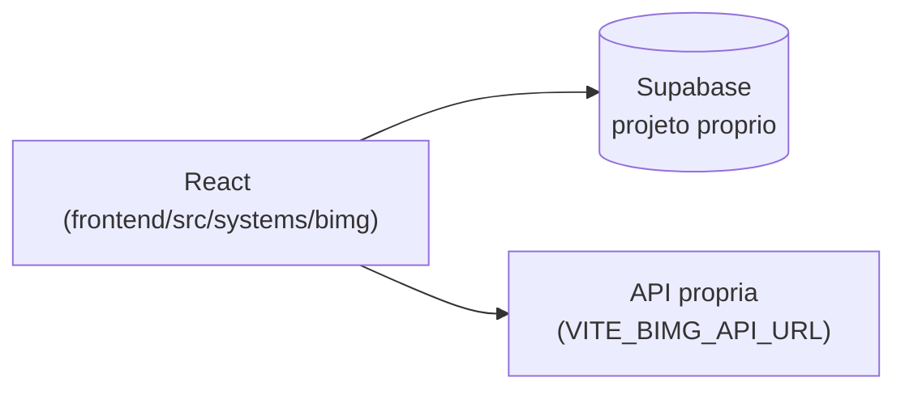

## 6. Banco de dados
PostgreSQL via Supabase (projeto dedicado). Não detalhado nesta rodada.

## 7. Autenticação e permissões
Supabase Auth. RBAC/papéis: DESCONHECIDO.

## 8. PWA
Perfil DESCONHECIDO | Manifest: DESCONHECIDO | Service worker: DESCONHECIDO | Offline: DESCONHECIDO

## 9. Integrações externas
Nenhuma identificada.

## 10. Dependências de outros sistemas internos
- `crm-mg`

## 11. Variáveis de ambiente
| Nome | Obrigatória | Sensível | Descrição |
|---|---|---|---|
| `VITE_BIMG_SUPABASE_URL` | sim | não | URL do projeto Supabase |
| `VITE_BIMG_SUPABASE_ANON_KEY` | sim | não | chave anon do Supabase |
| `VITE_BIMG_API_URL` | não | não | API própria complementar |

## 12. Observações de segurança e LGPD
Trata dado analítico — se inclui dado pessoal identificável não foi
confirmado. Ver `docs/PENDENCIAS.md`.

---

## `aplicacoes/calculadora-rescisao/README.md`

# Calculadora de Rescisão

## 1. Identificação
- **Slug:** `calculadora-rescisao` | **Status:** producao | **Criticidade:** baixa
- **Setor responsável:** DESCONHECIDO

## 2. Função do sistema
Cálculo de rescisões trabalhistas.

## 3. Setores que utilizam
Pessoal/DP

## 4. Stack utilizada
| Camada | Tecnologia | Versão | Observação |
|---|---|---|---|
| Frontend | React (embutido) | 19.2.6 | |
| Backend | Nenhum identificado — aparenta ser calculadora 100% client-side | nao_aplicavel | ver `docs/PENDENCIAS.md` |

## 5. Arquitetura
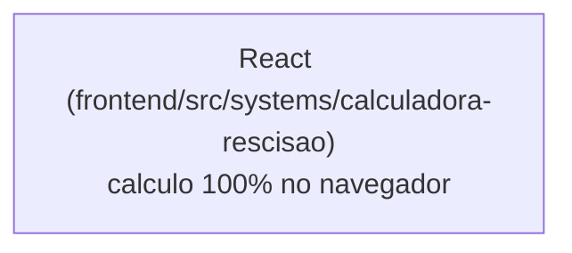

## 6. Banco de dados
Nenhum — sem cliente Supabase nem env var de API encontrado.

## 7. Autenticação e permissões
DESCONHECIDO

## 8. PWA
Perfil DESCONHECIDO | Manifest: DESCONHECIDO | Service worker: DESCONHECIDO | Offline: DESCONHECIDO

## 9. Integrações externas
Nenhuma identificada.

## 10. Dependências de outros sistemas internos
- `crm-mg`

## 11. Variáveis de ambiente
Nenhuma identificada.

## 12. Observações de segurança e LGPD
Se de fato é 100% client-side (a confirmar), não armazena dado pessoal —
processa só na sessão do navegador. Boa notícia de LGPD, mas precisa de
confirmação formal do time (ver `docs/PENDENCIAS.md`).

---

## `aplicacoes/calculo-adiantamento/README.md`

# Cálculo Adiantamento

## 1. Identificação
- **Slug:** `calculo-adiantamento` | **Status:** producao | **Criticidade:** baixa
- **Setor responsável:** DESCONHECIDO

## 2. Função do sistema
Cálculo de adiantamentos salariais.

## 3. Setores que utilizam
Pessoal/DP

## 4. Stack utilizada
| Camada | Tecnologia | Versão | Observação |
|---|---|---|---|
| Frontend | React (embutido) | 19.2.6 | |
| Backend | Supabase | DESCONHECIDO | |

## 5. Arquitetura
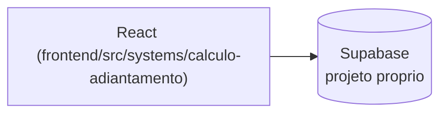

## 6. Banco de dados
PostgreSQL via Supabase (projeto dedicado). Não detalhado nesta rodada.

## 7. Autenticação e permissões
Supabase Auth. RBAC/papéis: DESCONHECIDO.

## 8. PWA
Perfil DESCONHECIDO | Manifest: DESCONHECIDO | Service worker: DESCONHECIDO | Offline: DESCONHECIDO

## 9. Integrações externas
Nenhuma identificada.

## 10. Dependências de outros sistemas internos
- `crm-mg`

## 11. Variáveis de ambiente
| Nome | Obrigatória | Sensível | Descrição |
|---|---|---|---|
| Nome exato não confirmado (`VITE_*_SUPABASE_URL`) | DESCONHECIDO | não | ver `docs/PENDENCIAS.md` |

## 12. Observações de segurança e LGPD
Trata dado trabalhista/salarial. Ver `docs/PENDENCIAS.md`.

---

## `aplicacoes/calculo-comissao/README.md`

# Sistema de Cálculo de Comissão

## 1. Identificação
- **Slug:** `calculo-comissao` | **Status:** producao | **Criticidade:** baixa
- **Setor responsável:** DESCONHECIDO

## 2. Função do sistema
Cálculo de comissões de vendas.

## 3. Setores que utilizam
Pessoal/DP

## 4. Stack utilizada
| Camada | Tecnologia | Versão | Observação |
|---|---|---|---|
| Frontend | React (embutido) | 19.2.6 | |
| Backend | Nenhum identificado — aparenta ser calculadora 100% client-side | nao_aplicavel | ver `docs/PENDENCIAS.md` |

## 5. Arquitetura
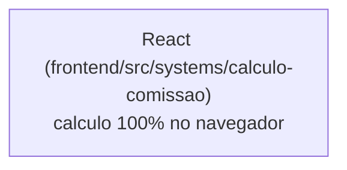

## 6. Banco de dados
Nenhum — sem cliente Supabase nem env var de API encontrado.

## 7. Autenticação e permissões
DESCONHECIDO

## 8. PWA
Perfil DESCONHECIDO | Manifest: DESCONHECIDO | Service worker: DESCONHECIDO | Offline: DESCONHECIDO

## 9. Integrações externas
Nenhuma identificada.

## 10. Dependências de outros sistemas internos
- `crm-mg`

## 11. Variáveis de ambiente
Nenhuma identificada.

## 12. Observações de segurança e LGPD
Se de fato é 100% client-side (a confirmar), não armazena dado pessoal. Ver
`docs/PENDENCIAS.md`.

---

## `aplicacoes/carne-leao/README.md`

# Carnê-Leão (Contábil Script)

## 1. Identificação
- **Slug:** `carne-leao` | **Status:** producao | **Criticidade:** baixa
- **Setor responsável:** DESCONHECIDO

## 2. Função do sistema
DESCONHECIDO — o backend real está em um repositório externo
(`PROJETO-CARNE-LEAO`, citado em comentário de `registry.tsx`), não incluído
neste workspace. Nome sugere apuração de Carnê-Leão (IRPF de pessoa física).

## 3. Setores que utilizam
Societário

## 4. Stack utilizada
| Camada | Tecnologia | Versão | Observação |
|---|---|---|---|
| Frontend | React (embutido) | 19.2.6 | slug real no banco: `contabil-script-estatico` |
| Backend | API própria (repo externo, hospedado na Vercel) | DESCONHECIDO | |

## 5. Arquitetura
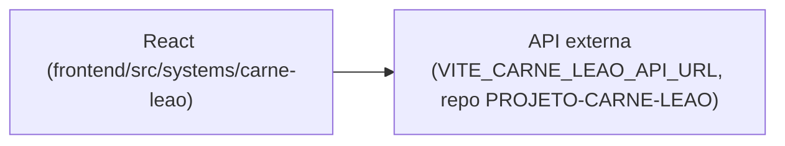

## 6. Banco de dados
DESCONHECIDO.

## 7. Autenticação e permissões
DESCONHECIDO

## 8. PWA
Perfil DESCONHECIDO | Manifest: DESCONHECIDO | Service worker: DESCONHECIDO | Offline: DESCONHECIDO

## 9. Integrações externas
Nenhuma além do próprio backend externo.

## 10. Dependências de outros sistemas internos
- `crm-mg`

## 11. Variáveis de ambiente
| Nome | Obrigatória | Sensível | Descrição |
|---|---|---|---|
| `VITE_CARNE_LEAO_API_URL` | sim | não | endpoint do backend externo (repo PROJETO-CARNE-LEAO) |

## 12. Observações de segurança e LGPD
Provável dado fiscal de pessoa física — sem confirmação (backend fora do
workspace). Ver `docs/PENDENCIAS.md`.

---

## `aplicacoes/central-suporte/README.md`

# Central de Suporte

## 1. Identificação
- **Slug:** `central-suporte`
- **Status:** producao
- **Criticidade:** alta
- **Setor responsável (dono técnico):** TI — Núcleo Digital

## 2. Função do sistema
Sistema de chamados e suporte técnico interno do escritório. Cobre abertura
conversacional de chamado (decision tree em chat), Kanban de atendimento,
chat flutuante em tempo real, relatórios/KPIs, gestão de incidentes, tarefas
automatizadas e consulta/auditoria de chamados arquivados.

## 3. Setores que utilizam
- Transversal — usado por todo o escritório como solicitante; mantido e
  operado pelo TI.

## 4. Stack utilizada
| Camada | Tecnologia | Versão | Observação |
|---|---|---|---|
| Frontend | React (embutido no shell crm-mg) | 19.2.6 | TypeScript, Vite compartilhado com o monorepo |
| UI | shadcn/ui + Tailwind (tokens próprios do sistema, distintos do `@mg/ui`) | — | Ver `frontend/src/systems/central-suporte/components/ui/` |
| Backend | Supabase (PostgREST + Realtime + Storage) | DESCONHECIDO | Projeto Supabase dedicado deste sistema |
| Gráficos | Recharts | — | Página de Relatórios |
| Drag-and-drop | @hello-pangea/dnd | — | Kanban |

## 5. Arquitetura
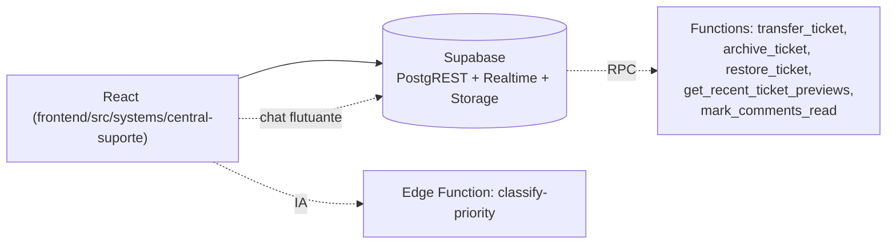

## 6. Banco de dados
PostgreSQL via Supabase, projeto dedicado. Tabelas principais: `tickets`,
`comments`, `attachments`, `categories`, `subcategories`, `sectors`,
`profiles`, `user_roles`, `incidents`, `task_instances`, `notifications`.
Migrations vivem como SQL solto em
`frontend/src/systems/central-suporte/integrations/supabase/migrations/` —
**não são aplicadas automaticamente**, precisam ser rodadas manualmente no
SQL Editor do Supabase a cada deploy que precisar delas. Detalhe completo em
[`BANCO.md`](./BANCO.md).

## 7. Autenticação e permissões
- **Método:** Supabase Auth (Google OAuth)
- **RBAC:** sim — roles em `user_roles`: `admin_ti`, `direction`,
  `coordinator` (+ variantes por setor: `coordinator_sp/sc/sf/fn/rh`),
  `support_agent`, `dev`, `viewer`, e roles de setor não-TI (`dp`, `fiscal`,
  `contabil`, `financeiro`, `societario`, `recepcao`, `rh`) que só têm
  acesso de solicitante.
- Só `admin_ti` pode trocar o solicitante de um chamado (`canEditRequester`
  no client + trigger `enforce_requester_change_admin_only` no banco).

## 8. PWA
- **Perfil:** nao-aplicavel (roda embutido no shell crm-mg)
- **Manifest:** não
- **Service worker:** não
- **Offline:** nenhum

## 9. Integrações externas
- Nenhuma integração de terceiros identificada (fora do próprio Supabase e
  de uma Edge Function de IA para classificação de prioridade).

## 10. Dependências de outros sistemas internos
- `crm-mg` — hospeda a navbar/shell e a autenticação de sessão do usuário.

## 11. Variáveis de ambiente
| Nome | Obrigatória | Sensível | Descrição |
|---|---|---|---|
| `VITE_SUPORTE_SUPABASE_URL` | sim | não | URL do projeto Supabase |
| `VITE_SUPORTE_SUPABASE_PUBLISHABLE_KEY` | sim | não | chave anon/publishable |

## 12. Observações de segurança e LGPD
- Trata dado pessoal (nome, e-mail, conteúdo de chamados e anexos). Sem
  política de retenção documentada.
- RLS parcial — a auditoria feita nesta sessão (fora do escopo deste
  inventário, ver histórico de PRs) já cobriu e corrigiu alguns gaps
  (ex.: trigger de proteção de `requester_id`), mas uma revisão completa de
  todas as policies de `tickets`/`comments`/`attachments` não foi refeita
  aqui — ver `docs/PENDENCIAS.md`.

---

## `aplicacoes/central-suporte/INSTALACAO.md`

# Central de Suporte — Instalação

> Este sistema roda **embutido** no monorepo `frontend/` do crm-mg — não tem
> `npm install`/build próprios. Os passos abaixo cobrem só o que é
> específico deste sistema; a instalação geral do monorepo está em
> `docs/aplicacoes/crm-mg/INSTALACAO.md`.

## 1. Pré-requisitos
- Node.js — versão exata DESCONHECIDA (sem `.nvmrc`/`engines` encontrado no
  `frontend/package.json`); usar uma versão recente com suporte a Vite 8 e
  React 19.
- Acesso a um projeto Supabase próprio deste sistema (URL + chave anon) —
  peça ao time de TI, não há projeto de teste documentado.

## 2. Clonagem e instalação
```bash
git clone <repositorio>
cd frontend
npm install
```
(instala as dependências de **todo** o monorepo frontend, não só deste
sistema — não há `package.json` isolado para `central-suporte`.)

## 3. Configuração de `.env`
Não há `.env.example` específico deste sistema no repositório. As variáveis
usadas (ver seção 11 do README) precisam ser adicionadas ao `.env` do
`frontend/` (raiz do workspace Vite):

```
VITE_SUPORTE_SUPABASE_URL=https://<seu-projeto>.supabase.co
VITE_SUPORTE_SUPABASE_PUBLISHABLE_KEY=<chave-anon-do-projeto>
```

Peça esses valores ao responsável pelo projeto Supabase — **nunca** commitar
um `.env` com valores reais.

## 4. Banco de dados
1. Criar (ou obter acesso a) um projeto Supabase.
2. Rodar manualmente, em ordem, todo o SQL em
   `frontend/src/systems/central-suporte/integrations/supabase/migrations/`
   pelo SQL Editor do Supabase — **não há runner automático** (ver
   `BANCO.md`).
3. Confirmar que as RLS policies citadas em `BANCO.md` existem antes de
   liberar o ambiente pra uso real.

## 5. Execução em desenvolvimento
```bash
cd frontend
npm run dev
```
Sobe o Vite dev server (porta padrão do Vite, 5173, salvo override). O
sistema fica acessível dentro do shell do CRM, na rota configurada pelo
registry (`central-de-suporte` / `central-suporte`, ver
`frontend/src/systems/registry.tsx`).

## 6. Build e execução em produção
```bash
cd frontend
npm run build   # roda build dos workspaces (@mg/ui, @mg/tokens) + tsc -b + vite build
npm run preview # opcional, serve o build local
```
O build gera o bundle de **todo** o monorepo frontend (todos os 25
sistemas), não só deste.

## 7. Deploy
Deploy é feito junto com o `crm-mg` shell inteiro via Coolify — ver
`docs/aplicacoes/crm-mg/INSTALACAO.md` seção 7. Não há deploy isolado deste
sistema.

## 8. Verificação pós-instalação
- [ ] Login via Google OAuth funciona e mostra o menu "Central de Suporte" na navbar
- [ ] Abrir um chamado de teste pelo fluxo conversacional (`/portal/new-ticket-ti`)
- [ ] Chamado aparece no Kanban (`/admin/kanban`)
- [ ] Comentar no chamado atualiza em tempo real (Realtime do Supabase) no chat flutuante
- [ ] Upload de anexo funciona (confirma que o bucket do Storage está criado)

## 9. Troubleshooting

- **Erro `new row violates row-level security policy for table 'tickets'`
  ao criar chamado** — já ocorreu em produção nesta sessão de
  desenvolvimento; causa raiz foi a policy de `INSERT` de `tickets` não
  cobrir o campo `opened_by_id` introduzido depois. Verificar
  `with_check` da policy de INSERT via `pg_policies`.
- **Lista de conversas do chat flutuante quebra com erro de função
  inexistente** — a função `get_recent_ticket_previews` (RPC) precisa ser
  criada manualmente via migration antes de usar a lista de conversas; sem
  ela, a query falha.
- **Chamado com anexo não mostra imagem** — checar se o bucket
  `ticket-attachments` existe no Storage do projeto Supabase e se a policy
  de leitura permite `createSignedUrl` pro usuário autenticado.

---

## `aplicacoes/central-suporte/BANCO.md`

# Central de Suporte — Banco de Dados

- **Engine:** PostgreSQL
- **Provedor:** Supabase (projeto dedicado a este sistema)
- **Hospedagem:** DESCONHECIDO (Supabase Cloud ou self-hosted via Coolify — não confirmado)

## Diagrama ER (tabelas principais, a partir do código-fonte inspecionado nesta sessão)

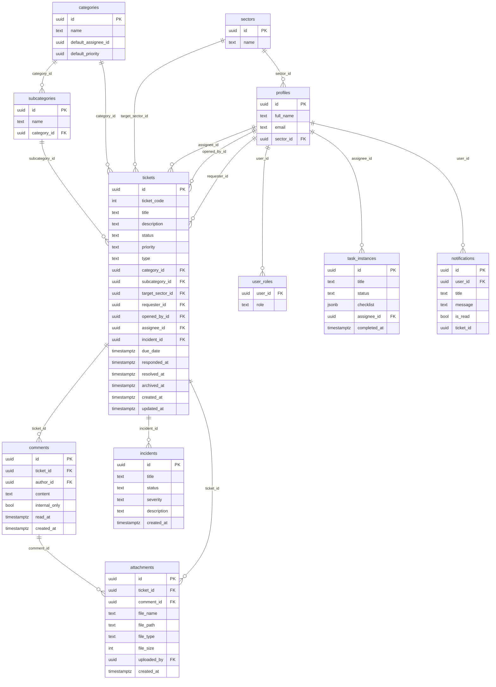

> Este diagrama foi reconstruído a partir das queries do frontend
> (`select(...)` do Supabase client em cada página/componente), não de um
> dump real do schema — colunas usadas pelo frontend estão confirmadas;
> colunas existentes no banco mas não usadas pelo frontend podem estar
> faltando aqui. Ver `docs/PENDENCIAS.md`.

## Tabelas — finalidade e chaves

| Tabela | Finalidade | Colunas-chave | FKs |
|---|---|---|---|
| `tickets` | Chamado em si | `status`, `priority`, `ticket_code` | `requester_id`, `opened_by_id`, `assignee_id`, `category_id`, `subcategory_id`, `target_sector_id`, `incident_id` → `profiles`/`categories`/`subcategories`/`sectors`/`incidents` |
| `comments` | Comentários/mensagens do chamado (chat) | `internal_only`, `read_at` | `ticket_id` → `tickets`, `author_id` → `profiles` |
| `attachments` | Anexos de chamado/comentário (Storage) | `file_path` | `ticket_id` → `tickets`, `comment_id` → `comments` |
| `profiles` | Perfil de usuário (espelha `auth.users`) | `full_name`, `email` | `sector_id` → `sectors` |
| `user_roles` | Papéis do usuário (RBAC) | `role` | `user_id` → `profiles` |
| `sectors` | Setores do escritório | `name` | — |
| `categories` / `subcategories` | Classificação do chamado | `default_assignee_id`, `default_priority` | `subcategories.category_id` → `categories` |
| `incidents` | Agrupamento automático de chamados correlatos | `status`, `severity` | — |
| `task_instances` | Tarefas de rotinas automatizadas (ex.: verificação de certificados) | `status`, `checklist` (jsonb) | `assignee_id` → `profiles` |
| `notifications` | Notificações do sino/mensagens no Header | `is_read` | `user_id` → `profiles`, `ticket_id` → `tickets` |

## Migrations

SQL solto em
`frontend/src/systems/central-suporte/integrations/supabase/migrations/`,
nomeado por timestamp (`YYYYMMDDHHmm_descricao.sql`). **Não há runner
automático** — cada migration precisa ser copiada e executada manualmente no
SQL Editor do Supabase depois do deploy do frontend que a introduziu. Isso é
uma dívida técnica real: não há garantia de que o schema em produção está
sincronizado com o que o código espera até alguém confirmar manualmente.

**Para criar uma nova migration:** adicionar um novo arquivo `.sql` nesse
diretório com timestamp atual, e documentar no PR que precisa ser rodado
manualmente (padrão já seguido nesta sessão, ver histórico de commits do
sistema).

## RLS (Row Level Security)

Não foi possível listar as policies reais (sem acesso à connection string do
projeto Supabase deste sistema nesta rodada de documentação). O que se sabe,
por auditoria feita durante o desenvolvimento desta sessão:

- `tickets`: policy de `UPDATE` restrita a roles de staff (`support_agent`,
  `dev`, `admin_ti`, coordenadores) — confirmado via `pg_policies` numa
  sessão de trabalho anterior.
- Existe um trigger (`enforce_requester_change_admin_only`) que bloqueia
  troca de `requester_id` por quem não é `admin_ti`, complementando a RLS
  (que sozinha não distingue coluna).
- **Risco sinalizado:** a policy de `INSERT` em `tickets` já teve um gap real
  encontrado e corrigido nesta sessão (exigia `auth.uid() = requester_id`,
  quebrando o fluxo de abrir chamado para outra pessoa) — não há garantia de
  que não existam gaps parecidos em outras tabelas (`comments`,
  `attachments`) que não foram reauditadas.

**Ação recomendada:** rodar `select policyname, cmd, qual, with_check from
pg_policies where schemaname = 'public'` no projeto Supabase deste sistema e
colar o resultado aqui.

## LGPD

- **Dado pessoal:** nome e e-mail do solicitante/responsável (via
  `profiles`), e o conteúdo dos chamados/comentários/anexos em si — que pode
  conter qualquer tipo de informação que o solicitante decida escrever ou
  anexar (prints de tela podem conter dado de outros sistemas).
- **Criptografia:** DESCONHECIDO (depende da configuração do Storage do
  Supabase, não inspecionada).
- **Mascaramento em log:** DESCONHECIDO.
- **Retenção:** não há política definida — chamados são "arquivados"
  (`archived_at`), não excluídos, e continuam consultáveis indefinidamente
  via tela de Consulta de Chamados.
- **Exclusão a pedido do titular:** não há fluxo de exclusão de dado
  identificado no código.

---

## `aplicacoes/conciliacao-fiscal/README.md`

# Conciliação Fiscal (FiscalMatch)

## 1. Identificação
- **Slug:** `conciliacao-fiscal` | **Status:** producao | **Criticidade:** alta
- **Setor responsável:** DESCONHECIDO

## 2. Função do sistema
Ferramenta para conciliação de notas e SPED contábil (nome interno
"FiscalMatch", conforme descrição no banco de sistemas).

## 3. Setores que utilizam
Fiscal

## 4. Stack utilizada
| Camada | Tecnologia | Versão | Observação |
|---|---|---|---|
| Frontend | React (embutido) | 19.2.6 | |
| Backend | API própria | DESCONHECIDO | repositório fora deste workspace |

## 5. Arquitetura
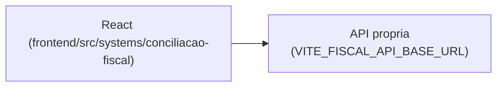

## 6. Banco de dados
DESCONHECIDO.

## 7. Autenticação e permissões
DESCONHECIDO

## 8. PWA
Perfil DESCONHECIDO | Manifest: DESCONHECIDO | Service worker: DESCONHECIDO | Offline: DESCONHECIDO

## 9. Integrações externas
Nenhuma identificada (provável integração com SPED/notas fiscais, não
confirmada em detalhe).

## 10. Dependências de outros sistemas internos
- `crm-mg`

## 11. Variáveis de ambiente
| Nome | Obrigatória | Sensível | Descrição |
|---|---|---|---|
| `VITE_FISCAL_API_BASE_URL` | sim | não | endpoint da API de conciliação fiscal |

## 12. Observações de segurança e LGPD
Trata dado fiscal de clientes. Sem confirmação de RLS/retenção. Ver
`docs/PENDENCIAS.md`.

---

## `aplicacoes/consulta-cnpj/README.md`

# Consulta CNPJ

## 1. Identificação
- **Slug:** `consulta-cnpj` | **Status:** producao | **Criticidade:** baixa
- **Setor responsável:** DESCONHECIDO

## 2. Função do sistema
DESCONHECIDO — não confirmado no banco de sistemas fornecido; o nome sugere
consulta de dados públicos de CNPJ. Ver `docs/PENDENCIAS.md`.

## 3. Setores que utilizam
Societário

## 4. Stack utilizada
| Camada | Tecnologia | Versão | Observação |
|---|---|---|---|
| Frontend | React (embutido) | 19.2.6 | |
| Backend | API própria | DESCONHECIDO | repositório fora deste workspace |

## 5. Arquitetura
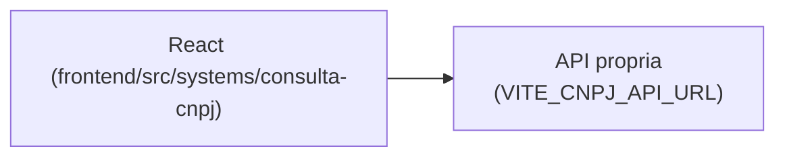

## 6. Banco de dados
DESCONHECIDO.

## 7. Autenticação e permissões
DESCONHECIDO

## 8. PWA
Perfil DESCONHECIDO | Manifest: DESCONHECIDO | Service worker: DESCONHECIDO | Offline: DESCONHECIDO

## 9. Integrações externas
- Provável API pública de CNPJ (provedor não confirmado)

## 10. Dependências de outros sistemas internos
- `crm-mg`

## 11. Variáveis de ambiente
| Nome | Obrigatória | Sensível | Descrição |
|---|---|---|---|
| `VITE_CNPJ_API_URL` | sim | não | endpoint da API de consulta de CNPJ |

## 12. Observações de segurança e LGPD
Dado público de empresa (CNPJ) — sem dado pessoal identificável esperado,
mas não confirmado.

---

## `aplicacoes/contai/README.md`

# ContAI

## 1. Identificação
- **Slug:** `contai` | **Status:** producao | **Criticidade:** media
- **Setor responsável:** DESCONHECIDO

## 2. Função do sistema
Assistente de IA para contabilidade (descrição do banco de sistemas).

## 3. Setores que utilizam
Contábil

## 4. Stack utilizada
| Camada | Tecnologia | Versão | Observação |
|---|---|---|---|
| Frontend | React (embutido) | 19.2.6 | |
| Backend | API própria | DESCONHECIDO | repositório fora deste workspace |

## 5. Arquitetura
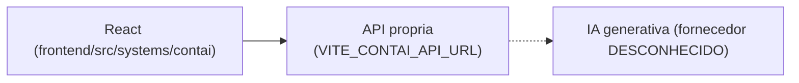

## 6. Banco de dados
DESCONHECIDO — backend fora deste workspace.

## 7. Autenticação e permissões
DESCONHECIDO

## 8. PWA
Perfil DESCONHECIDO | Manifest: DESCONHECIDO | Service worker: DESCONHECIDO | Offline: DESCONHECIDO

## 9. Integrações externas
- IA generativa (fornecedor não confirmado no frontend)

## 10. Dependências de outros sistemas internos
- `crm-mg`

## 11. Variáveis de ambiente
| Nome | Obrigatória | Sensível | Descrição |
|---|---|---|---|
| `VITE_CONTAI_API_URL` | sim | não | endpoint da API do ContAI |

## 12. Observações de segurança e LGPD
Pode processar dado contábil/fiscal de clientes via IA — retenção/uso desses
dados pelo provedor de IA não confirmado. Ver `docs/PENDENCIAS.md`.

---

## `aplicacoes/copilot-contabil/README.md`

# Copilot Contábil

## 1. Identificação
- **Slug:** `copilot-contabil` | **Status:** producao | **Criticidade:** media
- **Setor responsável:** DESCONHECIDO

## 2. Função do sistema
Copiloto inteligente para tarefas contábeis (descrição do banco de sistemas).

## 3. Setores que utilizam
Contábil

## 4. Stack utilizada
| Camada | Tecnologia | Versão | Observação |
|---|---|---|---|
| Frontend | React (embutido, `App` em `.jsx`) | 19.2.6 | JavaScript/JSX, não TypeScript |
| Backend | Supabase | DESCONHECIDO | |

## 5. Arquitetura
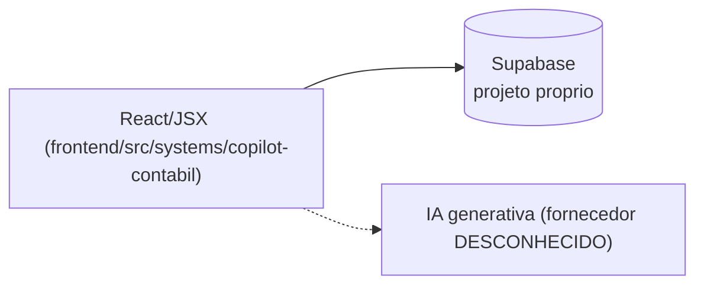

## 6. Banco de dados
PostgreSQL via Supabase (projeto dedicado). Não detalhado nesta rodada.

## 7. Autenticação e permissões
Supabase Auth. RBAC/papéis: DESCONHECIDO.

## 8. PWA
Perfil DESCONHECIDO | Manifest: DESCONHECIDO | Service worker: DESCONHECIDO | Offline: DESCONHECIDO

## 9. Integrações externas
- IA generativa (fornecedor não confirmado)

## 10. Dependências de outros sistemas internos
- `crm-mg`

## 11. Variáveis de ambiente
| Nome | Obrigatória | Sensível | Descrição |
|---|---|---|---|
| `VITE_COPILOT_SUPABASE_URL` | sim | não | URL do projeto Supabase |
| `VITE_COPILOT_SUPABASE_ANON_KEY` | sim | não | chave anon do Supabase |
| `VITE_COPILOT_API_URL` | não | não | API própria complementar |

## 12. Observações de segurança e LGPD
Pode processar dado contábil de clientes via IA. Retenção não confirmada.
Ver `docs/PENDENCIAS.md`.

---

## `aplicacoes/crm-mg/README.md`

# CRM Mendonça Galvão (shell)

## 1. Identificação
- **Slug:** `crm-mg`
- **Status:** producao
- **Criticidade:** alta
- **Setor responsável (dono técnico):** TI — Núcleo Digital

## 2. Função do sistema
Shell/hub central do escritório: tela de login (Google OAuth), navbar
global, registro/navegação entre todos os sistemas internos (25 sistemas
embutidos nativamente via `frontend/src/systems/registry.tsx`, mais
sistemas ainda em iframe), gestão de usuários/setores/clientes/tarefas,
notificações, auditoria e changelog. Resolve o problema de "cada sistema
interno vivia isolado, sem SSO nem navegação unificada".

## 3. Setores que utilizam
- Transversal — todo colaborador com acesso ao CRM passa por aqui.

## 4. Stack utilizada
| Camada | Tecnologia | Versão | Observação |
|---|---|---|---|
| Frontend | React | 19.2.6 | `frontend/package.json` |
| Linguagem | TypeScript | ~6.0.2 | |
| Build | Vite | ^8.0.12 | |
| Backend | FastAPI (ver `backend-fastapi`) | — | ficha própria |
| UI compartilhada | `@mg/ui` + `@mg/tokens` | workspace local (`packages/@mg/*`) | design system próprio, usado pelo shell e por parte dos sistemas embutidos |
| Estado servidor | `@tanstack/react-query` | — | |
| Estilo | Tailwind CSS 4 (`@tailwindcss/vite`) | — | |

## 5. Arquitetura
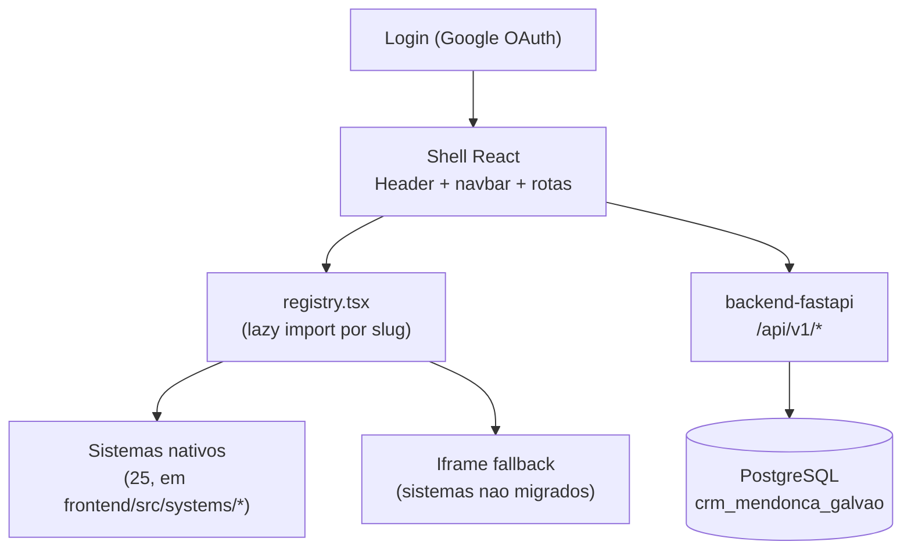

## 6. Banco de dados
O shell em si não tem banco próprio — usa o banco do `backend-fastapi`
(`crm_mendonca_galvao`) para tudo que é transversal (usuários, sistemas,
setores, notificações, auditoria). Cada sistema embutido pode ter o
**próprio** banco (Supabase dedicado ou API externa) — ver a ficha de cada
um. Detalhe completo do banco transversal:
[`../backend-fastapi/BANCO.md`](../backend-fastapi/BANCO.md).

## 7. Autenticação e permissões
- **Método:** Google OAuth (`@react-oauth/google`), token JWT emitido pelo
  `backend-fastapi` e usado pelo shell.
- **RBAC:** sim, ver `usuarios.perfil`/`setor`/`visibilidade_sistemas` e
  `usuario_sistema_acessos` (ficha do backend).

## 8. PWA
- **Perfil:** DESCONHECIDO — nenhum `manifest.json`/`vite-plugin-pwa`/
  service worker encontrado em `frontend/` nesta rodada. Ver `docs/PENDENCIAS.md`.
- **Manifest:** não
- **Service worker:** não
- **Offline:** nenhum

## 9. Integrações externas
- Google OAuth
- OpenAI (usada por sistemas embutidos via proxy do backend)
- Evolution API (WhatsApp)

## 10. Dependências de outros sistemas internos
- `backend-fastapi` — obrigatória, é a API do shell.
- Todos os 25 sistemas em `frontend/src/systems/` — dependentes do shell
  (rodam dentro dele), não o contrário.

## 11. Variáveis de ambiente
Ver [`../backend-fastapi/README.md`](../backend-fastapi/README.md) seção 11
para as variáveis de backend compartilhadas (`JWT_SECRET`,
`GOOGLE_CLIENT_ID`, etc.) e a ficha de cada sistema embutido para as
variáveis `VITE_*` específicas dele (ex.: `VITE_SUPORTE_SUPABASE_URL` do
Central de Suporte).
- `HOST_FRONTEND_PORT` (default `3009`) — porta publicada do frontend em produção via Docker Compose.

## 12. Observações de segurança e LGPD
Ver [`../backend-fastapi/README.md`](../backend-fastapi/README.md) seção 12
(a maior parte dos achados de segurança/LGPD deste inventário está no
backend, que é onde a lógica de autorização e os dados transversais vivem).

---

## `aplicacoes/crm-mg/INSTALACAO.md`

# CRM Mendonça Galvão (shell) — Instalação

> Este é o guia "mestre" — cobre o monorepo `frontend/` inteiro (shell +
> todos os sistemas embutidos) e, junto com
> [`../backend-fastapi/INSTALACAO.md`](../backend-fastapi/INSTALACAO.md),
> sobe o ambiente completo local do CRM.

## 1. Pré-requisitos
- Node.js — versão exata não fixada no repo (sem `.nvmrc`/`engines`); usar
  uma versão recente compatível com Vite 8 / React 19 (Node 20+ recomendado
  por precaução, não confirmado como requisito exato).
- Docker + Docker Compose (para o backend e o Postgres).
- Acesso aos projetos Supabase de cada sistema embutido que você for testar
  (não é preciso ter todos pra rodar o shell em si).

## 2. Clonagem e instalação
```bash
git clone <repositorio>
cd frontend
npm install
```
Isso instala as dependências de **todos** os 25 sistemas embutidos de uma
vez (é um único `package.json` na raiz do `frontend/`), mais os workspaces
locais `packages/@mg/ui` e `packages/@mg/tokens`.

## 3. Configuração de `.env`
```bash
cp .env.example .env   # na raiz do repositório
```
Ver [`../backend-fastapi/INSTALACAO.md`](../backend-fastapi/INSTALACAO.md)
seção 3 para as variáveis do backend. Para o frontend, adicionar em
`frontend/.env` as variáveis `VITE_*` de cada sistema embutido que for
testar (ex.: `VITE_SUPORTE_SUPABASE_URL` pro Central de Suporte) — ver a
ficha de cada sistema.

## 4. Subida do banco
```bash
docker compose up -d postgres pgadmin backend
cd backend-fastapi && alembic upgrade head
```

## 5. Execução em desenvolvimento
```bash
cd frontend
npm run dev
```
Sobe o Vite dev server (porta padrão 5173). O backend precisa estar rodando
à parte (`docker compose up -d backend` ou `uvicorn` local, ver ficha do
backend) — o frontend não sobe a API sozinho.

## 6. Build e execução em produção
```bash
cd frontend
npm run build
# = npm run build --workspaces --if-present && tsc -b && vite build
npm run preview
```

## 7. Deploy (Coolify)
- `docker-compose.yml` na raiz define 4 serviços: `postgres`, `pgadmin`
  (dev), `backend`, `frontend`.
- Coolify builda a partir desse compose; as env vars de build do frontend
  (todas as `VITE_*` de cada sistema embutido) precisam estar configuradas
  como *build args*, não só runtime — Vite embute env vars no bundle em
  build time.
- Deploy do frontend redeploya **todos os 25 sistemas de uma vez** (é um
  bundle único) — não há deploy incremental por sistema.
- Rollback: reverter pro build anterior no Coolify (não há healthcheck
  automático identificado para o serviço `frontend` no compose).

## 8. Verificação pós-instalação
- [ ] `http://localhost:${HOST_FRONTEND_PORT}` carrega a tela de login
- [ ] Login Google completa e mostra a navbar com os itens de menu
- [ ] Cada item de "Gestão"/"Abrir chamado" navega pro sistema esperado
- [ ] Um sistema com Supabase próprio (ex.: Central de Suporte) carrega dado real

## 9. Troubleshooting
- **Sistema embutido mostra tela em branco** — checar o console do
  navegador por erro de env var ausente (`VITE_*` daquele sistema
  específico não foi setada em build time).
- **Build falha em `tsc -b`** — geralmente um sistema embutido introduziu
  um erro de tipo; rodar `npx tsc -b` isolado pra localizar qual sistema.
- **Um sistema funciona local mas não em produção** — comum quando a env
  var `VITE_*` foi setada só no `.env` local e esquecida nos build args do
  Coolify (ver seção 7).

---

## `aplicacoes/dash-rh/README.md`

# Dash RH

## 1. Identificação
- **Slug:** `dash-rh` | **Status:** producao | **Criticidade:** media
- **Setor responsável:** DESCONHECIDO

## 2. Função do sistema
DESCONHECIDO — registrado no banco de sistemas com `setor = RESTRITO` (não
um dos setores "normais"), sem descrição no seed disponível. **Pergunta
prioritária para o time:** ver `docs/PENDENCIAS.md`.

## 3. Setores que utilizam
Pessoal/DP (setor `RESTRITO` no cadastro original — ver observação acima)

## 4. Stack utilizada
| Camada | Tecnologia | Versão | Observação |
|---|---|---|---|
| Frontend | React (embutido) | 19.2.6 | |
| Backend | DESCONHECIDO | DESCONHECIDO | nenhuma env var de API nem cliente Supabase encontrado |

## 5. Arquitetura
```mermaid
flowchart LR
  UI["React (frontend/src/systems/dash-rh)"] --> API["Backend DESCONHECIDO"]
```

## 6. Banco de dados
DESCONHECIDO.

## 7. Autenticação e permissões
DESCONHECIDO

## 8. PWA
Perfil DESCONHECIDO | Manifest: DESCONHECIDO | Service worker: DESCONHECIDO | Offline: DESCONHECIDO

## 9. Integrações externas
DESCONHECIDO

## 10. Dependências de outros sistemas internos
- `crm-mg`

## 11. Variáveis de ambiente
Nenhuma identificada nesta rodada.

## 12. Observações de segurança e LGPD
Setor `RESTRITO` sugere dado sensível de RH (possivelmente salarial ou
disciplinar) — prioridade alta pra esclarecer com o time antes de qualquer
mudança de acesso. Ver `docs/PENDENCIAS.md`.

---

## `aplicacoes/dashboard-dre/README.md`

# Dashboard DRE

## 1. Identificação
- **Slug:** `dashboard-dre` | **Status:** producao | **Criticidade:** media
- **Setor responsável:** DESCONHECIDO

## 2. Função do sistema
Dashboard de métricas do DRE (Demonstração do Resultado do Exercício).

## 3. Setores que utilizam
Contábil

## 4. Stack utilizada
| Camada | Tecnologia | Versão | Observação |
|---|---|---|---|
| Frontend | React (embutido) | 19.2.6 | |
| Backend | Proxy via `backend-fastapi` (`dre_proxy`) | — | senha própria (`DASHBOARD_DRE_SENHA`, nunca chega ao browser) |

## 5. Arquitetura
```mermaid
flowchart LR
  UI["React (frontend/src/systems/dashboard-dre)"] --> BE["backend-fastapi\n/dre-proxy"]
  BE -.-> EXT["ndmg-dev/DASH_RAZAO\n(hospedado tambem em dash-razao.vercel.app)"]
```

## 6. Banco de dados
DESCONHECIDO — mediado pelo proxy do backend.

## 7. Autenticação e permissões
Acesso protegido por senha própria do dashboard (`DASHBOARD_DRE_SENHA`,
mantida só server-side no `backend-fastapi`).

## 8. PWA
Perfil DESCONHECIDO | Manifest: DESCONHECIDO | Service worker: DESCONHECIDO | Offline: DESCONHECIDO

## 9. Integrações externas
Nenhuma além do próprio serviço DASH_RAZAO.

## 10. Dependências de outros sistemas internos
- `crm-mg`, `backend-fastapi`

## 11. Variáveis de ambiente
Nenhuma `VITE_*` própria — protegido via proxy do backend
(`DASHBOARD_DRE_SENHA`, ver ficha do `backend-fastapi`).

## 12. Observações de segurança e LGPD
Não trata dado pessoal identificado (dado financeiro agregado). Ver
`docs/PENDENCIAS.md`.

---

## `aplicacoes/documentacao-contabil/README.md`

# Documentação Contábil

## 1. Identificação
- **Slug:** `documentacao-contabil` | **Status:** producao | **Criticidade:** media
- **Setor responsável:** DESCONHECIDO

## 2. Função do sistema
DESCONHECIDO — não havia descrição para este sistema no `sistemas_seed.sql`
inspecionado; o nome sugere gestão/organização de documentos contábeis. Ver
`docs/PENDENCIAS.md`.

## 3. Setores que utilizam
Contábil

## 4. Stack utilizada
| Camada | Tecnologia | Versão | Observação |
|---|---|---|---|
| Frontend | React (embutido) | 19.2.6 | |
| Backend | API própria | DESCONHECIDO | repositório fora deste workspace |

## 5. Arquitetura
```mermaid
flowchart LR
  UI["React (frontend/src/systems/documentacao-contabil)"] --> API["API propria\n(VITE_DOCCONTABIL_API_URL)"]
```

## 6. Banco de dados
DESCONHECIDO.

## 7. Autenticação e permissões
DESCONHECIDO

## 8. PWA
Perfil DESCONHECIDO | Manifest: DESCONHECIDO | Service worker: DESCONHECIDO | Offline: DESCONHECIDO

## 9. Integrações externas
Nenhuma identificada.

## 10. Dependências de outros sistemas internos
- `crm-mg`

## 11. Variáveis de ambiente
| Nome | Obrigatória | Sensível | Descrição |
|---|---|---|---|
| `VITE_DOCCONTABIL_API_URL` | sim | não | endpoint da API de documentação contábil |

## 12. Observações de segurança e LGPD
Provável armazenamento de documentos de clientes — sem confirmação. Ver
`docs/PENDENCIAS.md`.

---

## `aplicacoes/fronteira/README.md`

# ICMS Fronteira

## 1. Identificação
- **Slug:** `fronteira` | **Status:** homologacao | **Criticidade:** alta
- **Setor responsável:** DESCONHECIDO

## 2. Função do sistema
Cálculo de ICMS fronteira. A versão embutida (v8) é código vendorizado do
repositório `tnunes8/sistema-fronteira-v8` e ainda está em homologação
contra o v7 (Django) que roda em produção — **não alterar o código original
sem confirmar com o time**, conforme aviso em `FronteiraApp.tsx`.

## 3. Setores que utilizam
Fiscal

## 4. Stack utilizada
| Camada | Tecnologia | Versão | Observação |
|---|---|---|---|
| Frontend | React (embutido, código vendorizado v8) | 19.2.6 | tokens/UI próprios (`packages/@mg-tokens`, `@mg-ui` locais deste sistema, distintos do `@mg/ui` do resto do CRM) |
| Backend | Proxy via `backend-fastapi` (`fronteira_proxy`) + backend Django v7 em produção (externo) | DESCONHECIDO | proxy responde 503 até o v8 ter ambiente publicado (`FRONTEIRA_V8_API_URL` vazio) |

## 5. Arquitetura
```mermaid
flowchart LR
  UI["React v8 vendorizado\n(frontend/src/systems/fronteira)"] --> BE["backend-fastapi\n/fronteira-proxy"]
  BE -.-> V8["Backend v8 (FastAPI + cookies httpOnly)\nainda nao publicado"]
  BE -.producao atual.-> V7["Backend Django v7\n(fronteira.mendoncagalvao.com.br)"]
```

## 6. Banco de dados
DESCONHECIDO — depende de qual backend (v7 ou v8) está ativo.

## 7. Autenticação e permissões
DESCONHECIDO (v8 usa cookies httpOnly, segundo comentário no
`backend-fastapi/app/core/config.py`).

## 8. PWA
Perfil DESCONHECIDO | Manifest: DESCONHECIDO | Service worker: DESCONHECIDO | Offline: DESCONHECIDO

## 9. Integrações externas
Nenhuma identificada além dos próprios backends v7/v8.

## 10. Dependências de outros sistemas internos
- `crm-mg`, `backend-fastapi`

## 11. Variáveis de ambiente
Nenhuma `VITE_*` própria — mediado pelo proxy do backend
(`FRONTEIRA_V8_API_URL`, ver ficha do `backend-fastapi`).

## 12. Observações de segurança e LGPD
Trata dado fiscal. Migração v7→v8 em andamento — risco de inconsistência de
dado durante a transição merece atenção do time. Ver `docs/PENDENCIAS.md`.

---

## `aplicacoes/guia-dp/README.md`

# Guia DP

## 1. Identificação
- **Slug:** `guia-dp` | **Status:** producao | **Criticidade:** baixa
- **Setor responsável:** DESCONHECIDO

## 2. Função do sistema
Guia de Departamento Pessoal e Contabilidade para clientes.

## 3. Setores que utilizam
Pessoal/DP

## 4. Stack utilizada
| Camada | Tecnologia | Versão | Observação |
|---|---|---|---|
| Frontend | React (embutido) | 19.2.6 | usa CSS Modules (`App.module.css`) |
| Backend | API própria | DESCONHECIDO | repositório fora deste workspace |

## 5. Arquitetura
```mermaid
flowchart LR
  UI["React (frontend/src/systems/guia-dp)"] --> API["API propria\n(VITE_GUIADP_API_BASE_URL)"]
```

## 6. Banco de dados
DESCONHECIDO.

## 7. Autenticação e permissões
DESCONHECIDO

## 8. PWA
Perfil DESCONHECIDO | Manifest: DESCONHECIDO | Service worker: DESCONHECIDO | Offline: DESCONHECIDO

## 9. Integrações externas
Nenhuma identificada.

## 10. Dependências de outros sistemas internos
- `crm-mg`

## 11. Variáveis de ambiente
| Nome | Obrigatória | Sensível | Descrição |
|---|---|---|---|
| `VITE_GUIADP_API_BASE_URL` | sim | não | endpoint da API do Guia DP |

## 12. Observações de segurança e LGPD
Voltado a clientes externos ao escritório — confirmar se há autenticação de
cliente e isolamento de dado entre clientes diferentes (possível caso de
multi-tenant não identificado). Ver `docs/PENDENCIAS.md`.

---

## `aplicacoes/mg-prospect/README.md`

# MG Prospect

## 1. Identificação
- **Slug:** `mg-prospect` | **Status:** producao | **Criticidade:** media
- **Setor responsável:** TI — Núcleo Digital

## 2. Função do sistema
Prospecção automática de clientes. As páginas internas (staff) foram
migradas pro CRM nativo; as páginas públicas (formulário de interesse,
unsubscribe) continuam no site original.

## 3. Setores que utilizam
TI

## 4. Stack utilizada
| Camada | Tecnologia | Versão | Observação |
|---|---|---|---|
| Frontend | React (embutido) | 19.2.6 | páginas staff apenas |
| Backend | Proxy via `backend-fastapi` (`mgprospect_proxy`) | — | |

## 5. Arquitetura
```mermaid
flowchart LR
  UI["React (frontend/src/systems/mg-prospect)"] --> BE["backend-fastapi\n/mgprospect-proxy"]
  BE -.-> EXT["Backend externo do MG Prospect\n(nao inspecionado)"]
```

## 6. Banco de dados
DESCONHECIDO — mediado pelo proxy do backend-fastapi.

## 7. Autenticação e permissões
DESCONHECIDO

## 8. PWA
Perfil DESCONHECIDO | Manifest: DESCONHECIDO | Service worker: DESCONHECIDO | Offline: DESCONHECIDO

## 9. Integrações externas
Nenhuma identificada além do próprio backend do MG Prospect.

## 10. Dependências de outros sistemas internos
- `crm-mg`, `backend-fastapi`

## 11. Variáveis de ambiente
Nenhuma `VITE_*` própria identificada — comunicação via proxy do backend.

## 12. Observações de segurança e LGPD
Trata dado de leads (nome, e-mail, telefone). Retenção não confirmada. Ver
`docs/PENDENCIAS.md`.

---

## `aplicacoes/obrigacoes-recibo/README.md`

# Obrigações — Worker de Baixa por Recibo

> Documentação legada mais detalhada existe em
> [`docs/obrigacoes-recibo-worker-readme.md`](../../obrigacoes-recibo-worker-readme.md)
> — consultar antes de qualquer mudança.

## 1. Identificação
- **Slug:** `obrigacoes-recibo` | **Status:** DESCONHECIDO (presumido ativo, junto do `obrigacoes`) | **Criticidade:** baixa
- **Setor responsável:** TI — Núcleo Digital

## 2. Função do sistema
Worker que dá baixa automática em obrigações do sistema `obrigacoes`
monitorando pastas de arquivo por recibo — roda separado do frontend porque
precisa de `service_role` (bypassa RLS) e acesso ao sistema de arquivos, dois
privilégios que nunca devem estar no browser/build do Vite.

## 3. Setores que utilizam
Transversal (mesmo público do `obrigacoes`)

## 4. Stack utilizada
| Camada | Tecnologia | Versão | Observação |
|---|---|---|---|
| Linguagem | Python | DESCONHECIDA (ver `pyproject.toml`) | `services/obrigacoes-recibo/pyproject.toml` |
| Banco | PostgreSQL (Supabase do módulo `obrigacoes`) | — | conexão direta via `DATABASE_URL`, não via PostgREST |

## 5. Arquitetura
```mermaid
flowchart LR
  FS["Pastas monitoradas\n(sistema de arquivos)"] --> WORKER["obrigacoes-recibo\n(Python, service_role)"]
  WORKER --> SB[("Supabase\nprojeto obrigacoes")]
```

## 6. Banco de dados
Mesmo banco do sistema `obrigacoes` (Supabase próprio) — este worker usa
`SUPABASE_SERVICE_ROLE_KEY` (bypassa RLS) e `DATABASE_URL` (conexão direta
Postgres), diferente do frontend que usa a chave anon.

## 7. Autenticação e permissões
Autenticação de serviço via `service_role` key — sem RBAC de usuário (é um
processo, não uma UI).

## 8. PWA
Não aplicável (não é uma UI).

## 9. Integrações externas
Nenhuma — só o Supabase do módulo `obrigacoes` e o sistema de arquivos local.

## 10. Dependências de outros sistemas internos
- `obrigacoes` — este worker existe só pra servir esse sistema.

## 11. Variáveis de ambiente
| Nome | Obrigatória | Sensível | Descrição |
|---|---|---|---|
| `SUPABASE_URL` | sim | não | Supabase do módulo `obrigacoes` (não é o do CRM) |
| `SUPABASE_SERVICE_ROLE_KEY` | sim | **sim, crítico** | bypassa RLS — nunca no frontend, nunca em variável `VITE_*` |
| `DATABASE_URL` | sim | sim | connection string direta do Postgres |
| `STORAGE_BUCKET` | não (default `obrigacoes-documentos`) | não | bucket de destino |
| `MAX_ARQUIVO_BYTES` | não (default ~25MB) | não | limite de tamanho de arquivo |
| `DEBOUNCE_SEGUNDOS` / `WORKERS` / `RECARGA_PASTAS_SEGUNDOS` / `LOG_LEVEL` | não | não | tuning do worker |

## 12. Observações de segurança e LGPD
- **[ALTO] Detém a `service_role` key do Supabase de `obrigacoes`** — é o
  único componente com esse nível de acesso; comprometer este worker
  compromete o isolamento multi-tenant inteiro do sistema `obrigacoes`.
  Merece atenção redobrada de onde/como está hospedado e quem tem acesso ao
  `.env` dele.
- Processa documento de cliente (mesmo dado sensível do `obrigacoes`).

---

## `aplicacoes/obrigacoes/README.md`

# Obrigações Acessórias

> Este sistema já tinha documentação própria e mais detalhada em
> [`docs/obrigacoes-readme.md`](../../obrigacoes-readme.md) (legado, escrito
> por quem desenvolveu o sistema) — **consultar esse arquivo antes de
> qualquer mudança**, esta ficha é um resumo padronizado pro inventário.

## 1. Identificação
- **Slug:** `obrigacoes` | **Status:** desenvolvimento | **Criticidade:** media
- **Setor responsável:** TI — Núcleo Digital

## 2. Função do sistema
Controle de entrega de obrigações acessórias, com portal do cliente. Sistema
satélite do CRM (mesmo padrão de `central-suporte`/`agendamento-ferias`):
**Supabase próprio**, SSO pelo Google ID token do CRM pro perímetro do
escritório, e uma sessão **separada** (magic link) pro perímetro do cliente.

## 3. Setores que utilizam
Transversal — qualquer setor com obrigações acessórias de cliente.

## 4. Stack utilizada
| Camada | Tecnologia | Versão | Observação |
|---|---|---|---|
| Frontend | React (embutido) | 19.2.6 | dois perímetros de rota: `/sistemas/<id>` (escritório) e `/obrigacoes/portal` (cliente, fora do AuthGuard) |
| Backend | Supabase (projeto próprio) | DESCONHECIDO | |
| Worker | `services/obrigacoes-recibo` (Python) | ver ficha própria | baixa automática por recibo |

## 5. Arquitetura
```mermaid
flowchart LR
  ESCRITORIO["Perimetro escritorio\n/sistemas/<id> — SSO Google via CRM"] --> SB[("Supabase\nprojeto obrigacoes\nmulti-tenant + RLS")]
  PORTAL["Perimetro cliente\n/obrigacoes/portal — magic link"] --> SB
  WORKER["obrigacoes-recibo\n(service_role, bypassa RLS)"] --> SB
```

## 6. Banco de dados
PostgreSQL via Supabase, **multi-tenant real** — mais de uma empresa-cliente
compartilha as mesmas tabelas, isolada por RLS usando a empresa vinda do
JWT (nunca de parâmetro de rota/query string). Migrations em
`frontend/src/systems/obrigacoes/integrations/supabase/migrations/`. Sem
`BANCO.md` detalhado nesta rodada — ver documentação legada.

## 7. Autenticação e permissões
- **Método:** SSO Google (escritório) + magic link e-mail (portal do
  cliente) — sessões e rotas completamente separadas, não é "o mesmo login
  com tela diferente".
- **RBAC:** sim — papéis `ADMIN`, `GESTOR`, `COLABORADOR` (perímetro
  escritório).
- **Requer configurar o Auth Hook `custom_access_token`** no Supabase
  (Authentication → Hooks) — sem isso, todo login sai sem claims e a RLS
  nega tudo silenciosamente (tela abre vazia, sem erro).

## 8. PWA
Perfil DESCONHECIDO | Manifest: DESCONHECIDO | Service worker: DESCONHECIDO | Offline: DESCONHECIDO

## 9. Integrações externas
Nenhuma identificada além do próprio Supabase.

## 10. Dependências de outros sistemas internos
- `crm-mg` (SSO do perímetro escritório)
- `obrigacoes-recibo` (worker de baixa automática)

## 11. Variáveis de ambiente
| Nome | Obrigatória | Sensível | Descrição |
|---|---|---|---|
| `VITE_OBRIGACOES_SUPABASE_URL` | não (fail-soft) | não | sem ela o módulo se declara indisponível, não quebra o CRM |
| `VITE_OBRIGACOES_SUPABASE_PUBLISHABLE_KEY` | não (fail-soft) | não | chave anon/publishable |

## 12. Observações de segurança e LGPD
- **Multi-tenant com teste real de isolamento**: a suíte de testes
  (`integrations/supabase/testar_schema.ps1`) sobe dois tenants na mesma
  tabela pra provar isolamento — é o único sistema deste inventário com essa
  confirmação explícita.
- Trata documento de cliente (podem conter qualquer dado pessoal/fiscal).
- **Status `desenvolvimento`** — não tratar como sistema em uso pleno ainda
  (sem URL de produção própria).

---

## `aplicacoes/ouvidoria/README.md`

# Ouvidoria Interna (RH)

## 1. Identificação
- **Slug:** `ouvidoria` | **Status:** producao | **Criticidade:** media
- **Setor responsável:** DESCONHECIDO

## 2. Função do sistema
Canal de ouvidoria interna para recursos humanos — recebe e trata relatos/
denúncias de colaboradores.

## 3. Setores que utilizam
Transversal

## 4. Stack utilizada
| Camada | Tecnologia | Versão | Observação |
|---|---|---|---|
| Frontend | React (embutido) | 19.2.6 | |
| Backend | Supabase (próprio) + proxy via `backend-fastapi` (`ouvidoria_proxy`) | DESCONHECIDO | CRUD principal fala direto com o Supabase próprio; o proxy só cobre operações 100% server-side (webhooks n8n, embeddings OpenAI) |

## 5. Arquitetura
```mermaid
flowchart LR
  UI["React (frontend/src/systems/ouvidoria)"] --> SB[("Supabase\nprojeto ouvidoria\n(dado sensivel)")]
  UI --> BE["backend-fastapi\n/ouvidoria-proxy"]
  BE --> SB
  BE -.-> N8N["n8n\n(triagem, resumo, chat, knowledge)"]
  BE -.-> OPENAI["OpenAI\n(embeddings)"]
```

## 6. Banco de dados
PostgreSQL via Supabase (projeto dedicado, repositório de origem citado no
código: `ndmg-dev/ouvidoria-mg`). RLS via SSO — não detalhado nesta rodada.

## 7. Autenticação e permissões
Supabase Auth (RLS via SSO, conforme comentário em
`frontend/src/systems/ouvidoria/lib/supabase.ts`). RBAC exato: DESCONHECIDO.

## 8. PWA
Perfil DESCONHECIDO | Manifest: DESCONHECIDO | Service worker: DESCONHECIDO | Offline: DESCONHECIDO

## 9. Integrações externas
- n8n (webhooks de triagem/resumo/chat/knowledge)
- OpenAI (embeddings, só server-side via proxy)

## 10. Dependências de outros sistemas internos
- `crm-mg`, `backend-fastapi`

## 11. Variáveis de ambiente
| Nome | Obrigatória | Sensível | Descrição |
|---|---|---|---|
| `VITE_OUVIDORIA_SUPABASE_URL` | sim | não | URL do projeto Supabase (frontend, chave anon) |
| `VITE_OUVIDORIA_SUPABASE_ANON_KEY` | sim | não | chave anon do Supabase (frontend) |

Variáveis server-side (não expostas ao browser, configuradas no
`backend-fastapi`): `OUVIDORIA_SUPABASE_URL`,
`OUVIDORIA_SUPABASE_SERVICE_ROLE_KEY`, `OUVIDORIA_N8N_*_WEBHOOK_URL` — ver
ficha do `backend-fastapi`.

## 12. Observações de segurança e LGPD
- **[ALTO]** É o sistema com o dado mais sensível deste inventário —
  relatos de denúncia interna, potencialmente identificando pessoas. Sem
  confirmação de política de retenção nem de anonimização do denunciante.
- A `service_role` key deste sistema (bypassa RLS) fica centralizada no
  `backend-fastapi`, não no próprio módulo — ver observação de segurança na
  ficha do backend e em `docs/PENDENCIAS.md`.

---

## `aplicacoes/ponto-admin/README.md`

# Ponto Admin

## 1. Identificação
- **Slug:** `ponto-admin` | **Status:** producao | **Criticidade:** alta
- **Setor responsável:** TI — Núcleo Digital

## 2. Função do sistema
Administração do aplicativo de ponto eletrônico da empresa: gestão de
colaboradores, espelho de ponto, justificativas e férias — integrado com um
sistema externo chamado "Cronos".

## 3. Setores que utilizam
TI, Pessoal/DP

## 4. Stack utilizada
| Camada | Tecnologia | Versão | Observação |
|---|---|---|---|
| Frontend | React (embutido no crm-mg) | 19.2.6 | TypeScript, Vite compartilhado |
| Backend | API própria — sistema "Cronos" | DESCONHECIDO | repositório fora deste workspace |

## 5. Arquitetura
```mermaid
flowchart LR
  UI["React (frontend/src/systems/ponto-admin)"] --> API["API Cronos\n(VITE_CRONOS_API_URL)"]
```

## 6. Banco de dados
DESCONHECIDO — o banco vive no backend "Cronos", fora deste workspace.

## 7. Autenticação e permissões
DESCONHECIDO

## 8. PWA
Perfil DESCONHECIDO | Manifest: DESCONHECIDO | Service worker: DESCONHECIDO | Offline: DESCONHECIDO

## 9. Integrações externas
- Cronos (sistema de ponto externo)

## 10. Dependências de outros sistemas internos
- `crm-mg`

## 11. Variáveis de ambiente
| Nome | Obrigatória | Sensível | Descrição |
|---|---|---|---|
| `VITE_CRONOS_API_URL` | sim | não | endpoint da API do Cronos |

## 12. Observações de segurança e LGPD
Trata dado trabalhista/ponto eletrônico. Sem RLS confirmável (backend fora
do workspace). Ver `docs/PENDENCIAS.md`.

---

## `aplicacoes/processar-ponto/README.md`

# Processamento Ponto

## 1. Identificação
- **Slug:** `processar-ponto` | **Status:** producao | **Criticidade:** media
- **Setor responsável:** TI — Núcleo Digital

## 2. Função do sistema
Processamento e controle de ponto eletrônico — upload/leitura de registros e
geração de resumos.

## 3. Setores que utilizam
Pessoal/DP

## 4. Stack utilizada
| Camada | Tecnologia | Versão | Observação |
|---|---|---|---|
| Frontend | React (embutido) | 19.2.6 | TypeScript, Vite compartilhado |
| Backend | API própria | DESCONHECIDO | repositório fora deste workspace |

## 5. Arquitetura
```mermaid
flowchart LR
  UI["React (frontend/src/systems/processar-ponto)"] --> API["API própria\n(VITE_PONTO_API_URL)"]
```

## 6. Banco de dados
DESCONHECIDO — backend fora deste workspace.

## 7. Autenticação e permissões
DESCONHECIDO

## 8. PWA
Perfil DESCONHECIDO | Manifest: DESCONHECIDO | Service worker: DESCONHECIDO | Offline: DESCONHECIDO

## 9. Integrações externas
Nenhuma identificada.

## 10. Dependências de outros sistemas internos
- `crm-mg`

## 11. Variáveis de ambiente
| Nome | Obrigatória | Sensível | Descrição |
|---|---|---|---|
| `VITE_PONTO_API_URL` | sim | não | endpoint da API de processamento de ponto |

## 12. Observações de segurança e LGPD
Trata dado de ponto eletrônico/nome do colaborador. Sem RLS confirmável. Ver
`docs/PENDENCIAS.md`.

---

## `aplicacoes/taskflow/README.md`

# TaskFlow

## 1. Identificação
- **Slug:** `taskflow` | **Status:** producao | **Criticidade:** media
- **Setor responsável:** TI — Núcleo Digital

## 2. Função do sistema
Gestão de tarefas/fluxo de trabalho do time de TI (kanban próprio, distinto
do Kanban da Central de Suporte).

## 3. Setores que utilizam
TI

## 4. Stack utilizada
| Camada | Tecnologia | Versão | Observação |
|---|---|---|---|
| Frontend | React (embutido) | 19.2.6 | TypeScript, Vite compartilhado |
| Backend | Supabase + API própria complementar | DESCONHECIDO | |

## 5. Arquitetura
```mermaid
flowchart LR
  UI["React (frontend/src/systems/taskflow)"] --> SB[("Supabase\nprojeto proprio")]
  UI --> API["API propria\n(VITE_TASKFLOW_API_URL)"]
```

## 6. Banco de dados
PostgreSQL via Supabase (projeto dedicado). Migrations não versionadas
neste repositório. Sem `BANCO.md` detalhado nesta rodada — ver
`docs/PENDENCIAS.md`.

## 7. Autenticação e permissões
Supabase Auth. RBAC/papéis: DESCONHECIDO.

## 8. PWA
Perfil DESCONHECIDO | Manifest: DESCONHECIDO | Service worker: DESCONHECIDO | Offline: DESCONHECIDO

## 9. Integrações externas
Nenhuma identificada além da própria API complementar.

## 10. Dependências de outros sistemas internos
- `crm-mg`

## 11. Variáveis de ambiente
| Nome | Obrigatória | Sensível | Descrição |
|---|---|---|---|
| `VITE_TASKFLOW_SUPABASE_URL` | sim | não | URL do projeto Supabase |
| `VITE_TASKFLOW_SUPABASE_ANON_KEY` | sim | não | chave anon do Supabase |
| `VITE_TASKFLOW_API_URL` | não | não | endpoint de API própria complementar |

## 12. Observações de segurança e LGPD
Trata nome/e-mail de usuário. RLS não auditada nesta rodada. Ver
`docs/PENDENCIAS.md`.

---
