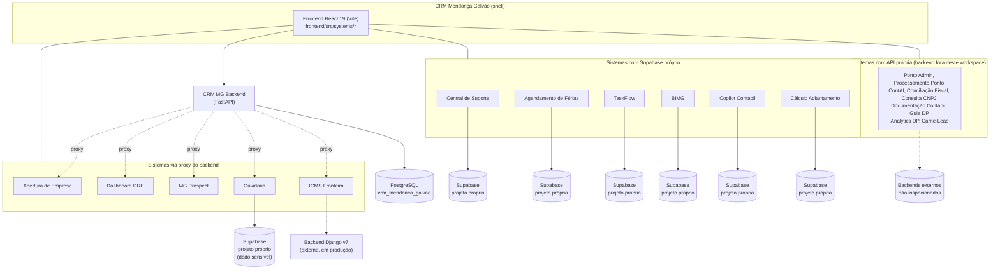

# Inventário de Aplicações — Núcleo Digital (TI), Mendonça Galvão

Documentação técnica de todas as aplicações internas identificadas neste
workspace. Fonte de verdade machine-readable: [`inventario.yaml`](./inventario.yaml).
Lacunas e achados de auditoria: [`PENDENCIAS.md`](./PENDENCIAS.md).

## Convenções

- Toda aplicação segue o mesmo template: [`TEMPLATE-APLICACAO.md`](./TEMPLATE-APLICACAO.md).
- Nada aqui foi inventado — o que não deu pra confirmar no código está
  marcado `DESCONHECIDO` e tem uma pergunta correspondente em `PENDENCIAS.md`.
- Nenhum `.env` real foi lido; nenhum segredo foi copiado pra estes docs.
- **Para adicionar uma nova aplicação ao inventário:**
  1. Adicione uma entrada em `inventario.yaml` seguindo o schema existente.
  2. Crie `docs/aplicacoes/<slug>/README.md` a partir de `TEMPLATE-APLICACAO.md`.
  3. Adicione a linha na tabela mestra abaixo e no(s) arquivo(s) de setor
     correspondente(s) em `docs/setores/`.
  4. Se algo não puder ser confirmado, marque `DESCONHECIDO` e registre a
     pergunta em `PENDENCIAS.md` — não adivinhe.

## Visão por setor

- [TI — Núcleo Digital](./setores/ti-nucleo-digital.md)
- [Contábil](./setores/contabil.md)
- [Fiscal](./setores/fiscal.md)
- [Pessoal / DP](./setores/pessoal-dp.md)
- [Societário](./setores/societario.md) *(extra — ver nota no arquivo)*
- [Transversal](./setores/transversal.md)

## Tabela mestra

| Aplicação | Setor(es) | Função | Stack | Banco | Status |
|---|---|---|---|---|---|
| [CRM Mendonça Galvão](./aplicacoes/crm-mg/README.md) | Transversal | Shell/hub central: auth, navegação entre sistemas, usuários/setores | React 19 + FastAPI | PostgreSQL (Alembic) | producao |
| [CRM MG Backend (API)](./aplicacoes/backend-fastapi/README.md) | Transversal | API do shell + proxy pra 5 sistemas embutidos | FastAPI (Python ≥3.11) | PostgreSQL (Alembic) | producao |
| [Central de Suporte](./aplicacoes/central-suporte/README.md) | Transversal | Chamados e suporte técnico interno | React 19 (embutido) | PostgreSQL (Supabase) | producao |
| [Ponto Admin](./aplicacoes/ponto-admin/README.md) | TI, DP | Administração do app de ponto (integração Cronos) | React 19 (embutido) | DESCONHECIDO | producao |
| [Processamento Ponto](./aplicacoes/processar-ponto/README.md) | DP | Processamento de registros de ponto eletrônico | React 19 (embutido) | DESCONHECIDO | producao |
| [TaskFlow](./aplicacoes/taskflow/README.md) | TI | Gestão de tarefas do time de TI | React 19 (embutido) | PostgreSQL (Supabase) | producao |
| [MG Prospect](./aplicacoes/mg-prospect/README.md) | TI | Prospecção automática de clientes | React 19 (embutido) | DESCONHECIDO (proxy) | producao |
| [BIMG - BI](./aplicacoes/bimg/README.md) | Contábil | Business Intelligence e análise de dados | React 19 (embutido) | PostgreSQL (Supabase) | producao |
| [ContAI](./aplicacoes/contai/README.md) | Contábil | Assistente de IA para contabilidade | React 19 (embutido) | DESCONHECIDO | producao |
| [Copilot Contábil](./aplicacoes/copilot-contabil/README.md) | Contábil | Copiloto de IA para tarefas contábeis | React 19 (embutido) | PostgreSQL (Supabase) | producao |
| [Dashboard DRE](./aplicacoes/dashboard-dre/README.md) | Contábil | Dashboard de métricas do DRE | React 19 (embutido) | DESCONHECIDO (proxy) | producao |
| [Documentação Contábil](./aplicacoes/documentacao-contabil/README.md) | Contábil | DESCONHECIDO | React 19 (embutido) | DESCONHECIDO | producao |
| [Conciliação Fiscal](./aplicacoes/conciliacao-fiscal/README.md) | Fiscal | Conciliação de notas e SPED contábil | React 19 (embutido) | DESCONHECIDO | producao |
| [ICMS Fronteira](./aplicacoes/fronteira/README.md) | Fiscal | Cálculo de ICMS fronteira (v8) | React 19 (embutido) | DESCONHECIDO | homologacao |
| [Abertura de Empresa](./aplicacoes/abertura-empresa/README.md) | Societário | Gerenciamento de abertura de empresas | React 19 (embutido) | DESCONHECIDO (proxy) | producao |
| [Consulta CNPJ](./aplicacoes/consulta-cnpj/README.md) | Societário | DESCONHECIDO | React 19 (embutido) | DESCONHECIDO | producao |
| [Carnê-Leão](./aplicacoes/carne-leao/README.md) | Societário | DESCONHECIDO (backend externo) | React 19 (embutido) | DESCONHECIDO | producao |
| [Agendamento de Férias](./aplicacoes/agendamento-ferias/README.md) | DP, Transversal | Agendamento e controle de férias | React 19 (embutido) | PostgreSQL (Supabase) | producao |
| [Analytics DP](./aplicacoes/analytics-dp/README.md) | DP | DESCONHECIDO | React 19 (embutido) | DESCONHECIDO | producao |
| [Dash RH](./aplicacoes/dash-rh/README.md) | DP | DESCONHECIDO (setor RESTRITO) | React 19 (embutido) | DESCONHECIDO | producao |
| [Cálculo Adiantamento](./aplicacoes/calculo-adiantamento/README.md) | DP | Cálculo de adiantamentos salariais | React 19 (embutido) | PostgreSQL (Supabase) | producao |
| [Aeronord](./aplicacoes/aeronord/README.md) | DP | Convocações e recibos (cliente Aeronord) | React 19 (embutido) | DESCONHECIDO | producao |
| [Calculadora de Rescisão](./aplicacoes/calculadora-rescisao/README.md) | DP | Cálculo de rescisões trabalhistas | React 19 (embutido) | nenhum (client-side) | producao |
| [Cálculo de Comissão](./aplicacoes/calculo-comissao/README.md) | DP | Cálculo de comissões de vendas | React 19 (embutido) | nenhum (client-side) | producao |
| [Guia DP](./aplicacoes/guia-dp/README.md) | DP | Guia de DP e Contabilidade para clientes | React 19 (embutido) | DESCONHECIDO | producao |
| [Obrigações Acessórias](./aplicacoes/obrigacoes/README.md) | Transversal | Controle de entregas/prazos/documentos de cliente | React 19 (embutido) | PostgreSQL (Supabase) | desenvolvimento |
| [Obrigações — Worker de Recibos](./aplicacoes/obrigacoes-recibo/README.md) | Transversal | Serviço auxiliar do Obrigações Acessórias | DESCONHECIDO | DESCONHECIDO | DESCONHECIDO |
| [Ouvidoria Interna (RH)](./aplicacoes/ouvidoria/README.md) | Transversal | Canal de ouvidoria interna | React 19 (embutido) | PostgreSQL (Supabase) | producao |

*(28 aplicações no total — ver `inventario.yaml` para o schema completo de
cada uma. 2 sistemas adicionais aparecem no banco de sistemas de produção
sem código neste workspace — Portal do Colaborador e Cláusula AI — ver
`PENDENCIAS.md`.)*

## Diagrama do ecossistema

## Documentação legada (pré-existente nesta pasta)

Estes documentos já existiam em `docs/` antes deste inventário e continuam
válidos — não foram absorvidos no `inventario.yaml` porque cobrem tópicos
específicos, não fichas de aplicação:

- [arquitetura-crm-mendonca-galvao.md](./arquitetura-crm-mendonca-galvao.md) — visão geral de arquitetura do CRM
- [review-log.md](./review-log.md) — histórico de revisões de código
- [integracao-ferias-cronos.md](./integracao-ferias-cronos.md) — integração Férias → Cronos (lado emissor)
- [contrato-ferias-cronos.md](./contrato-ferias-cronos.md) — contrato de integração Férias ↔ Cronos
- [obrigacoes-readme.md](./obrigacoes-readme.md) — sistema de Obrigações Acessórias
- [obrigacoes-recibo-worker-readme.md](./obrigacoes-recibo-worker-readme.md) — worker de baixa automática por recibo
- [frontend-readme.md](./frontend-readme.md) — README original do template Vite do frontend
- [migracoes/handoff.md](./migracoes/handoff.md) — handoffs de migração de sistemas (iframe → nativo)

> O `README.md` na raiz do repositório continua lá de propósito — é o que o
> GitHub renderiza como página inicial do projeto.

## Escopo e limitações desta rodada

Ver [`PENDENCIAS.md`](./PENDENCIAS.md) seção 3 para o detalhamento completo,
mas resumindo: a maioria das 25 aplicações embutidas em `frontend/src/systems/`
fala com um backend próprio que **não está neste workspace** (API externa,
Supabase próprio, ou serviço em Lovable/Vercel). Para essas, a ficha cobre o
que dá pra confirmar pelo frontend (stack de UI, env vars, integrações
visíveis) — `INSTALACAO.md`/`BANCO.md` detalhados ficam para quando o time
confirmar onde vive cada backend.
