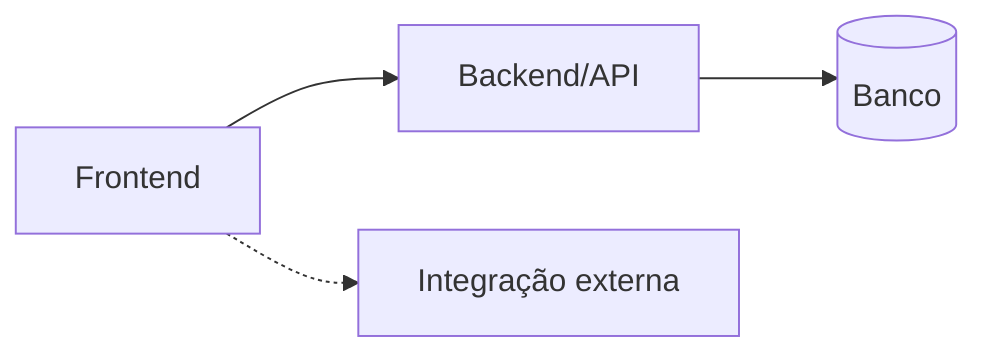

# Template — Ficha de Aplicação

> Este arquivo é o modelo usado por `docs/aplicacoes/<slug>/README.md`. Toda
> ficha de aplicação segue exatamente esta ordem de seções, mesmo quando uma
> seção só tem `DESCONHECIDO` — nunca omitir uma seção, só preenchê-la vazio.
>
> Fonte de verdade: `docs/inventario.yaml`. Se um dado aparece aqui, tem que
> estar lá também — os `.md` são a renderização humana do YAML, não uma
> segunda fonte.

```markdown
# <Nome do Sistema>

## 1. Identificação
- **Slug:** `<slug>`
- **Status:** producao | homologacao | desenvolvimento | descontinuado
- **Criticidade:** alta | media | baixa
- **Setor responsável (dono técnico):** <setor>

## 2. Função do sistema
<2-3 frases: o que faz, para quem, que dor resolve.>

## 3. Setores que utilizam
- <setor 1>
- <setor 2>

## 4. Stack utilizada
| Camada | Tecnologia | Versão | Observação |
|---|---|---|---|
| Frontend | | | |
| Backend | | | |
| Banco | | | |
| Infra | | | |

## 5. Arquitetura


## 6. Banco de dados
<resumo curto — detalhe completo em BANCO.md>

## 7. Autenticação e permissões
- **Método:** <Google OAuth | JWT próprio | Supabase Auth | DESCONHECIDO>
- **RBAC:** sim/não — papéis e o que cada um pode fazer

## 8. PWA
- **Perfil:** pwa-first | desktop-com-pwa | nao-aplicavel
- **Manifest:** sim/não
- **Service worker:** sim/não
- **Offline:** completo | basico | nenhum

## 9. Integrações externas
- <nome da integração — para quê>

## 10. Dependências de outros sistemas internos
- <slug do sistema — natureza da dependência>

## 11. Variáveis de ambiente
| Nome | Obrigatória | Sensível | Descrição |
|---|---|---|---|

## 12. Observações de segurança e LGPD
<achados relevantes; detalhe completo em PENDENCIAS.md/BANCO.md>
```
