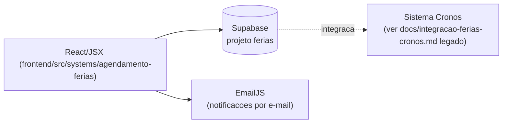

# Agendamento de Férias

## 1. Identificação
- **Slug:** `agendamento-ferias` | **Status:** producao | **Criticidade:** media
- **Setor responsável:** DESCONHECIDO

## 2. Função do sistema
Agendamento e controle de férias dos colaboradores.

## 3. Setores que utilizam
Pessoal/DP, Transversal (todo colaborador agenda a própria férias)

## 4. Stack utilizada
| Camada | Tecnologia | Versão | Observação |
|---|---|---|---|
| Frontend | React (embutido, `App` em `.jsx`) | 19.2.6 | JavaScript/JSX |
| Backend | Supabase | DESCONHECIDO | |
| Notificação | EmailJS | — | |

## 5. Arquitetura

## 6. Banco de dados
PostgreSQL via Supabase (projeto `ferias`). Migrations não versionadas neste
repositório. **Nota:** este sistema já tem documentação legada própria em
`docs/integracao-ferias-cronos.md` e `docs/contrato-ferias-cronos.md` —
consultar antes de qualquer mudança na integração.

## 7. Autenticação e permissões
Supabase Auth. RBAC/papéis: DESCONHECIDO.

## 8. PWA
Perfil DESCONHECIDO | Manifest: DESCONHECIDO | Service worker: DESCONHECIDO | Offline: DESCONHECIDO

## 9. Integrações externas
- EmailJS (notificações)
- Cronos (ver docs legados citados acima)

## 10. Dependências de outros sistemas internos
- `crm-mg`

## 11. Variáveis de ambiente
| Nome | Obrigatória | Sensível | Descrição |
|---|---|---|---|
| `VITE_FERIAS_SUPABASE_URL` | sim | não | URL do projeto Supabase |
| `VITE_FERIAS_SUPABASE_ANON_KEY` | sim | não | chave anon do Supabase |
| `VITE_FERIAS_EMAILJS_PUBLIC_KEY` | não | não | chave pública EmailJS |
| `VITE_FERIAS_EMAILJS_SERVICE_ID` | não | não | ID do serviço EmailJS |
| `VITE_FERIAS_EMAILJS_TEMPLATE_ID` | não | não | ID do template EmailJS |

## 12. Observações de segurança e LGPD
Trata dado trabalhista (férias). Ver documentação legada de integração com
Cronos para detalhes de contrato de dado entre sistemas.
