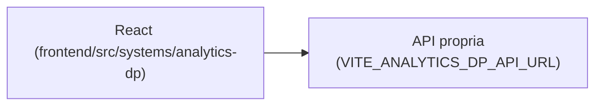

# Analytics DP

## 1. Identificação
- **Slug:** `analytics-dp` | **Status:** producao | **Criticidade:** media
- **Setor responsável:** DESCONHECIDO

## 2. Função do sistema
DESCONHECIDO — não confirmado no banco de sistemas fornecido; nome sugere
analytics/dashboards de Departamento Pessoal. Ver `docs/PENDENCIAS.md`.

## 3. Setores que utilizam
Pessoal/DP

## 4. Stack utilizada
| Camada | Tecnologia | Versão | Observação |
|---|---|---|---|
| Frontend | React (embutido) | 19.2.6 | |
| Backend | API própria | DESCONHECIDO | repositório fora deste workspace |

## 5. Arquitetura

## 6. Banco de dados
DESCONHECIDO.

## 7. Autenticação e permissões
DESCONHECIDO

## 8. PWA
Perfil DESCONHECIDO | Manifest: DESCONHECIDO | Service worker: DESCONHECIDO | Offline: DESCONHECIDO

## 9. Integrações externas
Nenhuma identificada.

## 10. Dependências de outros sistemas internos
- `crm-mg`

## 11. Variáveis de ambiente
| Nome | Obrigatória | Sensível | Descrição |
|---|---|---|---|
| `VITE_ANALYTICS_DP_API_URL` | sim | não | endpoint da API de analytics de DP |

## 12. Observações de segurança e LGPD
Provável dado trabalhista agregado. Ver `docs/PENDENCIAS.md`.
