# CRM MG Backend — Banco de Dados

- **Engine:** PostgreSQL
- **Provedor:** Docker Compose local (serviço `postgres` do `docker-compose.yml` raiz) / Coolify em produção
- **Nome lógico:** `crm_mendonca_galvao`

## Diagrama ER (a partir de `app/models/*.py`)

```mermaid
erDiagram
  usuarios ||--o{ tarefas : "responsavel_id"
  usuarios ||--o{ notificacoes : "usuario_id"
  usuarios ||--o{ user_sessions : "usuario_id"
  usuarios ||--o{ usuario_sistema_acessos : "usuario_id"
  usuarios ||--o{ system_access_logs : "usuario_id"
  sistemas ||--o{ usuario_sistema_acessos : "sistema_id"
  sistemas ||--o{ system_access_logs : "sistema_id"
  clientes ||--o{ tarefas : "cliente_id"
  clientes ||--o{ documentos : "cliente_id"
  clientes ||--o{ client_tokens : "cliente_id"
  releases ||--o{ release_notes : "release_id"

  usuarios {
    uuid id PK
    string nome
    string email UK
    string perfil
    string setor
    bool ativo
    string visibilidade_sistemas
    string foto_perfil
    datetime data_criacao
  }
  sistemas {
    uuid id PK
    string nome
    string slug UK
    string categoria
    string setor
    string url
    string icone
    bool ativo
  }
  setores {
    uuid id PK
    string codigo UK
    string nome
    string cor
    bool ativo
    string visibilidade_sistemas
    jsonb setores_visiveis
  }
  clientes {
    uuid id PK
    string razao_social
    string cnpj UK
    string regime_tributario
    string status_cnpj
    string documentos_exigidos
  }
  tarefas {
    uuid id PK
    string titulo
    uuid cliente_id FK
    uuid responsavel_id FK
    string status
    string prioridade
    datetime data_vencimento
    datetime data_conclusao
  }
  notificacoes {
    uuid id PK
    uuid usuario_id FK
    string titulo
    string mensagem
    bool lida
  }
  documentos {
    uuid id PK
    uuid cliente_id FK
    string nome_arquivo
    string caminho_storage
    string enviado_por
    string status
    string competencia
  }
  logs_auditoria {
    bigint id PK
    uuid usuario_id
    string acao
    string alvo
    jsonb detalhes
  }
  user_sessions {
    uuid id PK
    uuid usuario_id FK
    datetime inicio
    datetime fim
    string ip_address
    bool ativa
  }
  usuario_sistema_acessos {
    bigint id PK
    uuid usuario_id FK
    uuid sistema_id FK
    datetime granted_at
    uuid granted_by
  }
  system_access_logs {
    bigint id PK
    uuid usuario_id FK
    uuid sistema_id FK
    datetime inicio
    datetime fim
    int duracao_segundos
  }
  client_tokens {
    uuid id PK
    uuid cliente_id FK
    string token UK
    datetime data_expiracao
    bool ativo
  }
  releases {
    uuid id PK
    string version UK
    datetime released_at
  }
  release_notes {
    uuid id PK
    uuid release_id FK
    string system_name
    string description
  }
```



## Tabelas — finalidade e FKs

| Tabela | Finalidade | Colunas-chave | FKs |
|---|---|---|---|
| `usuarios` | Conta de cada colaborador com acesso ao CRM | `perfil`, `setor`, `visibilidade_sistemas` | — |
| `sistemas` | Registro de cada aplicação do ecossistema — é a fonte usada por `sistemas_seed.sql` | `slug` (único), `categoria`, `setor` | — |
| `setores` | Setores do escritório | `codigo`, `visibilidade_sistemas`, `setores_visiveis` (jsonb) | — |
| `clientes` | Empresas-cliente do escritório | `cnpj` (único), `regime_tributario` | — |
| `tarefas` | Tarefas internas ligadas a um cliente/responsável | `status`, `prioridade` | `cliente_id` → `clientes`, `responsavel_id` → `usuarios` |
| `notificacoes` | Notificações do sino/mensagens no Header | `lida` | `usuario_id` → `usuarios` |
| `documentos` | Documentos enviados por/para um cliente | `enviado_por`, `status`, `competencia` | `cliente_id` → `clientes` |
| `logs_auditoria` | Trilha de auditoria de ações no CRM | `acao`, `alvo`, `detalhes` (jsonb) | `usuario_id` (sem FK declarada no model) |
| `user_sessions` | Sessões ativas/históricas de login | `ativa`, `ip_address` | `usuario_id` → `usuarios` |
| `usuario_sistema_acessos` | Concessão explícita de acesso a um sistema (além da visibilidade por setor) | `granted_at`, `granted_by` | `usuario_id` → `usuarios`, `sistema_id` → `sistemas` |
| `system_access_logs` | Log de uso de cada sistema por usuário (tempo de sessão) | `duracao_segundos` | `usuario_id` → `usuarios`, `sistema_id` → `sistemas` |
| `client_tokens` | Token de acesso temporário do portal do cliente | `token` (único), `data_expiracao`, `ativo` | `cliente_id` → `clientes` |
| `releases` / `release_notes` | Changelog do CRM mostrado no Header | `version` (único) | `release_notes.release_id` → `releases` |

## Migrations
Alembic (`backend-fastapi/alembic/`, config em `alembic.ini`). Para criar uma
nova migration:
```bash
cd backend-fastapi
alembic revision --autogenerate -m "descricao_da_mudanca"
alembic upgrade head
```

## RLS (Row Level Security)
**Não aplicável neste banco** — o acesso é inteiramente mediado pela API
FastAPI (controle de acesso feito em código Python, não em policy de banco).
Isso significa que a autorização depende 100% de cada endpoint checar
corretamente o usuário — não há uma segunda camada de defesa no banco em si.
**Risco a avaliar com o time:** se algum endpoint tiver uma checagem de
autorização incompleta, não há RLS pra conter o acesso indevido — diferente
dos sistemas que usam Supabase diretamente (que têm RLS como camada
adicional).

## LGPD
- Tabelas com dado pessoal: `usuarios` (nome, e-mail, foto), `clientes`
  (razão social, CNPJ, contato, WhatsApp), `documentos` (arquivos de
  cliente, podem conter qualquer dado pessoal/fiscal), `logs_auditoria`
  (rastreia ações por `usuario_id`), `user_sessions` (IP, user agent).
- **Retenção:** não há coluna de expiração/exclusão automática identificada
  em nenhuma dessas tabelas (exceto `client_tokens`, que expira por design).
  `logs_auditoria` e `system_access_logs` acumulam indefinidamente.
- **Exclusão a pedido do titular:** não há endpoint de exclusão de dado de
  usuário/cliente identificado nesta rodada — ver `docs/PENDENCIAS.md`.
