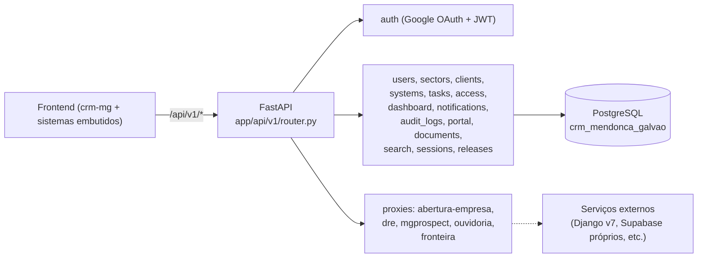

# CRM MG Backend (API)

## 1. Identificação
- **Slug:** `backend-fastapi`
- **Status:** producao
- **Criticidade:** alta
- **Setor responsável (dono técnico):** TI — Núcleo Digital

## 2. Função do sistema
API FastAPI que sustenta o shell `crm-mg`: autenticação (Google OAuth + JWT
próprio), usuários, setores, clientes, registro de sistemas (o "hub" que a
navbar consulta), tarefas, controle de acesso por sistema, dashboard,
auditoria, documentos de cliente, busca, sessões e releases. Também expõe
rotas "proxy" para 5 sistemas embutidos que precisam manter algo
server-side (chave de API, cookie httpOnly): Abertura de Empresa, Dashboard
DRE, MG Prospect, Ouvidoria e ICMS Fronteira.

## 3. Setores que utilizam
- Transversal — é infraestrutura, usada indiretamente por todo o escritório
  via o shell.

## 4. Stack utilizada
| Camada | Tecnologia | Versão | Observação |
|---|---|---|---|
| Backend | FastAPI | `>=0.111.0` | `pyproject.toml` |
| Linguagem/runtime | Python | `>=3.11` (Dockerfile usa `python:3.12-slim`) | |
| ORM | SQLAlchemy (async) + asyncpg | `>=2.0.31` / `>=0.29.0` | |
| Migrations | Alembic | `>=1.13.1` | |
| Auth | pyjwt + google-auth | `>=2.8.0` / `>=2.30.0` | |
| IA | openai (lib) | `>=1.30.0` | usada em `app/services/ai_service.py` |
| Empacotamento | uv (`pip install uv`) | — | Dockerfile |

## 5. Arquitetura

## 6. Banco de dados
PostgreSQL próprio (`crm_mendonca_galvao`), gerenciado via Alembic. Detalhe
completo (todas as tabelas mapeadas em `app/models/`) em [`BANCO.md`](./BANCO.md).

## 7. Autenticação e permissões
- **Método:** Login via Google OAuth (`google-auth`), emissão de JWT próprio
  (`pyjwt`) consumido pelo frontend e pelos outros sistemas que confiam no
  mesmo `JWT_SECRET`.
- **RBAC:** sim — `usuarios.perfil` + `usuarios.setor` +
  `usuario_sistema_acessos` (concessão de acesso por sistema, complementar à
  visibilidade por setor). Papéis exatos (`perfil`) não estão em um enum
  Python explícito visto nesta rodada — DESCONHECIDO os valores possíveis.
- Restrição de domínio de e-mail no login (`GOOGLE_ALLOWED_DOMAIN`, default
  `mendoncagalvao.com.br`) + lista de e-mails avulsos liberados
  (`GOOGLE_ALLOWED_EMAILS`).

## 8. PWA
- **Perfil:** nao-aplicavel (é uma API, não uma UI)

## 9. Integrações externas
- Google OAuth (login)
- OpenAI (features de IA — ver `app/services/ai_service.py`)
- Evolution API (WhatsApp) — configurada mas uso concreto não confirmado nesta rodada
- n8n (webhooks da Ouvidoria — `OUVIDORIA_N8N_*_WEBHOOK_URL`)

## 10. Dependências de outros sistemas internos
- Nenhuma — é a base que os outros dependem, não o contrário.

## 11. Variáveis de ambiente
| Nome | Obrigatória | Sensível | Descrição |
|---|---|---|---|
| `POSTGRES_HOST` / `PORT` / `USER` / `PASSWORD` / `DB` | sim | senha sim | conexão com o Postgres |
| `JWT_SECRET` | sim | sim | assinatura dos tokens — sem default no código (correto) |
| `JWT_EXPIRATION_SECONDS` | não (default 604800) | não | TTL do token |
| `GOOGLE_CLIENT_ID` | sim (pro login funcionar) | não | client id OAuth |
| `GOOGLE_ALLOWED_DOMAIN` | não (default `mendoncagalvao.com.br`) | não | domínio de e-mail liberado pro login |
| `GOOGLE_ALLOWED_EMAILS` | não | não | lista de e-mails avulsos liberados |
| `OPENAI_API_KEY` | não | sim | features de IA |
| `DASHBOARD_DRE_SENHA` | não | sim | senha repassada só server-side ao proxy do Dashboard DRE |
| `OUVIDORIA_SUPABASE_URL` / `OUVIDORIA_SUPABASE_SERVICE_ROLE_KEY` | não | a service role key sim | operações server-side do proxy da Ouvidoria |
| `OUVIDORIA_N8N_*_WEBHOOK_URL` (4 variáveis) | não | não | webhooks de triagem/resumo/chat/knowledge |
| `FRONTEIRA_V8_API_URL` | não | não | URL do backend do ICMS Fronteira v8 |
| `EVOLUTION_API_URL` / `EVOLUTION_API_KEY` / `EVOLUTION_INSTANCE` | não | a key sim | integração WhatsApp |
| `BACKEND_CORS_ORIGINS` | não (default localhost) | não | origens liberadas por CORS |

## 12. Observações de segurança e LGPD
- **[ALTO]** `POSTGRES_PASSWORD` e `EVOLUTION_API_KEY` têm **default
  hardcoded no código-fonte** (`app/core/config.py:16` e `:56`) em vez de
  obrigatórios sem default (como `JWT_SECRET` corretamente é). Ver
  `docs/PENDENCIAS.md`.
- `OUVIDORIA_SUPABASE_SERVICE_ROLE_KEY` (bypassa RLS do Supabase da
  Ouvidoria) fica configurada neste backend — amplia a superfície de
  exposição de um dado sensível (denúncias). Ver `docs/PENDENCIAS.md`.
- Trata dado pessoal de usuários (`usuarios`) e de clientes do escritório
  (`clientes`, `documentos`) — sem política de retenção documentada no
  código.
