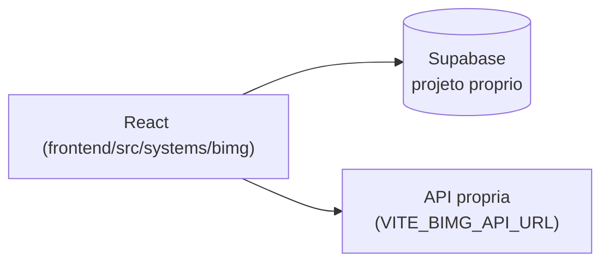

# BIMG - Business Intelligence

## 1. Identificação
- **Slug:** `bimg` | **Status:** producao | **Criticidade:** media
- **Setor responsável:** DESCONHECIDO

## 2. Função do sistema
Plataforma de Business Intelligence e análise de dados (descrição do banco
de sistemas — `sistemas_seed.sql`).

## 3. Setores que utilizam
Contábil

## 4. Stack utilizada
| Camada | Tecnologia | Versão | Observação |
|---|---|---|---|
| Frontend | React (embutido) | 19.2.6 | |
| Backend | Supabase + API própria complementar | DESCONHECIDO | |

## 5. Arquitetura

## 6. Banco de dados
PostgreSQL via Supabase (projeto dedicado). Não detalhado nesta rodada.

## 7. Autenticação e permissões
Supabase Auth. RBAC/papéis: DESCONHECIDO.

## 8. PWA
Perfil DESCONHECIDO | Manifest: DESCONHECIDO | Service worker: DESCONHECIDO | Offline: DESCONHECIDO

## 9. Integrações externas
Nenhuma identificada.

## 10. Dependências de outros sistemas internos
- `crm-mg`

## 11. Variáveis de ambiente
| Nome | Obrigatória | Sensível | Descrição |
|---|---|---|---|
| `VITE_BIMG_SUPABASE_URL` | sim | não | URL do projeto Supabase |
| `VITE_BIMG_SUPABASE_ANON_KEY` | sim | não | chave anon do Supabase |
| `VITE_BIMG_API_URL` | não | não | API própria complementar |

## 12. Observações de segurança e LGPD
Trata dado analítico — se inclui dado pessoal identificável não foi
confirmado. Ver `docs/PENDENCIAS.md`.
