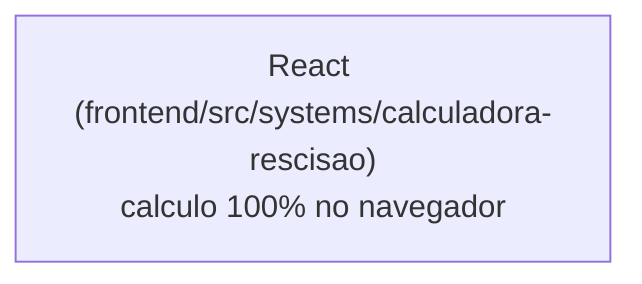

# Calculadora de Rescisão

## 1. Identificação
- **Slug:** `calculadora-rescisao` | **Status:** producao | **Criticidade:** baixa
- **Setor responsável:** DESCONHECIDO

## 2. Função do sistema
Cálculo de rescisões trabalhistas.

## 3. Setores que utilizam
Pessoal/DP

## 4. Stack utilizada
| Camada | Tecnologia | Versão | Observação |
|---|---|---|---|
| Frontend | React (embutido) | 19.2.6 | |
| Backend | Nenhum identificado — aparenta ser calculadora 100% client-side | nao_aplicavel | ver `docs/PENDENCIAS.md` |

## 5. Arquitetura

## 6. Banco de dados
Nenhum — sem cliente Supabase nem env var de API encontrado.

## 7. Autenticação e permissões
DESCONHECIDO

## 8. PWA
Perfil DESCONHECIDO | Manifest: DESCONHECIDO | Service worker: DESCONHECIDO | Offline: DESCONHECIDO

## 9. Integrações externas
Nenhuma identificada.

## 10. Dependências de outros sistemas internos
- `crm-mg`

## 11. Variáveis de ambiente
Nenhuma identificada.

## 12. Observações de segurança e LGPD
Se de fato é 100% client-side (a confirmar), não armazena dado pessoal —
processa só na sessão do navegador. Boa notícia de LGPD, mas precisa de
confirmação formal do time (ver `docs/PENDENCIAS.md`).
