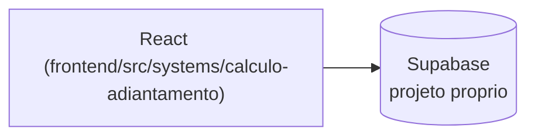

# Cálculo Adiantamento

## 1. Identificação
- **Slug:** `calculo-adiantamento` | **Status:** producao | **Criticidade:** baixa
- **Setor responsável:** DESCONHECIDO

## 2. Função do sistema
Cálculo de adiantamentos salariais.

## 3. Setores que utilizam
Pessoal/DP

## 4. Stack utilizada
| Camada | Tecnologia | Versão | Observação |
|---|---|---|---|
| Frontend | React (embutido) | 19.2.6 | |
| Backend | Supabase | DESCONHECIDO | |

## 5. Arquitetura

## 6. Banco de dados
PostgreSQL via Supabase (projeto dedicado). Não detalhado nesta rodada.

## 7. Autenticação e permissões
Supabase Auth. RBAC/papéis: DESCONHECIDO.

## 8. PWA
Perfil DESCONHECIDO | Manifest: DESCONHECIDO | Service worker: DESCONHECIDO | Offline: DESCONHECIDO

## 9. Integrações externas
Nenhuma identificada.

## 10. Dependências de outros sistemas internos
- `crm-mg`

## 11. Variáveis de ambiente
| Nome | Obrigatória | Sensível | Descrição |
|---|---|---|---|
| Nome exato não confirmado (`VITE_*_SUPABASE_URL`) | DESCONHECIDO | não | ver `docs/PENDENCIAS.md` |

## 12. Observações de segurança e LGPD
Trata dado trabalhista/salarial. Ver `docs/PENDENCIAS.md`.
