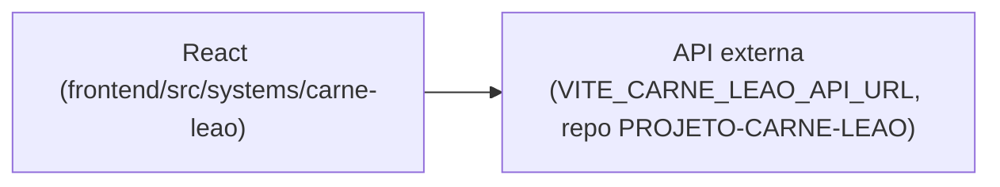

# Carnê-Leão (Contábil Script)

## 1. Identificação
- **Slug:** `carne-leao` | **Status:** producao | **Criticidade:** baixa
- **Setor responsável:** DESCONHECIDO

## 2. Função do sistema
DESCONHECIDO — o backend real está em um repositório externo
(`PROJETO-CARNE-LEAO`, citado em comentário de `registry.tsx`), não incluído
neste workspace. Nome sugere apuração de Carnê-Leão (IRPF de pessoa física).

## 3. Setores que utilizam
Societário

## 4. Stack utilizada
| Camada | Tecnologia | Versão | Observação |
|---|---|---|---|
| Frontend | React (embutido) | 19.2.6 | slug real no banco: `contabil-script-estatico` |
| Backend | API própria (repo externo, hospedado na Vercel) | DESCONHECIDO | |

## 5. Arquitetura

## 6. Banco de dados
DESCONHECIDO.

## 7. Autenticação e permissões
DESCONHECIDO

## 8. PWA
Perfil DESCONHECIDO | Manifest: DESCONHECIDO | Service worker: DESCONHECIDO | Offline: DESCONHECIDO

## 9. Integrações externas
Nenhuma além do próprio backend externo.

## 10. Dependências de outros sistemas internos
- `crm-mg`

## 11. Variáveis de ambiente
| Nome | Obrigatória | Sensível | Descrição |
|---|---|---|---|
| `VITE_CARNE_LEAO_API_URL` | sim | não | endpoint do backend externo (repo PROJETO-CARNE-LEAO) |

## 12. Observações de segurança e LGPD
Provável dado fiscal de pessoa física — sem confirmação (backend fora do
workspace). Ver `docs/PENDENCIAS.md`.
