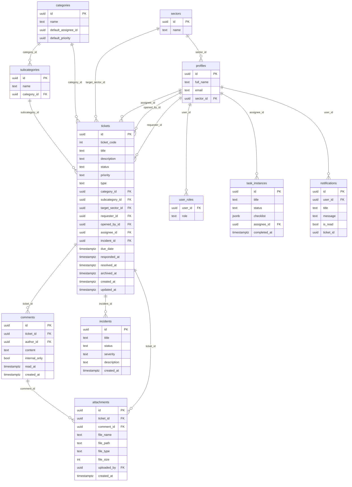

# Central de Suporte — Banco de Dados

- **Engine:** PostgreSQL
- **Provedor:** Supabase (projeto dedicado a este sistema)
- **Hospedagem:** DESCONHECIDO (Supabase Cloud ou self-hosted via Coolify — não confirmado)

## Diagrama ER (tabelas principais, a partir do código-fonte inspecionado nesta sessão)

> Este diagrama foi reconstruído a partir das queries do frontend
> (`select(...)` do Supabase client em cada página/componente), não de um
> dump real do schema — colunas usadas pelo frontend estão confirmadas;
> colunas existentes no banco mas não usadas pelo frontend podem estar
> faltando aqui. Ver `docs/PENDENCIAS.md`.

## Tabelas — finalidade e chaves

| Tabela | Finalidade | Colunas-chave | FKs |
|---|---|---|---|
| `tickets` | Chamado em si | `status`, `priority`, `ticket_code` | `requester_id`, `opened_by_id`, `assignee_id`, `category_id`, `subcategory_id`, `target_sector_id`, `incident_id` → `profiles`/`categories`/`subcategories`/`sectors`/`incidents` |
| `comments` | Comentários/mensagens do chamado (chat) | `internal_only`, `read_at` | `ticket_id` → `tickets`, `author_id` → `profiles` |
| `attachments` | Anexos de chamado/comentário (Storage) | `file_path` | `ticket_id` → `tickets`, `comment_id` → `comments` |
| `profiles` | Perfil de usuário (espelha `auth.users`) | `full_name`, `email` | `sector_id` → `sectors` |
| `user_roles` | Papéis do usuário (RBAC) | `role` | `user_id` → `profiles` |
| `sectors` | Setores do escritório | `name` | — |
| `categories` / `subcategories` | Classificação do chamado | `default_assignee_id`, `default_priority` | `subcategories.category_id` → `categories` |
| `incidents` | Agrupamento automático de chamados correlatos | `status`, `severity` | — |
| `task_instances` | Tarefas de rotinas automatizadas (ex.: verificação de certificados) | `status`, `checklist` (jsonb) | `assignee_id` → `profiles` |
| `notifications` | Notificações do sino/mensagens no Header | `is_read` | `user_id` → `profiles`, `ticket_id` → `tickets` |

## Migrations

SQL solto em
`frontend/src/systems/central-suporte/integrations/supabase/migrations/`,
nomeado por timestamp (`YYYYMMDDHHmm_descricao.sql`). **Não há runner
automático** — cada migration precisa ser copiada e executada manualmente no
SQL Editor do Supabase depois do deploy do frontend que a introduziu. Isso é
uma dívida técnica real: não há garantia de que o schema em produção está
sincronizado com o que o código espera até alguém confirmar manualmente.

**Para criar uma nova migration:** adicionar um novo arquivo `.sql` nesse
diretório com timestamp atual, e documentar no PR que precisa ser rodado
manualmente (padrão já seguido nesta sessão, ver histórico de commits do
sistema).

## RLS (Row Level Security)

Não foi possível listar as policies reais (sem acesso à connection string do
projeto Supabase deste sistema nesta rodada de documentação). O que se sabe,
por auditoria feita durante o desenvolvimento desta sessão:

- `tickets`: policy de `UPDATE` restrita a roles de staff (`support_agent`,
  `dev`, `admin_ti`, coordenadores) — confirmado via `pg_policies` numa
  sessão de trabalho anterior.
- Existe um trigger (`enforce_requester_change_admin_only`) que bloqueia
  troca de `requester_id` por quem não é `admin_ti`, complementando a RLS
  (que sozinha não distingue coluna).
- **Risco sinalizado:** a policy de `INSERT` em `tickets` já teve um gap real
  encontrado e corrigido nesta sessão (exigia `auth.uid() = requester_id`,
  quebrando o fluxo de abrir chamado para outra pessoa) — não há garantia de
  que não existam gaps parecidos em outras tabelas (`comments`,
  `attachments`) que não foram reauditadas.

**Ação recomendada:** rodar `select policyname, cmd, qual, with_check from
pg_policies where schemaname = 'public'` no projeto Supabase deste sistema e
colar o resultado aqui.

## LGPD

- **Dado pessoal:** nome e e-mail do solicitante/responsável (via
  `profiles`), e o conteúdo dos chamados/comentários/anexos em si — que pode
  conter qualquer tipo de informação que o solicitante decida escrever ou
  anexar (prints de tela podem conter dado de outros sistemas).
- **Criptografia:** DESCONHECIDO (depende da configuração do Storage do
  Supabase, não inspecionada).
- **Mascaramento em log:** DESCONHECIDO.
- **Retenção:** não há política definida — chamados são "arquivados"
  (`archived_at`), não excluídos, e continuam consultáveis indefinidamente
  via tela de Consulta de Chamados.
- **Exclusão a pedido do titular:** não há fluxo de exclusão de dado
  identificado no código.
