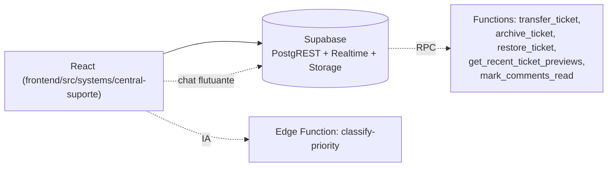

# Central de Suporte

## 1. Identificação
- **Slug:** `central-suporte`
- **Status:** producao
- **Criticidade:** alta
- **Setor responsável (dono técnico):** TI — Núcleo Digital

## 2. Função do sistema
Sistema de chamados e suporte técnico interno do escritório. Cobre abertura
conversacional de chamado (decision tree em chat), Kanban de atendimento,
chat flutuante em tempo real, relatórios/KPIs, gestão de incidentes, tarefas
automatizadas e consulta/auditoria de chamados arquivados.

## 3. Setores que utilizam
- Transversal — usado por todo o escritório como solicitante; mantido e
  operado pelo TI.

## 4. Stack utilizada
| Camada | Tecnologia | Versão | Observação |
|---|---|---|---|
| Frontend | React (embutido no shell crm-mg) | 19.2.6 | TypeScript, Vite compartilhado com o monorepo |
| UI | shadcn/ui + Tailwind (tokens próprios do sistema, distintos do `@mg/ui`) | — | Ver `frontend/src/systems/central-suporte/components/ui/` |
| Backend | Supabase (PostgREST + Realtime + Storage) | DESCONHECIDO | Projeto Supabase dedicado deste sistema |
| Gráficos | Recharts | — | Página de Relatórios |
| Drag-and-drop | @hello-pangea/dnd | — | Kanban |

## 5. Arquitetura

## 6. Banco de dados
PostgreSQL via Supabase, projeto dedicado. Tabelas principais: `tickets`,
`comments`, `attachments`, `categories`, `subcategories`, `sectors`,
`profiles`, `user_roles`, `incidents`, `task_instances`, `notifications`.
Migrations vivem como SQL solto em
`frontend/src/systems/central-suporte/integrations/supabase/migrations/` —
**não são aplicadas automaticamente**, precisam ser rodadas manualmente no
SQL Editor do Supabase a cada deploy que precisar delas. Detalhe completo em
[`BANCO.md`](./BANCO.md).

## 7. Autenticação e permissões
- **Método:** Supabase Auth (Google OAuth)
- **RBAC:** sim — roles em `user_roles`: `admin_ti`, `direction`,
  `coordinator` (+ variantes por setor: `coordinator_sp/sc/sf/fn/rh`),
  `support_agent`, `dev`, `viewer`, e roles de setor não-TI (`dp`, `fiscal`,
  `contabil`, `financeiro`, `societario`, `recepcao`, `rh`) que só têm
  acesso de solicitante.
- Só `admin_ti` pode trocar o solicitante de um chamado (`canEditRequester`
  no client + trigger `enforce_requester_change_admin_only` no banco).

## 8. PWA
- **Perfil:** nao-aplicavel (roda embutido no shell crm-mg)
- **Manifest:** não
- **Service worker:** não
- **Offline:** nenhum

## 9. Integrações externas
- Nenhuma integração de terceiros identificada (fora do próprio Supabase e
  de uma Edge Function de IA para classificação de prioridade).

## 10. Dependências de outros sistemas internos
- `crm-mg` — hospeda a navbar/shell e a autenticação de sessão do usuário.

## 11. Variáveis de ambiente
| Nome | Obrigatória | Sensível | Descrição |
|---|---|---|---|
| `VITE_SUPORTE_SUPABASE_URL` | sim | não | URL do projeto Supabase |
| `VITE_SUPORTE_SUPABASE_PUBLISHABLE_KEY` | sim | não | chave anon/publishable |

## 12. Observações de segurança e LGPD
- Trata dado pessoal (nome, e-mail, conteúdo de chamados e anexos). Sem
  política de retenção documentada.
- RLS parcial — a auditoria feita nesta sessão (fora do escopo deste
  inventário, ver histórico de PRs) já cobriu e corrigiu alguns gaps
  (ex.: trigger de proteção de `requester_id`), mas uma revisão completa de
  todas as policies de `tickets`/`comments`/`attachments` não foi refeita
  aqui — ver `docs/PENDENCIAS.md`.
