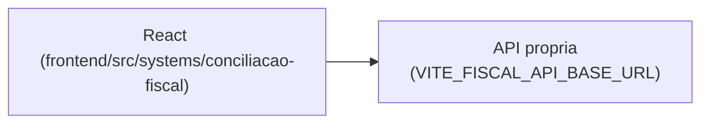

# Conciliação Fiscal (FiscalMatch)

## 1. Identificação
- **Slug:** `conciliacao-fiscal` | **Status:** producao | **Criticidade:** alta
- **Setor responsável:** DESCONHECIDO

## 2. Função do sistema
Ferramenta para conciliação de notas e SPED contábil (nome interno
"FiscalMatch", conforme descrição no banco de sistemas).

## 3. Setores que utilizam
Fiscal

## 4. Stack utilizada
| Camada | Tecnologia | Versão | Observação |
|---|---|---|---|
| Frontend | React (embutido) | 19.2.6 | |
| Backend | API própria | DESCONHECIDO | repositório fora deste workspace |

## 5. Arquitetura

## 6. Banco de dados
DESCONHECIDO.

## 7. Autenticação e permissões
DESCONHECIDO

## 8. PWA
Perfil DESCONHECIDO | Manifest: DESCONHECIDO | Service worker: DESCONHECIDO | Offline: DESCONHECIDO

## 9. Integrações externas
Nenhuma identificada (provável integração com SPED/notas fiscais, não
confirmada em detalhe).

## 10. Dependências de outros sistemas internos
- `crm-mg`

## 11. Variáveis de ambiente
| Nome | Obrigatória | Sensível | Descrição |
|---|---|---|---|
| `VITE_FISCAL_API_BASE_URL` | sim | não | endpoint da API de conciliação fiscal |

## 12. Observações de segurança e LGPD
Trata dado fiscal de clientes. Sem confirmação de RLS/retenção. Ver
`docs/PENDENCIAS.md`.
