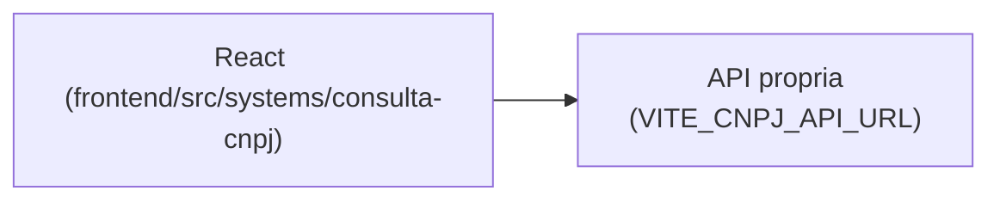

# Consulta CNPJ

## 1. Identificação
- **Slug:** `consulta-cnpj` | **Status:** producao | **Criticidade:** baixa
- **Setor responsável:** DESCONHECIDO

## 2. Função do sistema
DESCONHECIDO — não confirmado no banco de sistemas fornecido; o nome sugere
consulta de dados públicos de CNPJ. Ver `docs/PENDENCIAS.md`.

## 3. Setores que utilizam
Societário

## 4. Stack utilizada
| Camada | Tecnologia | Versão | Observação |
|---|---|---|---|
| Frontend | React (embutido) | 19.2.6 | |
| Backend | API própria | DESCONHECIDO | repositório fora deste workspace |

## 5. Arquitetura

## 6. Banco de dados
DESCONHECIDO.

## 7. Autenticação e permissões
DESCONHECIDO

## 8. PWA
Perfil DESCONHECIDO | Manifest: DESCONHECIDO | Service worker: DESCONHECIDO | Offline: DESCONHECIDO

## 9. Integrações externas
- Provável API pública de CNPJ (provedor não confirmado)

## 10. Dependências de outros sistemas internos
- `crm-mg`

## 11. Variáveis de ambiente
| Nome | Obrigatória | Sensível | Descrição |
|---|---|---|---|
| `VITE_CNPJ_API_URL` | sim | não | endpoint da API de consulta de CNPJ |

## 12. Observações de segurança e LGPD
Dado público de empresa (CNPJ) — sem dado pessoal identificável esperado,
mas não confirmado.
