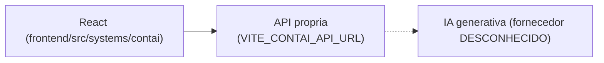

# ContAI

## 1. Identificação
- **Slug:** `contai` | **Status:** producao | **Criticidade:** media
- **Setor responsável:** DESCONHECIDO

## 2. Função do sistema
Assistente de IA para contabilidade (descrição do banco de sistemas).

## 3. Setores que utilizam
Contábil

## 4. Stack utilizada
| Camada | Tecnologia | Versão | Observação |
|---|---|---|---|
| Frontend | React (embutido) | 19.2.6 | |
| Backend | API própria | DESCONHECIDO | repositório fora deste workspace |

## 5. Arquitetura

## 6. Banco de dados
DESCONHECIDO — backend fora deste workspace.

## 7. Autenticação e permissões
DESCONHECIDO

## 8. PWA
Perfil DESCONHECIDO | Manifest: DESCONHECIDO | Service worker: DESCONHECIDO | Offline: DESCONHECIDO

## 9. Integrações externas
- IA generativa (fornecedor não confirmado no frontend)

## 10. Dependências de outros sistemas internos
- `crm-mg`

## 11. Variáveis de ambiente
| Nome | Obrigatória | Sensível | Descrição |
|---|---|---|---|
| `VITE_CONTAI_API_URL` | sim | não | endpoint da API do ContAI |

## 12. Observações de segurança e LGPD
Pode processar dado contábil/fiscal de clientes via IA — retenção/uso desses
dados pelo provedor de IA não confirmado. Ver `docs/PENDENCIAS.md`.
