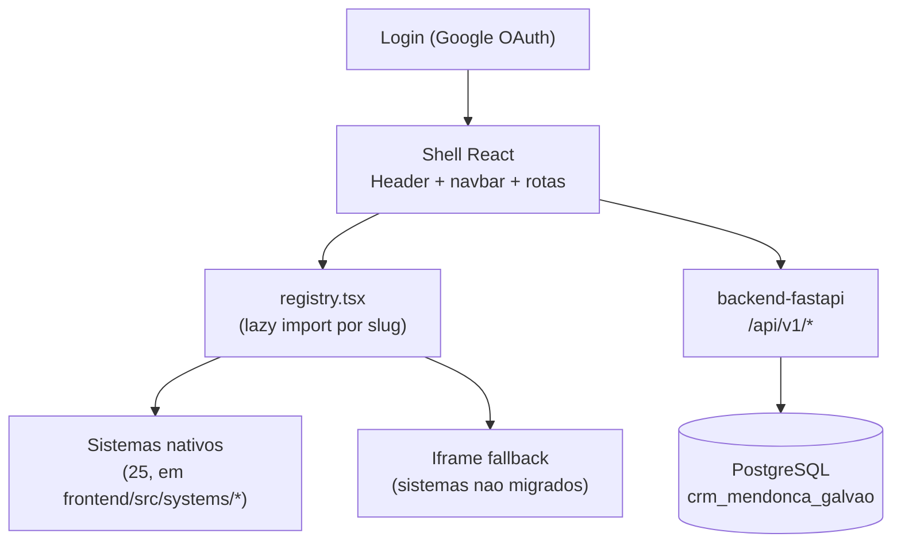

# CRM Mendonça Galvão (shell)

## 1. Identificação
- **Slug:** `crm-mg`
- **Status:** producao
- **Criticidade:** alta
- **Setor responsável (dono técnico):** TI — Núcleo Digital

## 2. Função do sistema
Shell/hub central do escritório: tela de login (Google OAuth), navbar
global, registro/navegação entre todos os sistemas internos (25 sistemas
embutidos nativamente via `frontend/src/systems/registry.tsx`, mais
sistemas ainda em iframe), gestão de usuários/setores/clientes/tarefas,
notificações, auditoria e changelog. Resolve o problema de "cada sistema
interno vivia isolado, sem SSO nem navegação unificada".

## 3. Setores que utilizam
- Transversal — todo colaborador com acesso ao CRM passa por aqui.

## 4. Stack utilizada
| Camada | Tecnologia | Versão | Observação |
|---|---|---|---|
| Frontend | React | 19.2.6 | `frontend/package.json` |
| Linguagem | TypeScript | ~6.0.2 | |
| Build | Vite | ^8.0.12 | |
| Backend | FastAPI (ver `backend-fastapi`) | — | ficha própria |
| UI compartilhada | `@mg/ui` + `@mg/tokens` | workspace local (`packages/@mg/*`) | design system próprio, usado pelo shell e por parte dos sistemas embutidos |
| Estado servidor | `@tanstack/react-query` | — | |
| Estilo | Tailwind CSS 4 (`@tailwindcss/vite`) | — | |

## 5. Arquitetura

## 6. Banco de dados
O shell em si não tem banco próprio — usa o banco do `backend-fastapi`
(`crm_mendonca_galvao`) para tudo que é transversal (usuários, sistemas,
setores, notificações, auditoria). Cada sistema embutido pode ter o
**próprio** banco (Supabase dedicado ou API externa) — ver a ficha de cada
um. Detalhe completo do banco transversal:
[`../backend-fastapi/BANCO.md`](../backend-fastapi/BANCO.md).

## 7. Autenticação e permissões
- **Método:** Google OAuth (`@react-oauth/google`), token JWT emitido pelo
  `backend-fastapi` e usado pelo shell.
- **RBAC:** sim, ver `usuarios.perfil`/`setor`/`visibilidade_sistemas` e
  `usuario_sistema_acessos` (ficha do backend).

## 8. PWA
- **Perfil:** DESCONHECIDO — nenhum `manifest.json`/`vite-plugin-pwa`/
  service worker encontrado em `frontend/` nesta rodada. Ver `docs/PENDENCIAS.md`.
- **Manifest:** não
- **Service worker:** não
- **Offline:** nenhum

## 9. Integrações externas
- Google OAuth
- OpenAI (usada por sistemas embutidos via proxy do backend)
- Evolution API (WhatsApp)

## 10. Dependências de outros sistemas internos
- `backend-fastapi` — obrigatória, é a API do shell.
- Todos os 25 sistemas em `frontend/src/systems/` — dependentes do shell
  (rodam dentro dele), não o contrário.

## 11. Variáveis de ambiente
Ver [`../backend-fastapi/README.md`](../backend-fastapi/README.md) seção 11
para as variáveis de backend compartilhadas (`JWT_SECRET`,
`GOOGLE_CLIENT_ID`, etc.) e a ficha de cada sistema embutido para as
variáveis `VITE_*` específicas dele (ex.: `VITE_SUPORTE_SUPABASE_URL` do
Central de Suporte).
- `HOST_FRONTEND_PORT` (default `3009`) — porta publicada do frontend em produção via Docker Compose.

## 12. Observações de segurança e LGPD
Ver [`../backend-fastapi/README.md`](../backend-fastapi/README.md) seção 12
(a maior parte dos achados de segurança/LGPD deste inventário está no
backend, que é onde a lógica de autorização e os dados transversais vivem).
