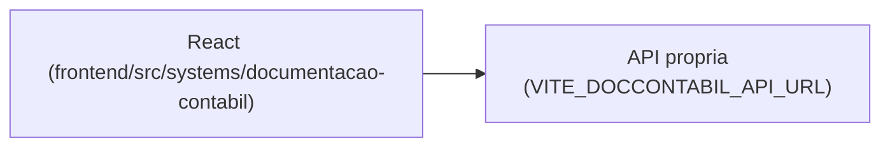

# Documentação Contábil

## 1. Identificação
- **Slug:** `documentacao-contabil` | **Status:** producao | **Criticidade:** media
- **Setor responsável:** DESCONHECIDO

## 2. Função do sistema
DESCONHECIDO — não havia descrição para este sistema no `sistemas_seed.sql`
inspecionado; o nome sugere gestão/organização de documentos contábeis. Ver
`docs/PENDENCIAS.md`.

## 3. Setores que utilizam
Contábil

## 4. Stack utilizada
| Camada | Tecnologia | Versão | Observação |
|---|---|---|---|
| Frontend | React (embutido) | 19.2.6 | |
| Backend | API própria | DESCONHECIDO | repositório fora deste workspace |

## 5. Arquitetura

## 6. Banco de dados
DESCONHECIDO.

## 7. Autenticação e permissões
DESCONHECIDO

## 8. PWA
Perfil DESCONHECIDO | Manifest: DESCONHECIDO | Service worker: DESCONHECIDO | Offline: DESCONHECIDO

## 9. Integrações externas
Nenhuma identificada.

## 10. Dependências de outros sistemas internos
- `crm-mg`

## 11. Variáveis de ambiente
| Nome | Obrigatória | Sensível | Descrição |
|---|---|---|---|
| `VITE_DOCCONTABIL_API_URL` | sim | não | endpoint da API de documentação contábil |

## 12. Observações de segurança e LGPD
Provável armazenamento de documentos de clientes — sem confirmação. Ver
`docs/PENDENCIAS.md`.
