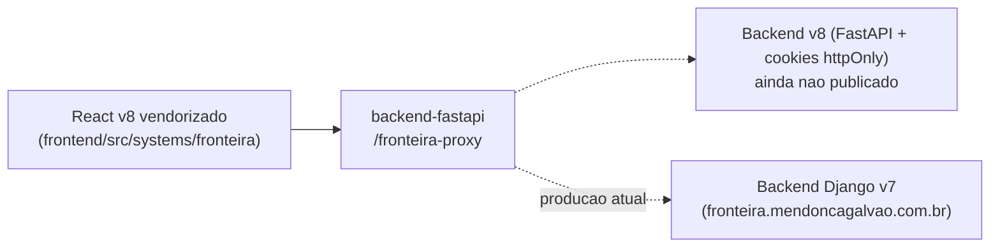

# ICMS Fronteira

## 1. Identificação
- **Slug:** `fronteira` | **Status:** homologacao | **Criticidade:** alta
- **Setor responsável:** DESCONHECIDO

## 2. Função do sistema
Cálculo de ICMS fronteira. A versão embutida (v8) é código vendorizado do
repositório `tnunes8/sistema-fronteira-v8` e ainda está em homologação
contra o v7 (Django) que roda em produção — **não alterar o código original
sem confirmar com o time**, conforme aviso em `FronteiraApp.tsx`.

## 3. Setores que utilizam
Fiscal

## 4. Stack utilizada
| Camada | Tecnologia | Versão | Observação |
|---|---|---|---|
| Frontend | React (embutido, código vendorizado v8) | 19.2.6 | tokens/UI próprios (`packages/@mg-tokens`, `@mg-ui` locais deste sistema, distintos do `@mg/ui` do resto do CRM) |
| Backend | Proxy via `backend-fastapi` (`fronteira_proxy`) + backend Django v7 em produção (externo) | DESCONHECIDO | proxy responde 503 até o v8 ter ambiente publicado (`FRONTEIRA_V8_API_URL` vazio) |

## 5. Arquitetura

## 6. Banco de dados
DESCONHECIDO — depende de qual backend (v7 ou v8) está ativo.

## 7. Autenticação e permissões
DESCONHECIDO (v8 usa cookies httpOnly, segundo comentário no
`backend-fastapi/app/core/config.py`).

## 8. PWA
Perfil DESCONHECIDO | Manifest: DESCONHECIDO | Service worker: DESCONHECIDO | Offline: DESCONHECIDO

## 9. Integrações externas
Nenhuma identificada além dos próprios backends v7/v8.

## 10. Dependências de outros sistemas internos
- `crm-mg`, `backend-fastapi`

## 11. Variáveis de ambiente
Nenhuma `VITE_*` própria — mediado pelo proxy do backend
(`FRONTEIRA_V8_API_URL`, ver ficha do `backend-fastapi`).

## 12. Observações de segurança e LGPD
Trata dado fiscal. Migração v7→v8 em andamento — risco de inconsistência de
dado durante a transição merece atenção do time. Ver `docs/PENDENCIAS.md`.
