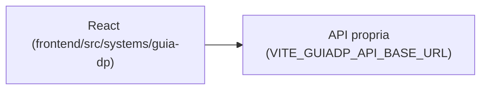

# Guia DP

## 1. Identificação
- **Slug:** `guia-dp` | **Status:** producao | **Criticidade:** baixa
- **Setor responsável:** DESCONHECIDO

## 2. Função do sistema
Guia de Departamento Pessoal e Contabilidade para clientes.

## 3. Setores que utilizam
Pessoal/DP

## 4. Stack utilizada
| Camada | Tecnologia | Versão | Observação |
|---|---|---|---|
| Frontend | React (embutido) | 19.2.6 | usa CSS Modules (`App.module.css`) |
| Backend | API própria | DESCONHECIDO | repositório fora deste workspace |

## 5. Arquitetura

## 6. Banco de dados
DESCONHECIDO.

## 7. Autenticação e permissões
DESCONHECIDO

## 8. PWA
Perfil DESCONHECIDO | Manifest: DESCONHECIDO | Service worker: DESCONHECIDO | Offline: DESCONHECIDO

## 9. Integrações externas
Nenhuma identificada.

## 10. Dependências de outros sistemas internos
- `crm-mg`

## 11. Variáveis de ambiente
| Nome | Obrigatória | Sensível | Descrição |
|---|---|---|---|
| `VITE_GUIADP_API_BASE_URL` | sim | não | endpoint da API do Guia DP |

## 12. Observações de segurança e LGPD
Voltado a clientes externos ao escritório — confirmar se há autenticação de
cliente e isolamento de dado entre clientes diferentes (possível caso de
multi-tenant não identificado). Ver `docs/PENDENCIAS.md`.
