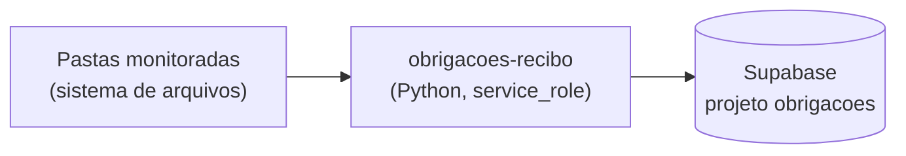

# Obrigações — Worker de Baixa por Recibo

> Documentação legada mais detalhada existe em
> [`docs/obrigacoes-recibo-worker-readme.md`](../../obrigacoes-recibo-worker-readme.md)
> — consultar antes de qualquer mudança.

## 1. Identificação
- **Slug:** `obrigacoes-recibo` | **Status:** DESCONHECIDO (presumido ativo, junto do `obrigacoes`) | **Criticidade:** baixa
- **Setor responsável:** TI — Núcleo Digital

## 2. Função do sistema
Worker que dá baixa automática em obrigações do sistema `obrigacoes`
monitorando pastas de arquivo por recibo — roda separado do frontend porque
precisa de `service_role` (bypassa RLS) e acesso ao sistema de arquivos, dois
privilégios que nunca devem estar no browser/build do Vite.

## 3. Setores que utilizam
Transversal (mesmo público do `obrigacoes`)

## 4. Stack utilizada
| Camada | Tecnologia | Versão | Observação |
|---|---|---|---|
| Linguagem | Python | DESCONHECIDA (ver `pyproject.toml`) | `services/obrigacoes-recibo/pyproject.toml` |
| Banco | PostgreSQL (Supabase do módulo `obrigacoes`) | — | conexão direta via `DATABASE_URL`, não via PostgREST |

## 5. Arquitetura

## 6. Banco de dados
Mesmo banco do sistema `obrigacoes` (Supabase próprio) — este worker usa
`SUPABASE_SERVICE_ROLE_KEY` (bypassa RLS) e `DATABASE_URL` (conexão direta
Postgres), diferente do frontend que usa a chave anon.

## 7. Autenticação e permissões
Autenticação de serviço via `service_role` key — sem RBAC de usuário (é um
processo, não uma UI).

## 8. PWA
Não aplicável (não é uma UI).

## 9. Integrações externas
Nenhuma — só o Supabase do módulo `obrigacoes` e o sistema de arquivos local.

## 10. Dependências de outros sistemas internos
- `obrigacoes` — este worker existe só pra servir esse sistema.

## 11. Variáveis de ambiente
| Nome | Obrigatória | Sensível | Descrição |
|---|---|---|---|
| `SUPABASE_URL` | sim | não | Supabase do módulo `obrigacoes` (não é o do CRM) |
| `SUPABASE_SERVICE_ROLE_KEY` | sim | **sim, crítico** | bypassa RLS — nunca no frontend, nunca em variável `VITE_*` |
| `DATABASE_URL` | sim | sim | connection string direta do Postgres |
| `STORAGE_BUCKET` | não (default `obrigacoes-documentos`) | não | bucket de destino |
| `MAX_ARQUIVO_BYTES` | não (default ~25MB) | não | limite de tamanho de arquivo |
| `DEBOUNCE_SEGUNDOS` / `WORKERS` / `RECARGA_PASTAS_SEGUNDOS` / `LOG_LEVEL` | não | não | tuning do worker |

## 12. Observações de segurança e LGPD
- **[ALTO] Detém a `service_role` key do Supabase de `obrigacoes`** — é o
  único componente com esse nível de acesso; comprometer este worker
  compromete o isolamento multi-tenant inteiro do sistema `obrigacoes`.
  Merece atenção redobrada de onde/como está hospedado e quem tem acesso ao
  `.env` dele.
- Processa documento de cliente (mesmo dado sensível do `obrigacoes`).
