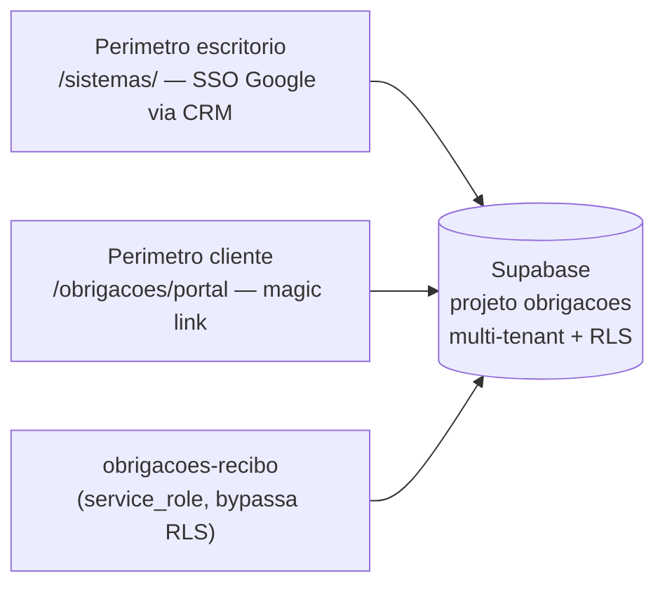

# Obrigações Acessórias

> Este sistema já tinha documentação própria e mais detalhada em
> [`docs/obrigacoes-readme.md`](../../obrigacoes-readme.md) (legado, escrito
> por quem desenvolveu o sistema) — **consultar esse arquivo antes de
> qualquer mudança**, esta ficha é um resumo padronizado pro inventário.

## 1. Identificação
- **Slug:** `obrigacoes` | **Status:** desenvolvimento | **Criticidade:** media
- **Setor responsável:** TI — Núcleo Digital

## 2. Função do sistema
Controle de entrega de obrigações acessórias, com portal do cliente. Sistema
satélite do CRM (mesmo padrão de `central-suporte`/`agendamento-ferias`):
**Supabase próprio**, SSO pelo Google ID token do CRM pro perímetro do
escritório, e uma sessão **separada** (magic link) pro perímetro do cliente.

## 3. Setores que utilizam
Transversal — qualquer setor com obrigações acessórias de cliente.

## 4. Stack utilizada
| Camada | Tecnologia | Versão | Observação |
|---|---|---|---|
| Frontend | React (embutido) | 19.2.6 | dois perímetros de rota: `/sistemas/<id>` (escritório) e `/obrigacoes/portal` (cliente, fora do AuthGuard) |
| Backend | Supabase (projeto próprio) | DESCONHECIDO | |
| Worker | `services/obrigacoes-recibo` (Python) | ver ficha própria | baixa automática por recibo |

## 5. Arquitetura

## 6. Banco de dados
PostgreSQL via Supabase, **multi-tenant real** — mais de uma empresa-cliente
compartilha as mesmas tabelas, isolada por RLS usando a empresa vinda do
JWT (nunca de parâmetro de rota/query string). Migrations em
`frontend/src/systems/obrigacoes/integrations/supabase/migrations/`. Sem
`BANCO.md` detalhado nesta rodada — ver documentação legada.

## 7. Autenticação e permissões
- **Método:** SSO Google (escritório) + magic link e-mail (portal do
  cliente) — sessões e rotas completamente separadas, não é "o mesmo login
  com tela diferente".
- **RBAC:** sim — papéis `ADMIN`, `GESTOR`, `COLABORADOR` (perímetro
  escritório).
- **Requer configurar o Auth Hook `custom_access_token`** no Supabase
  (Authentication → Hooks) — sem isso, todo login sai sem claims e a RLS
  nega tudo silenciosamente (tela abre vazia, sem erro).

## 8. PWA
Perfil DESCONHECIDO | Manifest: DESCONHECIDO | Service worker: DESCONHECIDO | Offline: DESCONHECIDO

## 9. Integrações externas
Nenhuma identificada além do próprio Supabase.

## 10. Dependências de outros sistemas internos
- `crm-mg` (SSO do perímetro escritório)
- `obrigacoes-recibo` (worker de baixa automática)

## 11. Variáveis de ambiente
| Nome | Obrigatória | Sensível | Descrição |
|---|---|---|---|
| `VITE_OBRIGACOES_SUPABASE_URL` | não (fail-soft) | não | sem ela o módulo se declara indisponível, não quebra o CRM |
| `VITE_OBRIGACOES_SUPABASE_PUBLISHABLE_KEY` | não (fail-soft) | não | chave anon/publishable |

## 12. Observações de segurança e LGPD
- **Multi-tenant com teste real de isolamento**: a suíte de testes
  (`integrations/supabase/testar_schema.ps1`) sobe dois tenants na mesma
  tabela pra provar isolamento — é o único sistema deste inventário com essa
  confirmação explícita.
- Trata documento de cliente (podem conter qualquer dado pessoal/fiscal).
- **Status `desenvolvimento`** — não tratar como sistema em uso pleno ainda
  (sem URL de produção própria).
