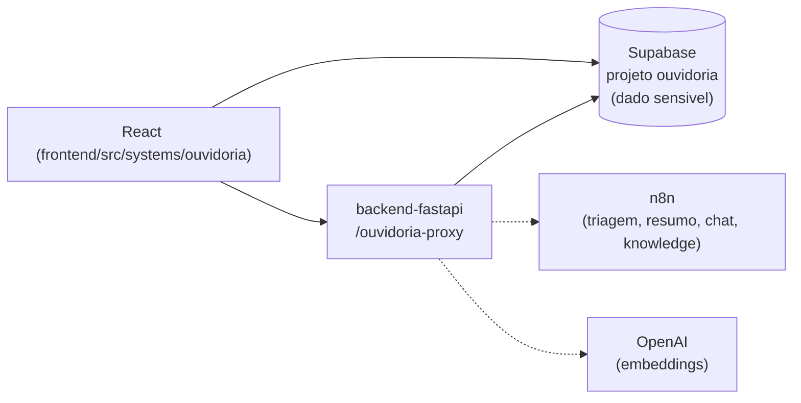

# Ouvidoria Interna (RH)

## 1. Identificação
- **Slug:** `ouvidoria` | **Status:** producao | **Criticidade:** media
- **Setor responsável:** DESCONHECIDO

## 2. Função do sistema
Canal de ouvidoria interna para recursos humanos — recebe e trata relatos/
denúncias de colaboradores.

## 3. Setores que utilizam
Transversal

## 4. Stack utilizada
| Camada | Tecnologia | Versão | Observação |
|---|---|---|---|
| Frontend | React (embutido) | 19.2.6 | |
| Backend | Supabase (próprio) + proxy via `backend-fastapi` (`ouvidoria_proxy`) | DESCONHECIDO | CRUD principal fala direto com o Supabase próprio; o proxy só cobre operações 100% server-side (webhooks n8n, embeddings OpenAI) |

## 5. Arquitetura

## 6. Banco de dados
PostgreSQL via Supabase (projeto dedicado, repositório de origem citado no
código: `ndmg-dev/ouvidoria-mg`). RLS via SSO — não detalhado nesta rodada.

## 7. Autenticação e permissões
Supabase Auth (RLS via SSO, conforme comentário em
`frontend/src/systems/ouvidoria/lib/supabase.ts`). RBAC exato: DESCONHECIDO.

## 8. PWA
Perfil DESCONHECIDO | Manifest: DESCONHECIDO | Service worker: DESCONHECIDO | Offline: DESCONHECIDO

## 9. Integrações externas
- n8n (webhooks de triagem/resumo/chat/knowledge)
- OpenAI (embeddings, só server-side via proxy)

## 10. Dependências de outros sistemas internos
- `crm-mg`, `backend-fastapi`

## 11. Variáveis de ambiente
| Nome | Obrigatória | Sensível | Descrição |
|---|---|---|---|
| `VITE_OUVIDORIA_SUPABASE_URL` | sim | não | URL do projeto Supabase (frontend, chave anon) |
| `VITE_OUVIDORIA_SUPABASE_ANON_KEY` | sim | não | chave anon do Supabase (frontend) |

Variáveis server-side (não expostas ao browser, configuradas no
`backend-fastapi`): `OUVIDORIA_SUPABASE_URL`,
`OUVIDORIA_SUPABASE_SERVICE_ROLE_KEY`, `OUVIDORIA_N8N_*_WEBHOOK_URL` — ver
ficha do `backend-fastapi`.

## 12. Observações de segurança e LGPD
- **[ALTO]** É o sistema com o dado mais sensível deste inventário —
  relatos de denúncia interna, potencialmente identificando pessoas. Sem
  confirmação de política de retenção nem de anonimização do denunciante.
- A `service_role` key deste sistema (bypassa RLS) fica centralizada no
  `backend-fastapi`, não no próprio módulo — ver observação de segurança na
  ficha do backend e em `docs/PENDENCIAS.md`.
