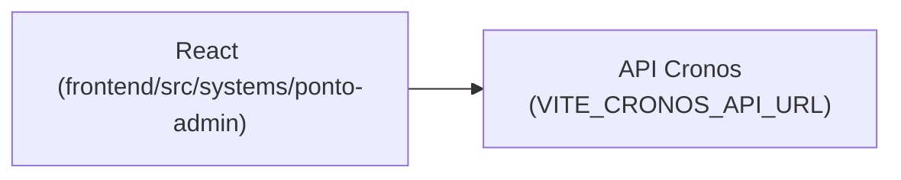

# Ponto Admin

## 1. Identificação
- **Slug:** `ponto-admin` | **Status:** producao | **Criticidade:** alta
- **Setor responsável:** TI — Núcleo Digital

## 2. Função do sistema
Administração do aplicativo de ponto eletrônico da empresa: gestão de
colaboradores, espelho de ponto, justificativas e férias — integrado com um
sistema externo chamado "Cronos".

## 3. Setores que utilizam
TI, Pessoal/DP

## 4. Stack utilizada
| Camada | Tecnologia | Versão | Observação |
|---|---|---|---|
| Frontend | React (embutido no crm-mg) | 19.2.6 | TypeScript, Vite compartilhado |
| Backend | API própria — sistema "Cronos" | DESCONHECIDO | repositório fora deste workspace |

## 5. Arquitetura

## 6. Banco de dados
DESCONHECIDO — o banco vive no backend "Cronos", fora deste workspace.

## 7. Autenticação e permissões
DESCONHECIDO

## 8. PWA
Perfil DESCONHECIDO | Manifest: DESCONHECIDO | Service worker: DESCONHECIDO | Offline: DESCONHECIDO

## 9. Integrações externas
- Cronos (sistema de ponto externo)

## 10. Dependências de outros sistemas internos
- `crm-mg`

## 11. Variáveis de ambiente
| Nome | Obrigatória | Sensível | Descrição |
|---|---|---|---|
| `VITE_CRONOS_API_URL` | sim | não | endpoint da API do Cronos |

## 12. Observações de segurança e LGPD
Trata dado trabalhista/ponto eletrônico. Sem RLS confirmável (backend fora
do workspace). Ver `docs/PENDENCIAS.md`.
