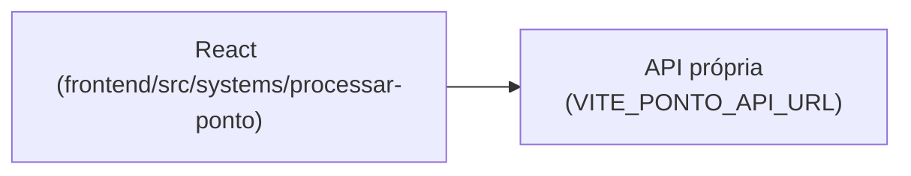

# Processamento Ponto

## 1. Identificação
- **Slug:** `processar-ponto` | **Status:** producao | **Criticidade:** media
- **Setor responsável:** TI — Núcleo Digital

## 2. Função do sistema
Processamento e controle de ponto eletrônico — upload/leitura de registros e
geração de resumos.

## 3. Setores que utilizam
Pessoal/DP

## 4. Stack utilizada
| Camada | Tecnologia | Versão | Observação |
|---|---|---|---|
| Frontend | React (embutido) | 19.2.6 | TypeScript, Vite compartilhado |
| Backend | API própria | DESCONHECIDO | repositório fora deste workspace |

## 5. Arquitetura

## 6. Banco de dados
DESCONHECIDO — backend fora deste workspace.

## 7. Autenticação e permissões
DESCONHECIDO

## 8. PWA
Perfil DESCONHECIDO | Manifest: DESCONHECIDO | Service worker: DESCONHECIDO | Offline: DESCONHECIDO

## 9. Integrações externas
Nenhuma identificada.

## 10. Dependências de outros sistemas internos
- `crm-mg`

## 11. Variáveis de ambiente
| Nome | Obrigatória | Sensível | Descrição |
|---|---|---|---|
| `VITE_PONTO_API_URL` | sim | não | endpoint da API de processamento de ponto |

## 12. Observações de segurança e LGPD
Trata dado de ponto eletrônico/nome do colaborador. Sem RLS confirmável. Ver
`docs/PENDENCIAS.md`.
