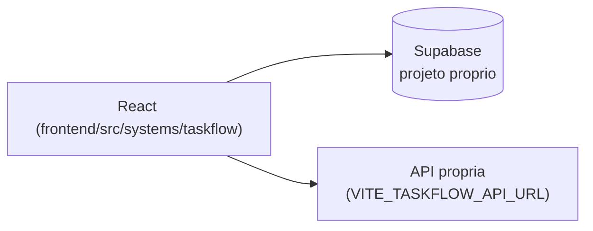

# TaskFlow

## 1. Identificação
- **Slug:** `taskflow` | **Status:** producao | **Criticidade:** media
- **Setor responsável:** TI — Núcleo Digital

## 2. Função do sistema
Gestão de tarefas/fluxo de trabalho do time de TI (kanban próprio, distinto
do Kanban da Central de Suporte).

## 3. Setores que utilizam
TI

## 4. Stack utilizada
| Camada | Tecnologia | Versão | Observação |
|---|---|---|---|
| Frontend | React (embutido) | 19.2.6 | TypeScript, Vite compartilhado |
| Backend | Supabase + API própria complementar | DESCONHECIDO | |

## 5. Arquitetura

## 6. Banco de dados
PostgreSQL via Supabase (projeto dedicado). Migrations não versionadas
neste repositório. Sem `BANCO.md` detalhado nesta rodada — ver
`docs/PENDENCIAS.md`.

## 7. Autenticação e permissões
Supabase Auth. RBAC/papéis: DESCONHECIDO.

## 8. PWA
Perfil DESCONHECIDO | Manifest: DESCONHECIDO | Service worker: DESCONHECIDO | Offline: DESCONHECIDO

## 9. Integrações externas
Nenhuma identificada além da própria API complementar.

## 10. Dependências de outros sistemas internos
- `crm-mg`

## 11. Variáveis de ambiente
| Nome | Obrigatória | Sensível | Descrição |
|---|---|---|---|
| `VITE_TASKFLOW_SUPABASE_URL` | sim | não | URL do projeto Supabase |
| `VITE_TASKFLOW_SUPABASE_ANON_KEY` | sim | não | chave anon do Supabase |
| `VITE_TASKFLOW_API_URL` | não | não | endpoint de API própria complementar |

## 12. Observações de segurança e LGPD
Trata nome/e-mail de usuário. RLS não auditada nesta rodada. Ver
`docs/PENDENCIAS.md`.
